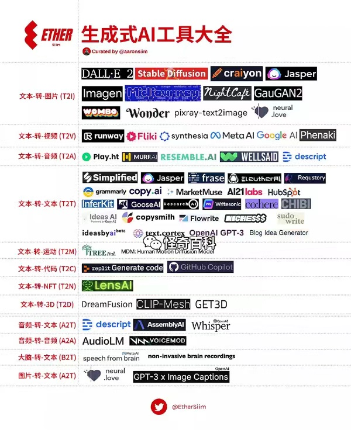
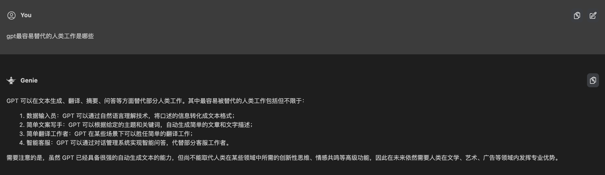
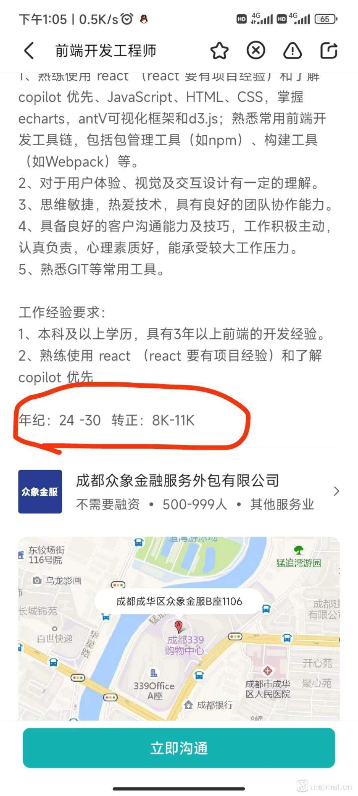
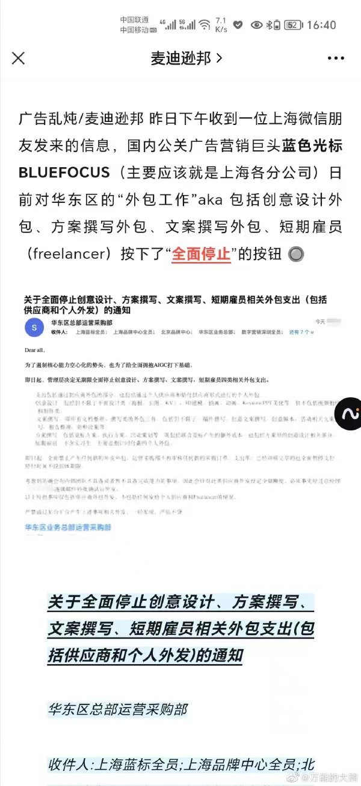

import { Link } from 'gatsby';

## 使用一段时间 AI 之后的感受

一个字，“强”。

已经无法用言语来形容 GPT 带给我的震撼了。

去年早些时候我还只是看到了 AI 绘图的一些新闻，那时候的 AI 还很不成熟，画的人物缺胳膊少腿，人体结构和透视一塌糊涂。但是短短几个月过后，AI 绘图从风格到精细程度就已经达到了以假乱真甚至超越一般画师的程度。

记得当时我和印度 UX 小姐姐开玩笑，我说我们都要被 AI 干掉了。没想到几个月过后一语成谶。不少 IT 公司认真调研 AI，并进行了组织结构和人员变更来适应 AI 时代。

公司 CTO 做过一次 GPT 的分享。在分享中他对项目通过合理的工序拆分和建模，在用指令让 GPT 完成了一个中型项目的前后端架构。

我在油管认真学习了很多利用 AI 编程的视频，AI 在业务逻辑较简单和明确的场景效率非常高，比如展示型网站，落地页，数据可视化等。

令人惊喜的是，AI 极大的降低了 web 3D 的编程门槛，因为很多物理和数学公式可以让 AI 来处理，程序员只需要纠正和微调。

GPT：理解上下文的能力 + 没有边界的数据库 + 自学习的能力。

在坐的各位 Dev 好好想想，按现在 AI 的进化速度，你有什么技术上的护城河可以把 AI 挡在外面。

我已不敢预测 3-5 年后的情况，但就目前而言，AI 已经可以干掉大量的初级岗位了，中级岌岌可危。但在这场 AI 浪潮中更危险的，恐怕不是程序员，而是偏经验积累又人力成本过高的行业，比如律师，咨询，美术等。

出于安全考虑，国内的大企业是不能直接使用 GPT 的，互联网公司如果想要接入 AI，那么就需要有新的平台，新的 MaaS(Model as a service)服务。这些都是新的需求，国内互联网的问题在于需求寒冬，在于缺少确定性，在于金融资本不敢投。互联网就这逻辑，画饼，做草稿，拉融资，其本身业绩兑现周期长。

## 回顾 19 年的文章《对人工智能社会的担忧》

19 年，我刚毕业一年。彼时的我还十分幼稚，在看到市场铺天盖地地炒作 AI 的时候写了一篇现在看来颇显尴尬的文章： <Link to="/essay/对人工智能社会的担忧/">对人工智能社会的担忧</Link>

基本思想其实没有变：AI 会对现有的生产关系产生颠覆性影响，而且 AI 的浪潮浩浩荡荡无法阻挡。

我依旧没有改变 19 年的想法，目前的 AI 根本算不上工业革命，GPT 持续火爆的原因在于它颠覆的行业是程序员，白领，艺术创作和内容行业，这些都是光鲜亮丽第三产业。你问餐馆或者工地狗怎么看，他们只会看乐子。工厂早八百年就用自动化干掉了很多工人了。

他颠覆的是城市化后都市小青年追求体面生活的希望。它干掉的是“人力成本”过高的行业，而这“人力成本”正是小镇做题家努力十几年渴望得到的体面收入。

00 年入 WTO，08 年经济开始爆发，今年 2023 年，第一批跟上发展快车的人现在是企业中层或高层，正年富力强离退休还很久远。现在经济进入下行或震荡期，留给年轻人的机会不多了，外有经济危机，内有 AI 平替，乐。

## 生产力决定生产关系

集体的动荡，很多时候并不是从底层开始的，底层的忍耐力太强了，是所谓的高学历精英阶层，因为他们话语权更大，也更难控制。这也是为什么奶头乐社会一定要垄断学习资源。

孔乙己真的愿意脱下自己长衫？反正还我是不愿意的。学历往往代表学识和眼界，信了傻逼的鬼话脱了长衫，往往后面还会发现自己在背后被说这话的穿着长衫的人取笑。

生产力决定生产关系，生产关系产生社会矛盾，矛盾促进改革。这个改革的过程是漫长而痛苦的，但这可能是未来几年我们需要经历的。

第三产业生产力因为 AI 爆炸增长，导致大量从业者失业，而这些从业者恰好就是第三产业的主要消费者。一个完美的资本主义过剩危机就会出现，这个覆盖的范围可不止三产，消费萎缩还会蔓延到地产等各行各业。理解了这个逻辑，就不会过于担心未来两年内出现 AI 大规模导致的裁员。

无所谓，美国国税局会出手。

> 笨蛋，问题是经济 It's the economy, stupid! - Bill Clinton

搞技术的人总会迷之崇拜技术的力量。一切发展的问题用发展解决，是一种放弃反思的懒惰思维。

## 我很乐观

AI 还替代不了普通程序员，我很乐观。

我比较看好目前 AI 混合概念的公司，AI 是一种新的商业属性，跟新能源一样可以让新公司弯道超车，干得好的话，国产平替也不是不可以。

## 前端

业务程序员很多时候就是一个搬砖的，现在 AI 的出现让他们搬砖的本质更明显了。

前端的出现本就是为了适应大厂流水线的专业化需求。

一方面 AI 让跨语言的门槛极大地降低了，另一方面前端的高光时刻是国内 C 端需求爆棚的时间段，但近几年 C 端早就是黑海了，B 端和 G 端也杀的一片血海。

前端的好日子没几年了，乘这波 AI 热潮早日转型才是正路。前端已死不是危言耸听。

你学习得越深入，沉没成本就越高，转型就越痛苦。现在前端面试疯狂地卷细枝末节就是一个信号，筑顶内卷的信号。

乐

哈哈。
