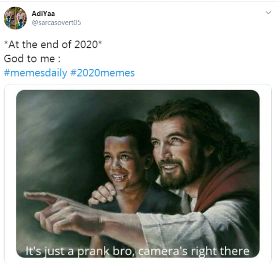
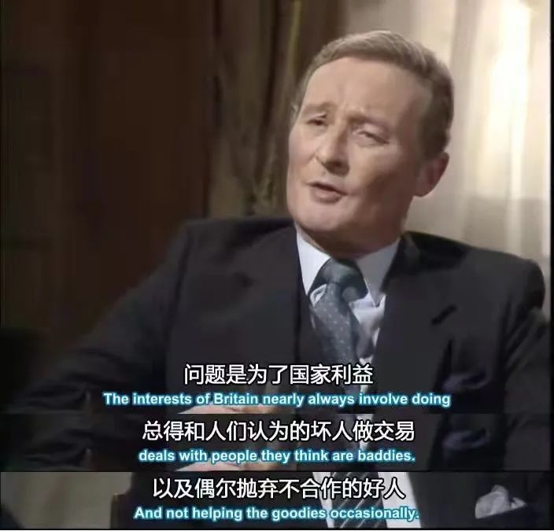
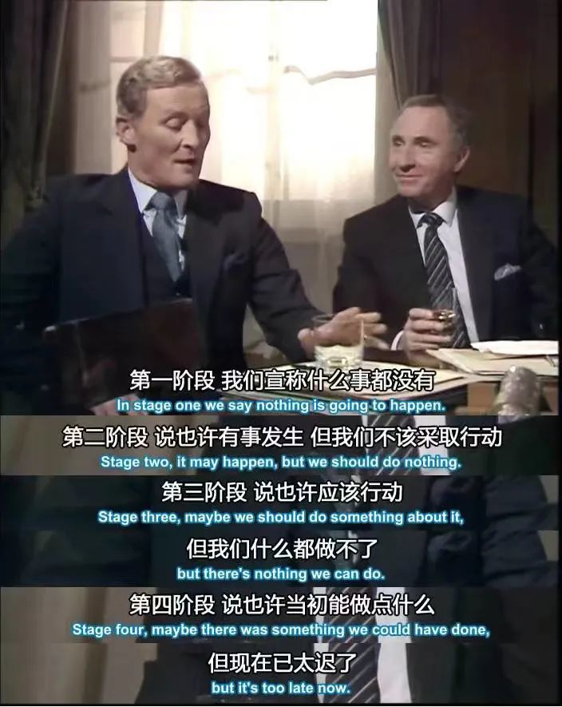
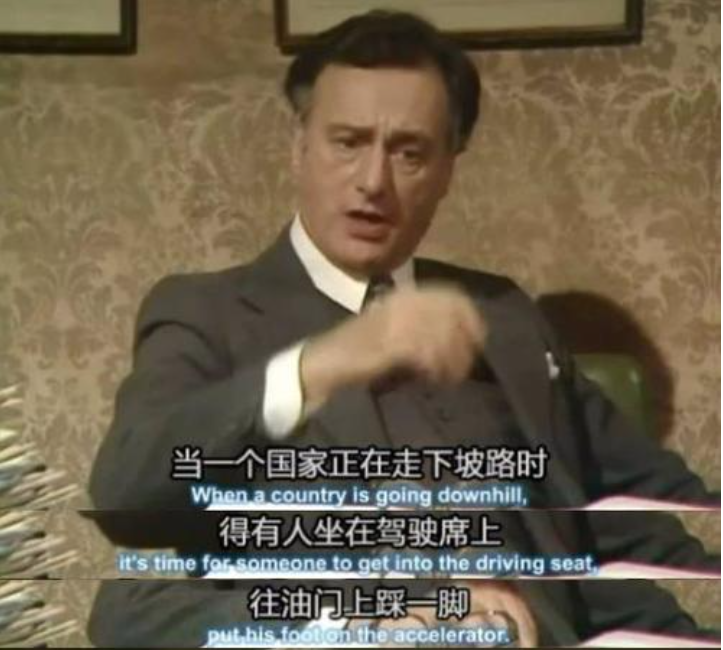
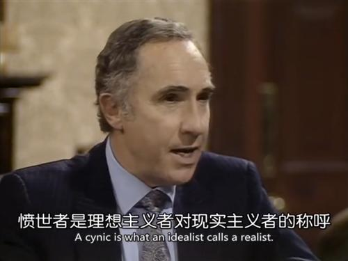

## 引子

我从 18 年开始关注国际新闻，最开始的时候其实有趣的新闻并不多，但从 19 年开始国际大戏越来越多，到了 2020 年各路政经自媒体更是话题多得说不完。2020 年对世界来说是百年未有之大变局，不管是国际政治还是科技军事力量对比都发生了剧烈的变化。

2020 年美国选举投票人数创历史记录，很多平时寄情娱乐不问世事的人都开始关心这美国宪法赋予他们的基本权利，对现实的无力让他们把这当成是改变现状的救命稻草。而大洋彼岸的中国，关心政治的年轻人也越来越多，上周在公司进行年终总结，隔壁项目组的小姐姐居然在总结中谈到了历史进程中个人的渺小，他们在年初花了几个月跟进的印度项目，最后因为一些特殊的原因被迫流产。

2020，欢迎来到一个充满着闹剧与苦难但却更加真实的世界。

我想在本文，以一些关键事件为节点，谈谈我自己不成熟的看法，其中也会对自己在 2019 年发的文章中的一些观点做一些反思和吐槽。因为没什么大纲，想表达的观点又多，想到哪说到哪，所以大概也不会得出什么有用的结论。

我本想给每个论据找到引用的文章，但是工程量是在太大了，我又不是在知乎骗赞。所以就全凭感觉来吧。

## 贸易战的未来

18 年中的时候，川普发动了对华贸易战，到特朗普下台前，战火已经延展到科技和金融等多方面领域，2021 年一月，拜登明确表明他上台后会延续川普的贸易制裁政策，即不管民主党和共和党曾经或将来有多少分歧，打压中国是他们永恒的共识。

### 贸易战

以关税为武器的贸易战是自损八百伤敌一千，川普是个喜欢讨价还价的人，他有自己的著作《交易的艺术》，对川普来说，发动贸易战的最大目的并不是打垮中国，而是争取选民，他想一方面通过贸易战拉回美国的制造业和促使中国加大对美国农作物的采购，以巩固铁锈带工人及农民的选票，另一方面他要通过打击中国塑造自己有别于民主党政客的政治强人身份，以吸引 wanna make a change 的中间选民，所以贸易战一直打打停停，川普一直是看着民调下政令，在贸易战期间甚至还不忘狮子大开口对日本等几个小弟要驻军费。

但是川普的这种单边制裁很容易被找到突破口，相比奥巴马时期想全力促进的[TPP](https://en.wikipedia.org/wiki/Trans-Pacific_Partnership)，效果只能说一般，2019 年出口统计局给出的数据也表明了这一点，2019 年东盟已代替美国成为中国的第二大贸易伙伴，第一大是欧盟，原本跑去美国的单，无非是换了个市场罢了。更不用说在 2020 年年尾相继促成的[RCEP](https://en.wikipedia.org/wiki/Regional_Comprehensive_Economic_Partnership)和[中欧投资协议](https://zh.wikipedia.org/wiki/%E4%B8%AD%E6%AC%A7%E5%85%A8%E9%9D%A2%E6%8A%95%E8%B5%84%E5%8D%8F%E5%AE%9A)，这两个协议的达成，虽然不能代表贸易战美方完全失败，但是中国将这两个庞大的经济体拉进了自己的经济战车里，日后对付拜登的新一轮贸易竞争就会更加游刃有余。

川普在任期内退出了很多多边组织，向盟友索取军费，以及分别对法国和德国进行了经济制裁。其中值得一提的是对德国的制裁。德国想通过[北溪二号管道](https://zh.wikipedia.org/wiki/%E5%8C%97%E6%BA%AA%E5%A4%A9%E7%84%B6%E6%B0%94%E7%AE%A1%E9%81%93)和俄罗斯合作，买到俄罗斯便宜的天然气，以摆脱德国对美国页岩油的依赖，但是却被美国以国防理由进行了经济制裁。在我印象里默克尔自[棱镜门](https://baike.baidu.com/item/%E6%A3%B1%E9%95%9C%E9%97%A8)事件过后就一直与美国不太对付，今年默克尔先是拒绝参加华盛顿的 G7 峰会，接着又是以欧盟轮值主席国的身份迅速促进中欧投资协定赶在拜登上台前签署，表示了德国或者大部分欧洲国家并不是铁了心和美国穿一条裤子，欧盟离了英国这根搅屎棍，未来会走上更加独立自主的道路。

另一个需要谈的是 RCEP，全称区域全面经济伙伴协定，其具体协定内容我就不说了，反正它覆盖的国家经济体占全球 1/3，是目前全球体量最大的自贸区。RECP 的签署使美国的 TPP 流产，是突破美国贸易封锁的重要一步。

如同 WHO 一样，中欧投资协定以及 RCEP 对中国来说既是机遇也是挑战，并不是像自媒体说的全是利好。更加开放的市场意味着更加激烈的竞争，原本靠着补贴或者地区保护起来的产业，往后如果不思进取可能会直接被国外产品吃掉，毕竟啥好处都被你捞完了谁还和你做生意，那还不如跟着美国干你，把你干死了还能吃点尸体。

### 科技战

贸易战的延伸便是科技战和金融战，科技战的开始标志是 2018 年的封杀中兴事件，其后被盯上的分别是华为和字节跳动。这三个公司应对川普的制裁表现各不相同。中兴在 18 年自我阉割过后这事儿差不多算结束了，tiktok 事件也随着懂王的下台告一段落，华为的战斗却还未停止，2021 年随着民主党重掌大权，中欧投资协定的落实还需要不断地与欧洲各国扯皮，而欧洲内部各有诉求，虽然搅屎棍英国已经脱欧，但是欧盟内部还有捷克波兰这些无脑反华的积极分子，其间华为和 5G 肯定是谈判中非常重要的一个议题，我认为今年华为的日子依然不好过，但是相比 2019 年生死存亡的一年已经好了很多。

import { Link } from 'gatsby';

我在去年的一篇文章 <Link to="/essay/对人工智能社会的担忧/">《对人工智能社会的担忧》</Link> 中表达了对 5G 吹捧现象的不屑，但其实当时的我的观点是片面且幼稚的。我曾经对华为这个企业抱有微词，因为对于打工者我来说，华为这个公司更像一个军事化管理的军队，但事实上华为确实是一支军队，还是战斗力很强的军队，是世界第一的国家倾国之力打不垮的军队。我依旧讨厌华为华而不实的营销风格，讨厌他的各种恶心人的制度，但是这不妨碍我对这个企业抱有敬意，一个企业想登上巅峰，光靠讲武德是不太可能实现的。

我对 5G 的实际功用及带来的所谓革命性变化的观点和去年相比没什么变化。不过去年的我看问题是从技术进步的角度来看，忽略了 5G 所带来的政治、专利、商业、配套产业和就业的影响。政治上 5G 是民族工业走出去的一面旗帜，5G 成为了中美科技话事人角力的重点，是中国对外产业扩张的头阵主力，有利于摆脱通信领域美国的专利限制，也有利于扩张中国在世界的政治影响力。经济上举个简单的例子，手机市场目前是一片红海，手机的性能基本上过剩，厂商为了吸引用户换手机，只能在一些奇奇怪怪的地方下手脚，诸如华为 4 个摄像头，苹果 faceId，什么屏幕指纹，无线充电，折叠屏之类的，实际上能吸引用户的手段并不多，但等到 5G 普及，手机的换代速度会加快很多。而 5G 带来的设备更新换代及其可能催生孵化出的 IOT 时代又会极大地促进就业和带来一次新的创业风口，只要是脑子正常的领导人，都能看到其中的经济利益。工业革命是实现经济腾飞的捷径，纵观世界历史，每次工业革命都会催生出新的世界霸主，同时又会有老牌霸主谢幕，当然 5G 和真的工业革命差的不少，不过在全球经济倒退的现状，5G 无疑是一个很有利的经济强心针。所以欧洲各国对 5G 的态度十分谨慎，既担心自己错过通信技术升级带来的红利，又害怕技术被中国企业像高通一样垄断，同时还有美国的制裁大棒伺候。但到东亚这边情况就好得多了，虽然嘴巴上嫌弃，但是 5G 是个香饽饽，[印尼已经先下一城](http://surabaya.mofcom.gov.cn/article/jmxw/202012/20201203025183.shtml)，把 5G 当做 2021 年的主要经济增长点。

本周[美国又用行政手段抓了一个美籍华人教授](https://mp.weixin.qq.com/s/9TtFFE4TjoYeRr_Xvrolzw)，国内的高精尖技术高校生想去美国留学是相当困难的，审核相当严格，相反政经文化类的留学生相比起来就相当容易申请。以现在两国的技术竞争态势来看，未来两国的技术会慢慢朝着两个隔绝的体系发展，原来的买办思维会被对方卡脖子卡死，只有自己攻破技术难关才能摆脱美国的技术封锁。

## 新冠，后疫情时代

2020 年初，全世界都等着看中国崩溃。疫情+香港暴乱+贸易战+经济下滑，疫情来得太猛烈，摧枯拉朽地席卷了整个旧世界。当时我失业在家，想的是接下来我们会不会经历“失去的几十年”，我在想要不要去后山开点荒，屯点食物，能多活几年是几年。在央视看到疫情攻坚战的宣传转头再去外媒看国外的一些新闻和言论，感觉这个世界就相当的魔幻，但接下来几个月新冠的发展就更加的魔幻。

新冠是一场硬仗，其关键程度不亚于从建国到现在的任何一次战斗。难以想象新冠在以工业为主的 14 亿人口的国家内扩散的后果，其惨烈程度绝对不亚于近代任何一次灾难。目前新冠已经导致全球 200 多万人死亡，病毒还在不断变异，英国自己的媒体估计[英国已经 1/5 的人口感染了新冠](https://www.edgehealth.co.uk/post/as-many-as-1-in-5-people-in-england-have-had-the-covid-19-disease)，而疫苗对这种频繁变异的单链病毒能保持多久的有效性还是个问题。不管是政客还是科学家，目前都还看不到新冠疫情结束的曙光，死亡人数和感染人数还会不断攀升，虽然西方媒体不断地画后疫情时代复兴的大饼，但是病毒就在那里，越变越强，越变越狡猾，病毒没有理智不讲政治，人类的政治攻讦和意识形态战争在病毒面前就是个笑话，病毒没有结束，一切人类之间的内耗都是在加速自我毁灭。

热情的台湾网友称新冠是中国的最大帮手，唯结果论上来说新冠是中国 2020 年国运转折的重要原因，但最大原因还是自身的奋斗。如果将新冠比作诺亚方舟的大洪水，那么大洪水是诺亚的帮手吗？诺亚有上帝的提前通告，中国却没有，面对突如其来的病毒袭击，隔岸观火几个月的西方国家，在灾难面前又试图做了些什么？上帝只救自救者，如果有上帝，那么他无疑也是一名共产党员。

我来梳理一下新冠对中国对外关系上造成的一系列影响：

- 重创他国家的经济，迫使他们寻求经济突破口，直接促进了 RCEP 和中欧投资协定的签署
- 重创美国经济和军事实力，削弱美国全球影响力，欧洲和东南亚部分想摆脱美国影响的国家开始重新思考自己的位置，重新选边站，也间接促进了两个协议。
- 扯下美式新自由主义民选政治体制的遮羞布，彰显其愚民，低能且双标的本质，重创了美国的普世价值，打烂了公知美分的脸。
- 重创了各国的产业资本，工厂停产，导致中国 2020 年的外贸交易量不降反升，轮船物流成本飙升。贸易战实质性破产。
- 经济剧烈下滑导致各地出现反抗和颜色革命，印度、泰国、法国，最后轮到了美国自己。一月六日华盛顿国会山事件，以及即将到来的拜登就职典礼。感谢美利坚给全世界人民上了这么一场好戏。

去年年末键政圈流行两个新的词语，一个叫“入关”，一个叫“加速主义”，入关是指打破美国霸权地位，收割美国的垄断资本，加速主义则是以毒攻毒，如果旧制度腐败，就让他更加腐败以加速旧制度的灭亡，新冠疫情客观上既加快了入关的进程，也给走下坡路的西方制度踩了一脚油门。

如果疫情不出现更大的变数，中美两国的力量对比将在后疫情时代发生天翻地覆的变化，套用中国人民的老朋友基辛格的一句话：“中美关系再也回不去了”。中美将在未来的几年内以竞争的关系为主，拜登不会像川普一样歇斯底里，但是也别指望他能给中国好果子吃，而由于疫情和贸易战的原因，世界全球化会发生倒退，形成西欧，东亚，北美的几个主要的相互比较独立的经济体，曾经人们习以为常的出境旅游、留学、投资还有物价可能都会发生很大的变化。

## 人权、民主、自由，理想主义者之死

## 民族主义与民粹主义

## 科技，资本与打工人

## 百年未有之大变局

## 你是战士还是子弹？
