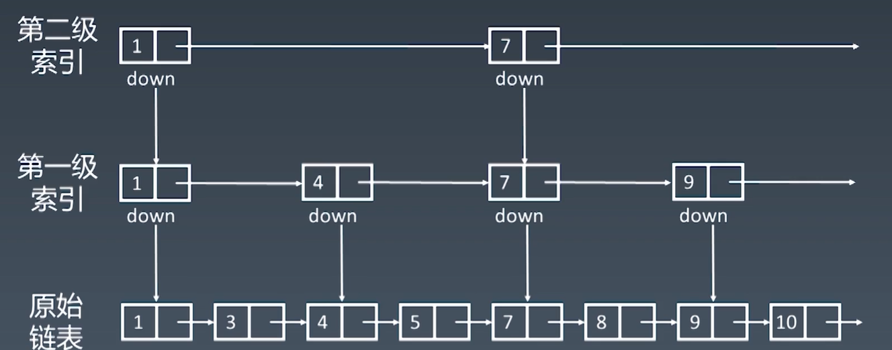

## 数组(Array)

1. 可直接访问数组元素, 直接访问的时间复杂度为 O(1)

2. 删除指定项的过程:

   移除指定项的数据 -> 将后续数组项向前平挪一个角标 -> 删除数组最后一项或者直接将数组的长度减一

3. 添加指定项的过程:

   在指定角标处插入添加的项 -> 后续数组项往后平挪一位

数组的添加和删除, 都是 O(n)的时间复杂度, 频繁的添加删除操作效率并不高.

## 链表(Linked-list)

js 实现 Node 类

```js
function Node(val) {
  // 当前节点的值
  this.val = val;
  // next 指针, 指向下一个节点
  this.next = null;
}
```

根据指针的差别, 链表又分为单向链表, 双向链表和循环链表

链表相对于数组, 最大的优势就是删除和增加操作, 数组需要平移操作, 但是链表只需要改指针, 链表的删除增加操作, 时间复杂度是 O(1), 但是链表除了`head`和`tail`可以直接访问外, 链表节点的访问必须遍历节点, 时间复杂度是 O(n) , 链表和数组各有利弊.

## 跳表



通过升维, 携带多级索引的链表就是跳表.

跳表有个前提, 就是原始链表必须是有序的.

因为多携带了索引信息, 所以跳表占用内存比链表大, 但是跳表的查询时间复杂度是 O(logn), 比链表的 O(n)快得多.

跳表的查询过程:

如上图, 我们要查询 10,

1. 从第二级索引开始遍历, 1 -> 7 , 发现 7 小于 10, 从 1 的索引向一级索引遍历, 遍历了 2 个节点
2. 第一级索引, 7 -> 9 , 发现 9 小于 10, 从 9 的索引向原始链表遍历, 遍历了 1 个节点
3. 原始链表, 9 -> 10, 找到目标元素, 遍历了 1 个节点

一共遍历了 4 个节点, 相比原始链表直接遍历 8 个节点效率上有所提升.
