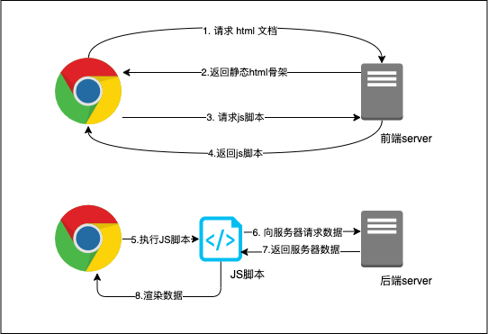
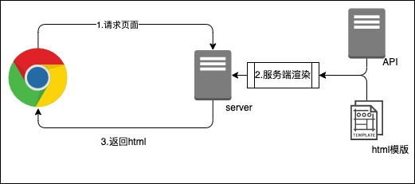
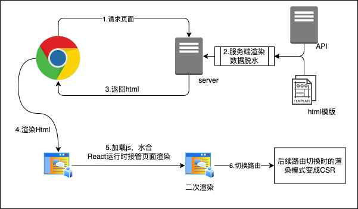
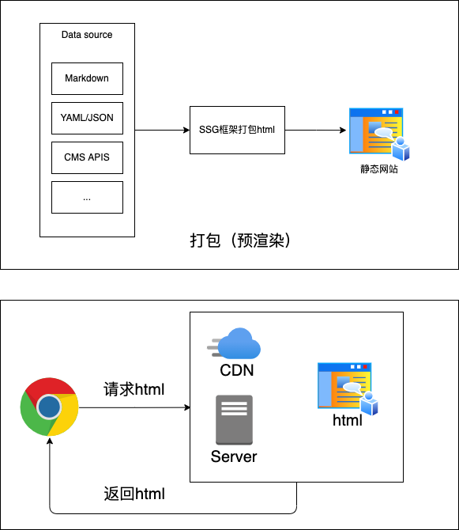
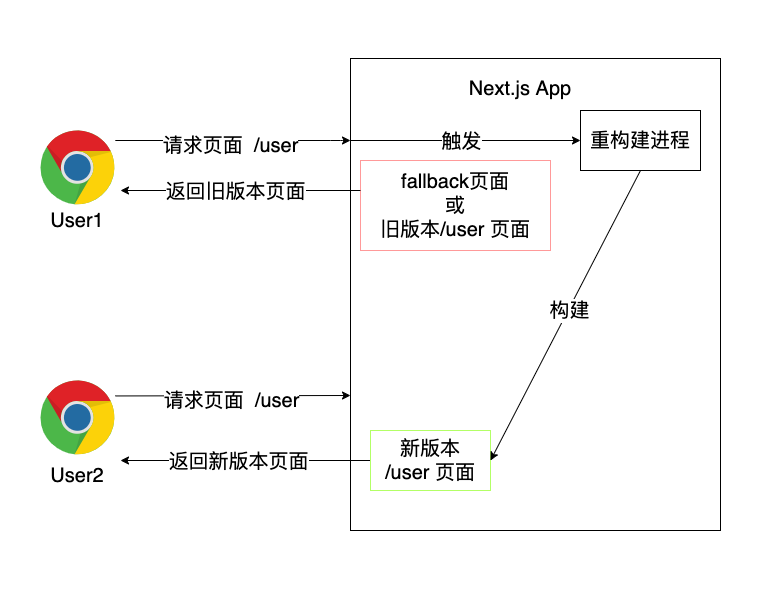
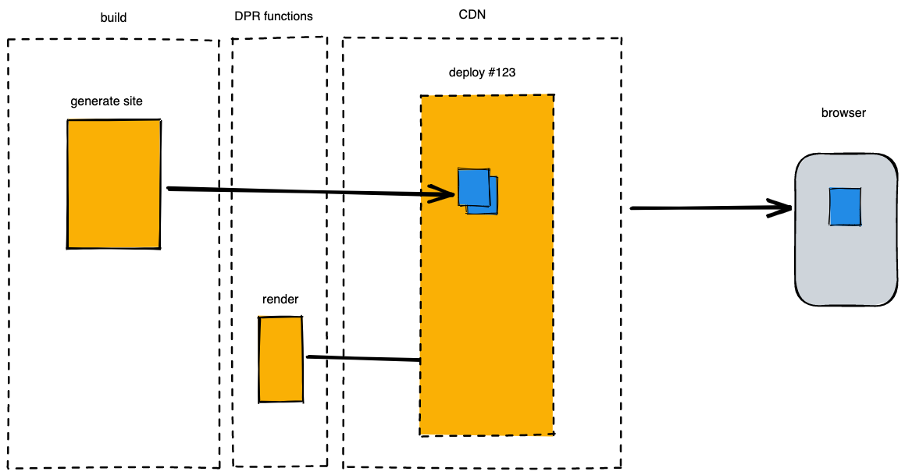
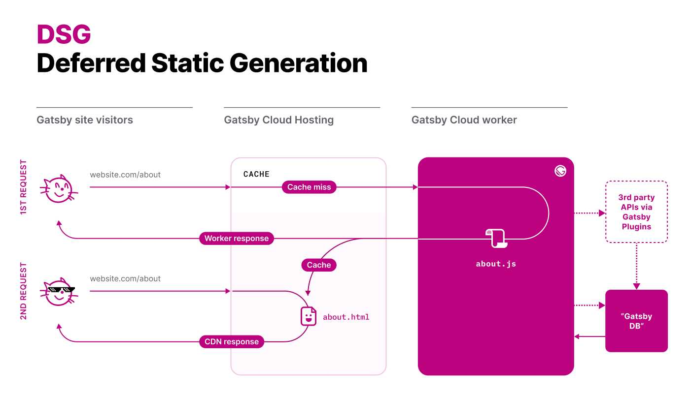

> 部分图片引用自：https://web.dev/rendering-on-the-web/

## CSR 客户端渲染(Client Side Render)




CSR 第一次请求页面的时候会下载一个 Html template：

```html
<!DOCTYPE html>
<html>
  <head>
    <title>App</title>
    <meta charset="utf-8" />
  </head>
  <body>
    <div id="app"></div>
    <script src="bundle.js"></script>
  </body>
</html>
```

在执行步骤 5 之前，用户看到的页面都是这个空白的 html 模版（白屏）。

在执行完步骤 8 之前，页面上不会有 server 的数据。

**Pros**

1. 简单易实现
2. 缓存易控制
3. 服务器资源占用小
4. 首屏渲染过后，后续不需要再重复下载资源

**Cons**

1. SEO 差
2. 首屏渲染白屏时间长
3. 在不支持 js 的设备上会一直白屏

## SSR 服务端渲染(Server Side Render)




CSR 的优点和缺点，刚好就是 SSR 的缺点和优点。

**Pros**

1. 对 SEO 友好
2. 首屏白屏时间短
3. 不支持 js 的设备也可以渲染完整的页面
4. 优秀的社会媒体优化（SMO）

**Cons**

1. 每个页面都要向服务器请求 Html，会下载重复的代码。
2. 服务器负载高。服务器渲染会增加服务器负载。
3. 缓存较差。由于所有页面资源都在服务器上，需要每个路由都发送请求。

### 同构渲染




同构渲染是 SSR 和 CSR 的混合。简单来说就是在服务端渲染一次，在浏览器端再渲染一次。

如图步骤 2 所示，在服务端渲染的时候，将渲染所需的 props，state 和 context 传入组件，利用 react 提供的服务端渲染 api `renderToString`/`renderToNodeStream` 将组件渲染为生成带有标记的 html 字符串或者数据流。

这个步骤叫脱水，类似于三体脱水的概念。如上图所示，这些数据虽然已经被渲染到了 html 中，但是还会留在脚本里，等待浏览器注水。

步骤 4 渲染 Html 页面，此时并未加载 js，页面虽然已经可见，但是不可交互。

步骤 5 加载 js 脚本，构建 react 运行时，取出脱水的数据，重新渲染页面和绑定事件（注水）。二次渲染（Rehydration）会复用服务端渲染的 html 节点，一般情况下其实只会注册一些事件，在 React 18 中如果 CSR 和 SSR 渲染结果不一致，会直接用 render 而不是 hydrate，并且会直接在控制台报错，所以开发的时候需要注意保持组件为纯函数不要依赖外部变量。

首屏渲染结束过后，后续切换路由就基本上和 CSR 一样了。

**Pros**

兼有 SSR 和 CSR 的优点，比较重要的优点：

1. 首屏白屏时间短
2. 后续页面加载快不需要重复下载资源
3. SEO 友好

**Cons**

缺点主要是在性能上

1. 二次渲染时页面无法交互（js 阻塞），有欺骗性。TTI 远大于 FCP。
2. 服务器负载比 CSR 高但比 SSR 低。

### 高并发下的 SSR

SSR 技术广泛应用，大家都想要 SSR 首屏渲染的好处，但是又不想多给服务器的钱，所以高并发下的 SSR 的优化就尤为重要了。

1. 降级处理
2. Nodejs 多进程
3. 返回缓存
4. 减少 DOM 数量。用虚拟列表，视口交叉懒加载，流式 SSR 等技术。

参考文章[SSR 同构降级策略](https://juejin.cn/post/6884107649843986440#heading-3)

### Streaming SSR

参考[浅析 React 18 Streaming SSR（流式服务端渲染）](https://juejin.cn/post/7064759195710521381)

流式 SSR 可以让我们能够将一些不影响首屏渲染的组件分割成单独的 SSR 组件。目的是进一步减少首屏渲染的 DOM 数量及文件大小，并且 SSR 组件可以保持在前端缓存中，进一步加快了后续页面请求的速度。

## SSG 静态网站生成器(Static Site Generator)



SSG 在前端看来和 SSR 是一样的，都是请求渲染过的页面，区别只在于 SSG 的渲染是在构建时而不是服务端实时渲染。

SSG 是应该在条件允许的情况（数据更新频率较低）下应该被优先考虑的渲染模式。

**Pros**

1. 兼有所有 SSR 的优点，但服务器负载小
2. 更易发挥 CDN， Offline web 和 PWA 的效果，合理利用缓存，让网站有极致的性能表现

**Cons**

1. 只适用于不经常更新的数据。更新新数据需要重新打包。
2. 同 SSR，每个页面都要重新请求。

### ISR 增量静态渲染(Incremental Static Regeneration)

[Nextjs ISR](https://nextjs.org/docs/basic-features/data-fetching/incremental-static-regeneration)



ISR 是 Nextjs 对 SSG 的优化渲染模式。

对大型网站而言，全量预渲染整个网站是不现实的。所以 Next 有了 ISR 这个方案。

1、**关键性的页面**（如网站首页、热点数据等）预渲染为静态页面，缓存至 CDN，保证最佳的访问性能；

2、**非关键性的页面**（如流量很少的老旧内容），如图所示 User1 首先访问/user 页面，该页面从来没人访问过，服务器没有缓存，则先响应 fallback 内容，然后浏览器渲染（CSR）实际数据，如果并不是初次访问，浏览器已经有了上一次构建的网页，则直接返回上次构建的产物(SSG)；
在满足 Next 的触发规则后，会触发重构建进程，构建新的网页，当 User2 访问同一页面的时候，就可以直接拿到上一次构建的页面了。

触发的规则分默认和 on-demond，详细的原理看[文档](https://nextjs.org/docs/basic-features/data-fetching/incremental-static-regeneration#on-demand-revalidation)

fallback 也可以开启 blocking，这样就不会是 CSR 而是类似 SSR 的体验。

**Pros**

1. 相比于全量 SSG，减少了需要构建的网页的数量，节省发布时间。

**Cons**

1. 会有用户拿到 fallback 的 CSR 网页，或者过时的 SSG 网页。

### DPR 分布式持续渲染(Distributed Persistent Rendering)



[Netlify DPR RFC](https://github.com/jamstack/jamstack.org/discussions/549)

为了解决 ISR 的一系列问题，Netlify 发起了 DPR 的提案。

DPR 本质上讲，是对 ISR 的模型做了几处改动，并且搭配上 CDN 的能力：

1. 去除了 fallback 行为，而是直接用 [On-demand Builder](https://docs.netlify.com/configure-builds/on-demand-builders/)（按需构建器）来响应未经过预渲染的页面，然后将结果缓存至 CDN；
2. 数据页面过期时，不再响应过期的缓存页面，而是 CDN 回源到 Builder 上，渲染出最新的数据；
3. 每次发布新版本时，自动清除 CDN 的缓存数据。

更多细节：[Netlify docs](https://docs.netlify.com/configure-builds/on-demand-builders/)

**Pros**

1. 相比于 ISR，用户不会拿到 fallback 的 CSR 页面

**Cons**

1. 和 ISR 一样的问题，过时网页。
2. 依赖特定的云服务和部署平台
3. 还是个草案

### DSG 延迟静态生成(Deferred Static Generation)



DSG 是依托于 Gatsby cloud 的渲染模式 [A Guide To Deferred Static Generation](https://www.gatsbyjs.com/blog/deferred-static-generation-guide/)

它和 DPR 十分类似。优缺点也几乎一样。
