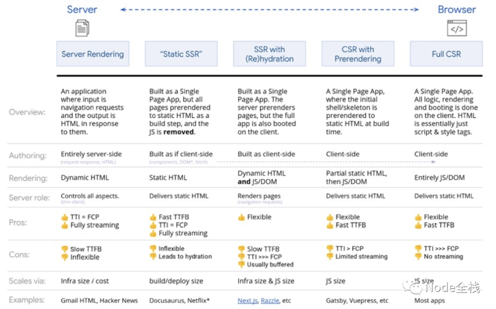

> 前景提要
>
> 性能指标：https://blog.foolishrobot.xyz/tech/2132011539
>
> 补水的风险：https://blog.foolishrobot.xyz/tech/-8034188
>
> 前置知识：
>
> 《浏览器工作原理》，Http 2


> 我们需要了解早期 SSR 的特点，后来的 CSR 为什么比早期的模版语法技术优秀，以及现在为什么又开始风水轮流转提倡 SSR。
>
> 粗略对比，不会太深入细节。

## 远古时期 - PHP / JSP 人人都是 SSR

> 参考资料： [SSR 与当年的 JSP、PHP 有什么区别？](https://segmentfault.com/a/1190000037793694)

前后端没分离的时候也没有 Ajax 技术，页面相当简单，一个 form 或者一个表格就行了。

这一时期网页内容完全由服务端渲染，浏览器向后端直接请求完整的带有数据的页面（带有极少的内联样式），这就是以前的 SSR 页面。

缺点：

性能差：每一个请求过来都要重新执行一遍数据逻辑和视图逻辑，动态生成 HTML 甚至刷新页面，即便其中很大一部分内容是相同的（对应 Ajax 技术）

机器成本高：服务器渲染是需要服务器资源的，早期的服务器能力很羸弱

开发/维护难：前后端代码掺杂在一起，修改维护要十分谨慎

效果差：随着互联网时代需求的爆发，原来的简单交互或者简陋 UI 逐渐满足不了业务的需求了。

面对这些问题，两个思路逐渐变得清晰起来，动静分离与前后端分层，前者解决性能和机器成本的问题，后者解决开发/维护的问题

### 动静分离

为了充分利用 Web 服务器的静态资源处理优势，同时减轻应用服务器的负担，将资源分为两类：

静态资源：图片、CSS、JS 等公用的，与具体用户无关的资源

动态资源：应用逻辑、数据操作等与具体用户密切相关的资源

两种资源分开部署，把静态资源部署至 Web 服务器或 CDN，应用服务器只部署动态资源。如此这般，静态资源响应更快了（浏览器缓存、CDN 加速）

然而，视图逻辑却被我们漏掉了，HTML 算作静态资源还是动态资源？

前后端分层就是为了回答这个问题。

### 前后端分层

视图逻辑的特殊之处在于：

与数据密切相关
服务端与客户端均可承载视图逻辑
也就是说，HTML 视图结构的创建和维护工作，可以由服务端完成，也可以在客户端完成，都依赖服务数据。但与服务端相比，客户端环境有一些优势：

无需刷新（重新请求页面）即可更新视图
免费的计算资源

因此，视图逻辑划分到了客户端（即 CSR），以数据接口为界，分成前后端两层：

后端：提供数据及数据操作支持
前端：负责数据的呈现和交互功能
自此，前后端各司其职，前端致力于用户体验的提升，后端专注业务领域，并行迭代，（不涉及接口变化时）互不影响

## CSR 客户端渲染(Client Side Render)

前后端分层之后，进入了 CSR 的黄金时代，探索出了功能插件、UI 库、框架、组件等多种代码复用方案，最终形成了繁荣的组件生态，也就是前端的 Golden Age

客户端渲染（CSR）允许在导航到不同页面时几乎立即在浏览器中更新网站，但在开始时需要更多的初始下载和客户端上的额外渲染。 首次访问时网站速度较慢，但后续访问速度要快得多。

通过 Vue 或者 React 直接生成的 SPA 网页通常最后都是通过 CSR 呈现给使用者的。浏览器下载 Html 骨架，css 文件和 js 文件，然后依循浏览器网页渲染引擎的渲染流程绘制网页，接着等待异步请求拿到的请求数据，再处理组装数据更新网页内容，最后完成页面渲染。

目前绝大部分网页也都是 CSR 的，因为简单，而且大部分网页对首次加载的速度要求并不大，对 SEO 的要求也并不大。

常见的 CSR html 骨架

```html
<!DOCTYPE html>
<html>
  <head>
    <title>App</title>
    <meta charset="utf-8" />
  </head>
  <body>
    <div id="app"></div>
    <script src="bundle.js"></script>
  </body>
</html>
```

缺点：

- SEO 效果不好。
- 首屏渲染慢（白屏时间长）：在组件树首次渲染完之前，页面上无法展示任何内容，包括 loading（可通过 iframe 规避），数据请求必须等到所属组件开始渲染才能发出去，进一步加长了白屏时间。

> SEO 效果不好的原因，是因为简单的搜索引擎爬虫只能爬到最基础的 HTML 骨架，爬虫并不会通过 Ajax 请求去拉取后端数据。这是 SPA 页面的共有问题，但是这几年搜索引擎已经有一些进步了（只要你愿意加钱，都能搞定）。

白屏时间较长这个问题，在 SPA 页面尤其明显，因为大部分 SPA 页面下载下来的 HTML 只有最简单的结构，绝大部分页面内容全都需要等待 JS 脚本执行完毕才能展示。如果这个 SPA 网页还没有进行 Code split 的话，那白屏时间就会更长。渲染流程是同步阻塞的，低端设备上 JS 执行效率低，白屏时间长，弱网环境下数据返回慢，loading 时间长，CSR 虽然利用了用户设备的计算资源，但同时也受其性能、网络环境等不可控因素的制约。

于是，大家又重新将目光聚集到了 SSR

## SSR 服务端渲染(Server Side Render)

SSR 模式下，首屏内容在服务端生成，客户端收到响应 HTML 后能够直接呈现内容，而无需等到组件树渲染完毕

虽然核心思想都是在服务端完成页面渲染工作，但如今的 SSR 与先前大不相同，体现在：

出发点：为了更快、更稳定地呈现出首屏内容（解决客户端渲染导致的白屏问题）

成熟度：建立在前端成熟的组件体系、模块生态之上，基于 Node.js 的同构方案成为最佳实践（Nuxt，Next 等）

独立性：仍然保持着前后端分层，不与业务领域的应用服务强耦合

也就是说，如今的 SSR 是为了解决前端层的问题，结合 CSR 优化内容加载体验，是在 CSR 多年积淀之上的扩展，与现有的前端技术生态保持着良好的相容性。而当年的 SSR 更多地是为了实现功能，解决温饱问题

再看当年 SSR 面临的几个问题：

性能差：每一个请求过来都要重新执行一遍数据逻辑和视图逻辑，动态生成 HTML，即便其中很大一部分内容是相同的

机器成本高：Tomcat/Apache 等应用服务器的并发处理能力远不及 nginx 之类的 Web 服务器，因此需要部署更多的机器

开发/维护难：前后端代码掺杂在一起，人员协作是个问题，并且修改维护要十分谨慎（标签结构容易被破坏）

引入 SSR 之后这些问题卷土重来，但这些年的技术发展为解决这些问题提供了新的思路：

实时渲染的性能问题：动静分离的思路仍然适用，例如 Static Generation

服务器资源成本问题：云计算的发展有望大幅降低机器成本，例如 Node FaaS

SSR 部分与 CSR 部分的开发/维护问题：同构为解决开发/维护难题提供了一种新思路（之前的思路是前后端分层，但这一次分不开了），维护同一份代码，跑在不同的运行环境输出不同形式的目标产物

## SSG 静态站点生成（ Static Site Generator），or 预渲染

Static Generation（也叫 SSG，Static Site Generation）是指在编译时生成静态 HTML（可部署至 CDN），避免实时渲染的性能开销，它和 SSR 的区别在于将数据和 HTML 组合的过程在前端打包编译代码的时候就已经处理好了，白屏时间更短，对服务器资源占用更小。

目前 Gatsbyjs 是 react 技术栈里 SSG 做的最好的工具，本博客也基于 Gatsbyjs。SSG 还有很多优点，便于 PWA，前端 Offline，白屏时间更短等等。

但 SSG 也有两个麻烦的问题：

1. 并非所有页面都能在编译时静态生成，页面上总会有需要个性化显示的内容。
2. 当静态数据修改的时候，往往需要重新构建整个静态网站，一些复杂网站的打包时间可能得按天计算。

这两个问题分别对应两种解决办法。

第一个问题的一种可行的实践方案是将 SSR 与 SSG 结合起来，只对内容依赖个性化数据、或者频繁更新的页面走 SSR 或者 CSR，其余场景都走 SSG。通常来说我们可以用`useEffect`这种副作用钩子来简单实现这一效果，但我们也可以考虑其他第三方库提供的一些新的渲染方案 ISR / DPR / DSG，这部分只作为延伸学习。

## 总结



如图是从服务端到浏览器的五种渲染模式。

开发者应该根据实际项目需要，选择合适的渲染模式。

绝大部分商业项目都不是纯SSR或者CSR模式，而采用混合模式。在该图片中的 SSR with (Re)hydration 和 CSR with Prerendering 这两种即为SSR/SSG/CSR混用的模式。

除此之外，不同的框架还提功能更细化的混合渲染模式，这一块我放在技术延伸里，仅供参考。

图片来源：[我看 Next.js：一个更现代的海王](https://toutiao.io/posts/ffcwol1/preview) 

## 技术延伸（引用的文章会配图更易理解）

### Jamstack 技术架构

太长咯，直接搬运一篇写得不错的文章[Jamstack，下一代Web建站技术栈？](https://zhuanlan.zhihu.com/p/281085404)

### ISR增量静态渲染(Incremental Site Rendering)

对大型网站而言，全量预渲染整个网站是不现实的。所以Next有了ISR这个方案。

1、**关键性的页面**（如网站首页、热点数据等）预渲染为静态页面，缓存至 CDN，保证最佳的访问性能；

2、**非关键性的页面**（如流量很少的老旧内容）先响应 fallback 内容，然后浏览器渲染（CSR）为实际数据；同时对页面进行异步预渲染，之后缓存至 CDN，提升后续用户访问的性能

始终返回 CDN 的缓存数据（无论是否过期）；如果数据已经过期，那么触发异步的预渲染，异步更新 CDN 的缓存。

### DPR 分布式持续渲染(Distributed Persistent Rendering)

为了解决 ISR 的一系列问题，Netlify 在前段时间发起了一个新的提案

> 以上两个更详细的利弊可以参考该博客 [新一代Web技术栈的演进：SSR/SSG/ISR/DPR都在做什么？](https://www.cnblogs.com/rsapaper/p/14753789.html)，只做搬运

### DSG延迟静态生成(Deferred Static Generation)

Gatsbyjs 在 SSG 上更进一步优化的渲染模式，不过只能使用他们的云服务，后端数据也只能用nodejs。

简单来说，就是把SSG的打包操作托管给了Gatsby cloud，然后gatsby cloud不会直接生成静态网站，而是在用户发送了第一次页面请求过后才组装页面并构建html结果，生成的页面会直接返回给用户，然后该页面会在CDN里留一个缓存，当有第二个用户请求该页面的时候，就可以直接通过CDN返回缓存，而不用再次构建静态HTML。

具体可以看这个介绍：[A Guide To Deferred Static Generation](https://www.gatsbyjs.com/blog/deferred-static-generation-guide/)

该技术最大的优势就是可以选择性地生成静态HTML文件，比如我们可以对一些访问量很小的旧博客/商品页面/老页面采用DSG方式，这样在重新打包静态站点的时候就可以跳过这些网页，仅在用户请求的时候才进行构建，节省服务器资源。

### Server Components（React 服务端组件，未成熟的方案）

无论哪种渲染方案，发给服务端发送给客户端的都是完整的 Html， 而如果采用服务端渲染模式，我们需要准备好所有组件的 HTML 才能返回。如果某个组件需要的数据耗时较久，也会阻塞整个 HTML 的生成。为了优化白屏时间，我们还可以考虑 code split 懒加载以减少直接下载的 Html 代码量。

Server Components 就是结合了 code split 懒加载和 SSR 的技术方案。

普通的懒加载是动态 import 一段 js 代码，而 Server Components 借助于 SSR，是直接从服务端直接下载 渲染后的片段，由于服务端组件是静态的、服务端渲染的，它有 SSR 的所有优点，但因此相对于客户端组件，不可避免的也会有些使用限制。

缺点：

1. 服务端组件不能有任何交互行为（例如：不能使用 `useState()`，`useEffect()`）。但是你可以通过在服务端组件内部引入客户端组件（客户端组件是允许存在交互行为的）的方式来解决这个问题。
2. 由于服务端组件是在服务端完成渲染后通过网络传输给到客户端， 因此服务端组件传输 props 到客户端组件的时候，props 必须被序列化（意味着：可传输的数据只能是字符串、JSON 对象或者 JSX，不能传输 JavaScript 函数）。

### Streaming SSR（React 流式服务端渲染）

Streaming SSR 是服务端组件技术的延伸，配合服务端组件和 react `Suspense`组件，实现流式加载的效果（常见于图片加载，只不过这里图片变成了 html 片段）。

具体的细节，可以参考这篇文章： [浅析 React 18 Streaming SSR（流式服务端渲染）](https://juejin.cn/post/7064759195710521381)

它可以和`IntersectionObserver` API 搭配使用，实现极致的性能优化。

另外，流式渲染需要发送更多的http请求，所以搭配http2多路复用的特性使用更好。

### 微前端（乾坤和模块联邦）

微前端不属于渲染模式，这里加上只是顺手。。。

SPA 全称叫 single-page-app, 即单页面应用，不管 SPA 还是 MPA，一个页面都是一个应用，但我们经常还需要在网页上嵌入第三方应用，这个时候要踩的坑就很多了。

前端应用最广的解决嵌入其他应用的方案是 iframe，但 iframe 有相当多的问题（性能，通信等）。

另一个解决方案就是还不成熟的微前端方案。

微前端简单来说就是将一个庞大的前端应用拆分成多个独立灵活的小型应用，每个应用都可以独立开发、独立运行、独立部署，再将这些小型应用融合为一个完整的应用，或者将原本运行已久、没有关联的几个应用融合为一个应用。微前端既可以将多个项目融合为一，又可以减少项目之间的耦合，提升项目扩展性，相比一整块的前端仓库，微前端架构下的前端仓库倾向于更小更灵活。

它解决了两个问题：

1. 随着项目迭代应用越来越庞大，难以维护。
2. 跨团队或跨部门协作开发项目导致效率低下的问题。

由于是不同的前端应用，所以微前端主要处理的问题就是应用之间的通信和沙箱隔离问题，这一块目前业界没有固定的解决方案，比较成熟的是阿里开源的乾坤框架。
这个技术不到万不得已不应该考虑使用，他会增加前端的代码量以及技术栈复杂程度，技术细节就自己找找吧。
[京东开源-micro-app](https://zeroing.jd.com/micro-app/docs.html#/)
[qiankun](https://qiankun.umijs.org/zh/guide)
