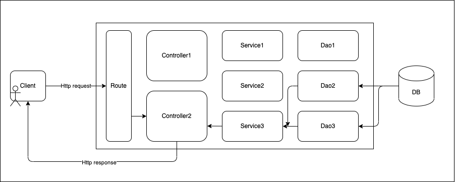

## 目录结构

```text
src
  ├── app.ts	      app
  ├── server.ts		  入口，port设置和添加数据搜集等插件
  ├── config.ts		  配置，环境变量
  ├── /controller	  控制层
  ├── /services		  业务逻辑层
  ├── /dao		      数据层
  ├── /view		      视图层
  ├── /routes		  路由
  ├── /middleware     中间件
  ├── /errorHandler   错误处理
  ├── /utils	      工具函数
  ├── /constants	  常量
test                  测试
auto                  自动化脚本
```

## 关注点分离 - 三层架构



### View 视图层

现在大多数项目都是前后端分离，所以并不存在传统 MVC 的 View. 这里的 View 只用来 typescript 项目存放返回的 response json 的类型，可有可无

### Controller 控制层

Controller 层主要用于接受路由匹配的请求，处理和验证参数并调用相应的 Service，然后返回 response。

Controller 中不应包含任何业务逻辑。

```ts Controller.ts
const getDemo = async (
  req: Request,
  res: Response,
  next: NextFunction
): Promise<Response | void> => {
  try {
    const params = req.params;
    const response = await someService(params);

    return res.status(200).json(response);
  } catch (err) {
    next(err);
  }
};

export default {
  getDemo,
};
```

### Service 业务逻辑层

Model 层可以拆分成 Service 层和 Dao 层，能更好地应付大部分复杂度不高的后端项目。

Service 层是放业务逻辑的地方，接收 controller 传入的参数，进行相应的业务逻辑处理，然后调用 Dao 层拿到数据库中的数据。

```ts service.ts
const searchData = async (params: any): Promise<Metric[]> => {
  const metrics = await queryForDao(params);

  return metrics;
};

export default {
  searchData,
};
```

### Dao / Repository 数据持久层

[What is the difference between DAO and Repository patterns](https://stackoverflow.com/questions/8550124/what-is-the-difference-between-dao-and-repository-patterns)
数据层主要是和数据库交互 -- CRUD boy 的核心所在。所有的 SQL 查询、数据库连接、models、ORM（对象关系映射器）等都应该在这里定义。

## Routes

通过实例化 express 的 `Router` 类可以创建模块化易于拆分的路由。

```ts routes.ts
import { Router } from 'express';
import someController from '../controller/someController';

export const getRoutes = (): Router => {
  const router = Router();

  router.get('/somePath', someController.doSomething);

  return router;
};
```

## Error handler

### 使用内建 error 对象

用内建 error 和 `instenceof` 来判断错误类型，而不是字符串或者对象的属性

```ts
enum ErrorType {
  SomeError = 'SomeError',
}
// 定义抽象类 AppError 用作判断的基类, 习惯用AppError来表示app内部已被定义的错误
export abstract class AppError extends Error {
  constructor(readonly type: ErrorType, message: string) {
    super(message);
  }
}
// 通过继承抽象类，定义不同类型的error类
export class SomeError extends AppError {
  constructor(errorMessage: string) {
    super(ErrorType.SomeError, errorMessage);
  }
}

// 判断错误类型是否是AppError
export const isAppError = (error: Error): error is AppError =>
  error instanceof AppError;
```

### 集中处理 error

错误处理逻辑应该被封装在一个专门的、集中的处理器中，当有错误出现时，所有的 endpoints（例如 Express 中间件、单元测试）都会调用这个处理器。

这个的错误处理器负责搜集和暴露错误，方便记录日志，触发一些监控插件（Sentry 等），并决定进程是否应该崩溃。

如果不集中处理错误，会很容易造成返回给客户的错误变得混乱，或者漏掉错误。

```ts errorHandler.ts
// errorHandler middleware
import { Response, Request, NextFunction } from 'express';
import { isAppError } from './appError';

const internalServerErrorResponse = {
  status: 500,
  detail: 'Sorry, something went wrong',
};

const generateHttpErrorResponse = (error: Error): HttpErrorResponse => ({
  status: 400,
  detail: error.message ?? 'default error message',
});

export const errorHandler = (
  error: Error,
  _req: Request,
  res: Response,
  // express 的 errorHandler 中间件必须传入next, 否则不会被识别为中间件
  _next: NextFunction
): void => {
  let response: HttpErrorResponse;
  if (isAppError(error)) {
    response = generateHttpErrorResponse(error);
  } else {
    response = internalServerErrorResponse;
  }

  res.status(response.status).json({ errors: response });
};
```

### 区分操作错误和程序错误

操作性错误：通常指在开发过程中已经被预知到了的错误（比如入参验证出错，登陆验证出错），并且可以根据实际情况选择合适的处理方案。

程序错误：通常来说就是系统的 bug(外部错误，数据库连接出错，内存泄漏等，很难定位错误原因)，需要重启服务以防止程序不一致导致更多的错误。

用 `isAppError` 来判断 Error 类型，然后返回一个`internalServerError` 的 response， 接着重启。

## Logger

由于我们集中处理了 error，所以只需要在`errorHandler`内根据不同的 error 类型打 log 就行了。

### Log 级别

为了在翻日志是更快找到最有价值的信息，我们需要将 log 分级。

以流行的日志库 winston 为例：

winston 规定了 7 种日志级别

```js
const levels = {
  error: 0,
  warn: 1,
  info: 2,
  http: 3,
  verbose: 4,
  debug: 5,
  silly: 6,
};
```

对于`AppError`，一般用 warn 或者 info 就行了，未知错误用 error，并且设置报警。

### 总是带上时间戳

winston 或 log4js 这种库自己封装了时间戳，不需要手动添加。

## 脚本

## API Doc

市面上 API Doc 产品很多，最通用的 Swagger，或者本地化 UI 做的更好的 YApi，选一个适合自己的。

## 容器化

参考另一篇文章 Docker 容器化 Express 项目

## 测试

### Unit test

[Thoughtworks 洞见-测试金字塔](https://insights.thoughtworks.cn/practical-test-pyramid/)

单元测试应该保证你代码所有的路径都被测试到（包括正常路径和边缘路径）。同时它们不应该和代码的实现有太紧密的耦合。

单元测试应关注输入输出而不是实现细节（黑盒测试），这也是 TDD 的前提。不测试私有方法（或者模块未导出的私有函数）。

三层架构会让测试思路更清晰。比如在 Service 层就直接可以 mock 掉 Dao 层的对象，遵循 OOP SOLID 原则或者 FP 纯函数减少测试的 mock 数量。

### E2E test

E2E 测试成本较高，不可能覆盖所有的请求情况。E2E 更多地是来保证 API 的可用性，不需要覆盖接口的所有情况。

最好单独用一个 docker-compose 来跑 E2E 测试。

## FP 与 OOP 比较

有一件非常有趣的事：前端背景的人去写 Nodejs 和后端背景的人去写会写出完全不一样的代码结构。

大多数前端背景的，不喜欢 OOP，而后端则对 FP 比较排斥。

使用这两种编程范式其实都可以很好地完成工作，关键在于统一以及熟练度。

对 Nodejs 项目来说，函数式效率可能更高，但面向对象更有利于复杂项目业务建模。见仁见智吧。

## 中间件

如果已经可复用的流行的中间件了，就永远不要自己造轮子。
