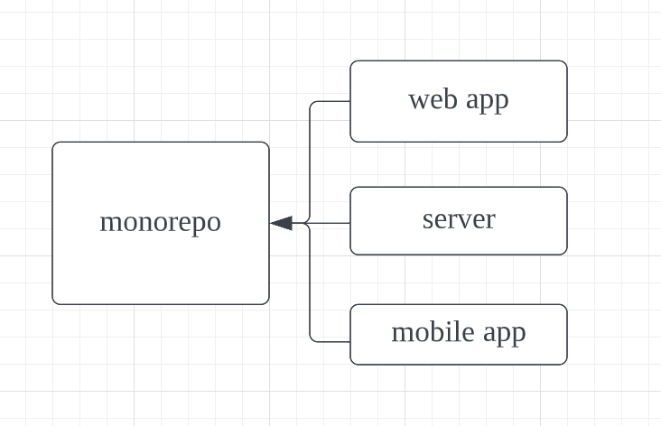

> 参考文章：
>
> [The Many Benefits of Using a Monorepo](https://pspdfkit.com/blog/2019/benefits-of-a-monorepo/)
>
> [精读《Monorepo 的优势》](https://zhuanlan.zhihu.com/p/65533186)
>
> [Introducing The Monorepo & NX](https://medium.com/tenable-techblog/introducing-the-monorepo-nx-18e8b273b66)

## Monorepo

monorepo 是一种源码管理模型。其核心是“所有代码在同一个仓库”



总的来说，**虽然拆分子仓库、拆分子 NPM 包（For web）是进行项目隔离的天然方案，但当仓库内容出现关联时，没有任何一种调试方式比源码放在一起更高效。**

**工程化的最终目的是让业务开发可以 100% 聚焦在业务逻辑上**，那么这不仅仅是脚手架、框架需要从自动化、设计上解决的问题，这涉及到仓库管理的设计。

一个理想的开发环境可以抽象成这样：

“只关心业务代码，可以直接跨业务复用而不关心复用方式，调试时所有代码都在源码中。”

在前端开发环境中，多 Git Repo，多 Npm 则是这个理想的阻力，它们导致复用要关心版本号，调试需要 Npm Link。

另外对于多仓库的缺点，英文原文中还有一些没有提到的因素，这里一并列举出来：

**管理、调试困难**

多个 git 仓库管理起来天然是麻烦的。对于功能类似的模块，如果拆成了多个仓库，无论对于多人协作还是独立开发，都需要打开多个仓库页面。

虽然 vscode 通过 [Workspaces](https://code.visualstudio.com/docs/editor/multi-root-workspaces) 解决多仓库管理的问题，但在多人协作的场景下，无法保证每个人的环境配置一致。

对于共用的包通过 Npm 安装，如果不能接受调试编译后的代码，或每次 npm link 一下，就没有办法调试依赖的子包。

**分支管理混乱**

假如一个仓库提供给 A、B 两个项目用，而 B 项目优先开发了功能 b，无法与 A 项目兼容，此时就要在这个仓库开一个 `feature/b` 的分支支持这个功能，并且在未来合并到主干同步到项目 A。

一旦需要开分支的组件变多了，且之间出来依赖关联，分支管理复杂度就会呈指数上升。

**依赖关系复杂**

独立仓库间组件版本号的维护需要手动操作，因为源代码不在一起，所以没有办法整体分析依赖，自动化管理版本号的依赖。

**三方依赖版本可能不一致**

一个独立的包拥有一套独立的开发环境，难以保证子模块的版本和主项目完全一直，就存在运行结果不一致的风险。

**占用总空间大**

正常情况下，一个公司的业务项目只有一个主干，多 git repo 的方式浪费了大量存储空间重复安装比如 React 等大型模块，时间久了可能会占用几十 GB 的额外空间，对于没有外接硬盘的同学来说，定期清理不用的项目下 `node_modules` 也是一件麻烦事。

**不利于团队协作**

一个大项目可能会用到数百个二方包，不同二方包的维护频率不同，权限不同，仓库位置也不同，主仓库对它们的依赖方式也不同。

一旦其中一个包进行了非正常改动，就会影响到整个项目，而我们精力有限，只盯着主仓库，往往会栽在不起眼的二方包发布上。

所以对于一个非常复杂，又具有技术挑战的大型系统在协作人员多的情况下出现问题的概率非常大，需要通过 Review 制度避免错误的发生，那么将所有相关的源码聚合在一个仓库下，是更好管理的。

但 monorepo 也有一些问题，由于源码在一起，仓库变更非常常见，存储空间也变得很大，甚至几 GB，CI 测试运行时间也会变长。

## 即将过时的方案[NPM/Yarn workspaces](https://code.visualstudio.com/docs/editor/multi-root-workspaces) + [lerna](https://github.com/lerna/lerna)

在过去 Lerna + Yarn Workspace 的形式是社区使用率最高的 Monorepo 方案。

lerna 已经不在作为 monorepo 的推荐方案了，因为有更好的方案可以替代，并且 lerna 本身的维护也成为了一个问题，可能在未来停止维护。

[Lerna is largely unmaintained](https://github.com/lerna/lerna/issues/2703)

仿照官网规范构造的 monorepo 结构

```
.
├── packages
│      ├─ module-a
│      │    ├─ src            # 模块 a 的源码
│      │    └─ package.json   # 自动生成的，仅模块 a 的依赖
│      └─ module-b
│           ├─ src            # 模块 b 的源码
│           └─ package.json   # 自动生成的，仅模块 b 的依赖
├── tsconfig.json             # 配置文件，对整个项目生效
├── .eslintrc                 # 配置文件，对整个项目生效
├── node_modules              # 整个项目只有一个外层 node_modules
└── package.json              # 包含整个项目所有依赖
```

lerna 负责任务调度

```shell
# 为单个软件包或多个软件包运行命令
lerna run xxx
# 管理依赖关系，如果开启了workspace，则不需要用这个，直接yarn
lerna bootstrap
# 发布你的软件包，处理版本管理，并生成更新日志
lerna publish
```

yarn workspace 负责依赖处理

```shell
yarn workspace module-a add vue --dev
```

或者将项目内的 module-a 作为依赖链接给 module-b

```json
{
  "name": "module-b",
  "version": "1.0.0",
  "dependencies": {
    "cross-env": "5.0.5",
    // 将module-a作为module-b的依赖，module-a会直接被引用而不会打包到node_modules
    "module-a": "1.0.0"
  }
}
```

## [Nx](https://nx.dev/) vs [Turborepo](https://turborepo.org/)

Nx 是一个前谷歌成员构建的项目，它吸收了许多 Google、Meta 内部 Monorepo 方案的优点。

lerna 在 5.1 版本过后默认集成了 Nx。

turborepo 最开始是一个个人项目，于去年被 Vercel 收购。

Nx 和 turborepo 做的事情是类似的。但 Nx 已经开发了 5 年之久，而 turborepo 再很多方面还略显稚嫩：

可以参考 Nx 官网的比较： [Nx and Turborepo](https://nx.dev/more-concepts/turbo-and-nx)

### 速度

参考 github 的一个测速的项目： [large-monorepo](https://github.com/vsavkin/large-monorepo)

即便 turborepo 是由 Go 编写的，但在速度上 Nx 还是略胜一筹。

但这个问题会随着 turborepo 的不断更新而改变。毕竟 Go 的上限还是高于 Nx 的 Typescript，可以未来再观察一下。

### 依赖关系

turborepo 通过 package.json 来分析项目的依赖关系，而 Nx 除了 package.json 之外还会检查项目的代码，所以在 Nx 项目里，子项目可以没有 package.json

Nx 还有一个` visibility rules`，可以规定 monorepo 中某些部分的代码是某个团队私有的。比如 service 不能引用 web app 的代码，防止因为团队混杂过后把项目变成了乱麻。

### 项目可视化

两者都提供了项目依赖关系的可视化功能，但 turborepo 只有一个图表，而 Nx 是一个丰富的可交互的工具。

这方面毫无疑问 turborepo 还有很大提升空间。

### 缓存，编辑器支持等

基本上都在 Nx 官网的比较文章里写了。

在工程成熟度方面 Nx 基本上是完胜的

### turborepo 的优势

turborepo 也有优势：

Nx 是基于插件系统的工具，其社区有丰富的插件可供使用，但必要的时候需要自己实现插件。

Turborepo is designed to be **incrementally adopted**，Turborepo 很适合老项目迁移或者需要快速实现比较灵活的 monorepo 的项目。如果是新建一个长期维护且复杂的项目，那优先考虑的还是 NX
