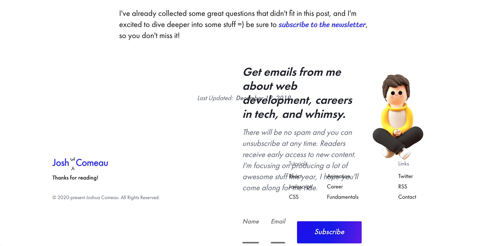
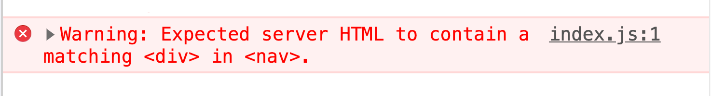
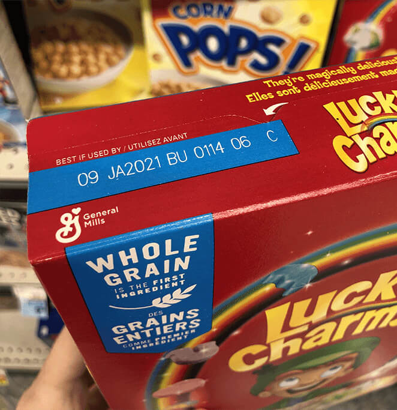

> 前段时间我发现自己的博客网站 html 结构发生了错位, 一些组件，比如 footer 跑到了奇奇怪怪的地方，这个 bug 一度让我手足无措，因为检查 react 代码我并没有发现任何错误。找了很久的资料， 才发现是 SSR 的问题。这
>
> 翻译一篇解释得比较好点的文章，原文： https://www.joshwcomeau.com/react/the-perils-of-rehydration/

# The Perils of Rehydration(补水的风险)

> An Eye-Opening Realization about Gatsby and React

我最近遇到了一个很奇怪的问题。在开发过程中，一切都是那么顺畅，但在生产环境打包过后中，我博客的底部却发生了一些……意想不到的事情：

<center>乱成一锅粥的UI</center>

<center>
  (译者: 哈哈哈, 如你所见, html 错位了, 我的博客错位得更彻底, 完全面目全非,
  为此我提了好几个commit尝试来修改这个问题, 结果都是徒劳)
</center>

我在 devtools 中的 Elements 选项卡进行了一点挖掘，发现了罪魁祸首…我的 React 组件呈现在错误的位置：

```jsx
<!-- 测试环境下一切正常 -->

<main>
  <div class="ContentFooter">
    Last updated: <strong>Sometime</strong>
  </div>
  <div class="NewsletterSignup">
    <form>
      <!-- Newsletter signup form stuff -->
    </form>
  </div>
</main>
```

```jsx
<!-- 在生产环境, 代码就乱飞了 -->

<main>
  <div class="ContentFooter">
    Last updated: <strong>Sometime</strong>
    <div class="NewsletterSignup">
      <form>
        <!-- Newsletter signup form stuff -->
      </form>
    </div>
  </div>
</main>
```

怎么会这样？难道我发现了 React 中的一个 Bug？我检查了 React Devtools 的 "⚛️Components " 选项卡，它告诉了我一个不同的故事，在这个故事里，一切都很好，所有的组件都躺在它们应该在的地方。骗子啊!

原来，我对 React 在 SSR 下的工作方式有根本性的误解。而我想**很多**React 开发人员都有这样的误解! 而且它可能会带来一些很严重的影响。

这里贴上 React 官方对于服务器端渲染可能出现的不匹配给出的[解释](https://zh-hans.reactjs.org/docs/react-dom.html#hydrate)。

> 作者在出了个视频教程, 教程内容就是复现 gatsby 在 ssr 生产环境产生的错误渲染, 及其原因和解决办法
>
> [视频链接](https://egghead.io/lessons/react-avoiding-state-flickers-in-gatsby-applications?pl=undefined&af=49agrw)

## 一些有问题的代码

下面这个是一段会导致错误渲染的问题代码, 你能找到问题在哪吗?

```jsx
function Navigation() {
  if (typeof window === 'undefined') {
    return null;
  }
  // 假设个function存在
  // 并返回 user 对象或者 null
  const user = getUser();
  if (user) {
    return <AuthenticatedNav user={user} />;
  }
  return (
    <nav>
      <a href="/login">Login</a>
    </nav>
  );
}
```

很长一段时间，我都会认为这个代码是 OK 的。直到有一天我的博客扭曲成了毕加索的画。

本教程旨在找到幕后的原因，使我们了解服务器端渲染的工作原理。我们将知道为什么这段代码的逻辑会有问题，以及我们如何用不同的方法来实现避免出现这样的错误。

## Server-side rendering 的第 101 件事

想要理解这个问题，我们需要先了解一下 Gatsby 或 Next.js 这种 SSR 框架和普通的 client-side 通过 react 构建的应用之间的区别。

当你通过 create-react-app 这种脚手架构建 react 应用的时候，所有的渲染都发生在浏览器中。不管你的应用有多大，浏览器都将收到一个初始的 HTML 文档，看起来就像这样：

```html
<!DOCTYPE html>
<html lang="en">
  <head>
    <!-- Maybe some stuff here -->
  </head>
  <body>
    <div id="root"></div>
    <script src="/static/bundle.js"></script>
    <script src="/static/0.chunk.js"></script>
    <script src="/static/main.chunk.js"></script>
  </body>
</html>
```

这个页面基本上是空的，但它包括几个 JS 脚本。一旦浏览器下载并解析了这些脚本，React 就会建立一个页面应该是什么样子的切片，并注入一堆 DOM 节点使之成为这样的切片。这就是所谓的客户端渲染(client-side-render)，因为所有的渲染都发生在客户端（用户的浏览器）中。

但所有的这些过程都会耗时，当浏览器和 React 在进程中施展魔法时，屏幕前用户却只能盯着空白的屏幕。这不是最好的体验。

聪明的人意识到，如果我们能在服务器上进行渲染，我们就能给用户发送一个完整的 HTML 文档。这样一来，当浏览器下载、解析和执行 JS 的时候，他们就有东西可看了。这就是所谓的服务器端渲染（SSR）。

服务器端渲染可以在性能上取胜，但问题是，这些工作仍然需要按需完成。当你请求 your-website.com 时，React 必须将你的 React 组件转化为 HTML，而你在等待的过程中仍然会盯着一个空白的屏幕。只是这些工作是在服务器上完成的，而不是在用户的电脑上。

更机智的人发现，许多网站和应用的一些大的代码 chunk 是静态的，它们可以在编译时构建。我们可以提前在我们的开发机器上生成初始 HTML，并在用户请求时立即分发。我们的 React 应用可以像普通的 HTML 网站一样快速加载！而这正是 Gatsby 所做的事情（以及 Next.js，在某些配置下）。当你运行`yarn build`构建时，它会为你网站上的每一条路径生成一个 HTML 文档。每一个侧页、每一篇博客文章、每一个商店项目---都会为它们创建一个 HTML 文件。

> 这一切只是服务器端的渲染吗？
> ​ 不幸的是，这个过程中进行了多次语义转换，而且这个过程可能非常难以理解。从技术上讲，Gatsby 所做的是服务器端渲染，因为它在 Node.js 上使用相同的 ReactDOMServer API 来渲染 React 应用，就像一个传统的服务器端渲染一样。不过在我看来，这两者在概念上是不同的。"服务器端渲染 "是在你的实时生产服务器上实时发生的，是对请求的响应，而 Gatsby 在编译时即进行渲染则发生得更早，是构建过程的一部分。
>
> 有些人开始把它称为 SSG，它要么代表 "Static Site Generation"，要么代表 "Server-Side Generate"，这取决于你问谁。

### 客户端上的代码

现在我们构建的应用都是交互式的，动态的---用户已经习惯了单靠 HTML 和 CSS 无法完成的网页体验！所以我们仍然需要运行客户端的 JS。

客户端 JS 包括在编译时生成的相同的 React 代码。它在用户的设备上运行，并建立一个整个网页应该是什么样子的切片。然后，它将其与文档中构建的 HTML 进行比较。这是一个被称为补水(`rehydration`)的过程。（译者：在 ssr 中，没有添加 react 脚本的 dom tree 就像干巴巴的枯枝，把 js 代码注入进去的过程就像给干海绵补水，所以才叫`rehydration`）

关键的是，`rehydration`与渲染不是一回事。在典型的渲染中，当`props`或`state`发生变化时，React 会比对差异并更新 DOM。在`rehydration`中，React 假设 DOM 不会改变。它只是试图采用现有的 DOM。

## 动态变化的 Sections

让我们重回代码：

```jsx
const Navigation = () => {
  if (typeof window === 'undefined') {
    return null;
  }
  // Pretend that this function exists,
  // and returns either a user object or `null`.
  const user = getUser();
  if (user) {
    return <AuthenticatedNav user={user} />;
  }
  return (
    <nav>
      <a href="/login">Login</a>
    </nav>
  );
};
```

按逻辑，这个组件会返回三种可能的结果：

- 如果 user 登录了， 渲染`<AuthenticatedNav>`组件
- 如果 user 不登录，渲染`<UnauthenticatedNav>`组件
- 如果我们不知道 user 登录与否, 什么都不渲染。

### 薛定谔的 user

对于我们的 app 而言， 在用户进入往后的前几分钟，我们并不知道他们是否已经登录， 就像薛定谔的猫。

这是因为 HTML 文件是在编译时建立的。无论他们是否登录，每个用户都会得到一份相同的 HTML 副本。一旦 JS bundle 被解析和执行，我们就可以更新 UI 来反映用户的状态，但在这之前有一个很大的时间差。请记住，SSG 的目的是在我们下载、解析和`rehydration`应用时给用户一些东西看，这在 3G 冲浪的设备上可能是一个漫长的过程。

许多 webapps 选择默认显示 "注销 "状态，这就导致了你之前可能遇到的闪烁情况。

import VideoComponent from '../../../src/components/Video.tsx';

<VideoComponent src="https://www.joshwcomeau.com/_next/static/media/guardian-with-effect-5c8e3ed088ad6d3b9efa334a4dd7f62b.mp4" />

<VideoComponent src="https://www.joshwcomeau.com/_next/static/media/airbnb-243d77013adf202e2a581a262a1c7fe8.mp4" />

<center>Airbnb也犯了同样的错误，默认切换到了未登录的navigation bar</center>

我创建了一个小的 gatsby 应用，用来复现这个问题：

<VideoComponent src="https://www.joshwcomeau.com/_next/static/media/the-problem-c1dacc92a2a2cc3b25463b8d785a732f.mp4" />

<center>在3G网速下，错误的状态会维持一长段时间</center>

> 如果你愿意，你可以自己试一试。点击 "登录 "链接进行假登录，再点击就可以退出。

### 一个想法很好，但是有缺陷的尝试

在以下分享的代码片段中， 我们尝试通过这几行代码解决这个问题：

```jsx
const Navigation = () => {
  if (typeof window === 'undefined') {
    return null;
  }
```

这么做的想法是合理的。我们初始的`compile-time`构建发生在 Node.js，一个服务器运行时。我们可以通过检查`window`对象是否存在来检测我们是否在服务器上渲染。如果不存在，我们可以提前中止渲染。

但问题是，这样做，我们就违反了规则。😬

## Rehydration ≠ render

当 React 应用补水时，它会假设 DOM 结构固定不变。

当 React 应用第一次在客户端上运行时，React 通过挂载你的所有组件，建立起 DOM 应该是什么样子的切片。然后，它眯着眼睛看页面上已有的 DOM 节点，并试图将两者匹配在一起。它不是在玩 "大家来找茬 "的游戏，它只是想把两个节点拼接在一起，以便将来的更新能够正确处理。

服务器端渲染这些不同的东西的过程，我们就像黑进整个系统的黑客。我们丢给了 React 一坨 html 代码，然后让 React 自己去见缝插针生成另外的 html。

```jsx
<!-- 构建过程中生成的初始html -->

<header>
  <h1>Your Site</h1>
</header>
```

```jsx
<!-- 补水过后react期待的html -->

<header>
  <h1>Your Site</h1>
  <nav>
    <a href="/login">Login</a>
  </nav>
</header>
```

有点值得注意的是，React 有时候还是可以处理这种情况的。你可能在不知情的情况下犯了这种错误, 但是逃过了一劫。但你这无疑是在玩火。补水过程的优化是为了 ⚡️ 快速 ⚡️，而不是为了捕捉和修复不匹配。

### gatsby 的问题

React 团队知道补水不匹配可能会导致页面显示错误的问题，他们选择在控制台抛出错误来提醒你构建出来的 html 可能不匹配：



不幸的是，Gatsby 只有在生产构建时才会使用服务器端渲染的 API。而且由于 React 警告一般只在开发过程中发生，这意味着当使用 Gatsby😱 构建时，这些警告永远不会被显示出来(哪怕是报错，你也不知道报错原因)。

这是一种权衡。通过在开发中选择不使用服务器端渲染，Gatsby 可以更好地热更新以及优化构建过程。让你能够快速看到你所做的更改是[非常非常重要的](https://vimeo.com/36579366)。Gatsby 优先考虑的是速度，而不是准确性。

这是个很重要的问题，不过；在[一个公开讨论的问题](https://github.com/gatsbyjs/gatsby/issues/17914)中，人们正在倡导改变这一设定，我们可能会在以后的版本中开始看到补水地警告。

不过在那之前，在使用 Gatsby 开发时，注意这一点尤为重要!

## 解决办法

为了避免问题的发生，我们需要确保补水后的应用与原始 HTML 相匹配。那么我们如何管理 "动态 "数据呢？

下面是解决方案的样子。

```jsx
function Navigation() {
  const [hasMounted, setHasMounted] = React.useState(false);
  React.useEffect(() => {
    setHasMounted(true);
  }, []);
  if (!hasMounted) {
    return null;
  }
  const user = getUser();
  if (user) {
    return <AuthenticatedNav user={user} />;
  }
  return (
    <nav>
      <a href="/login">Login</a>
    </nav>
  );
}
```

我们初始化一块状态，`hasMounted`，为`false`。当它为`false`时，我们就不会去渲染 "真实 "内容。

在`useEffect`调用里面，我们立即触发重新渲染，将`hasMounted`设置为`true`。当这个值为真时，"真实 "内容就会被渲染。

与我们之前的解决方案不同的是：`useEffect`只有在组件挂载后才会启动。当 React 应用在补水过程中去查看 DOM 时，`useEffect`还没有被调用，因此我们满足了 React 的期望。

```jsx
<!-- 构建过程中生成的初始html -->

<header>
  <h1>Your Site</h1>
</header>
```

```jsx
<!-- 补水过后react期待的html -->

<header>
  <h1>Your Site</h1>
</header>
```

在这个比较之后，我们立即触发一个重新渲染，这让 React 可以做一个适当的调节。它会注意到这里有一些新的内容需要渲染--要么是一个认证的菜单，要么是一个登录链接，然后相应地更新 DOM。

我们的重现案例中，这个解决方案是这样的。

<VideoComponent src="https://www.joshwcomeau.com/_next/static/media/the-initial-solution-83aaef44bf7c39a4f53761ac58e230ce.mp4" />

<center>
  在初始渲染时，会显示一个空白点。挂载后，重新渲染会以真实状态更新它。
</center>

## 双重(two-pass)渲染

你有没有注意到，麦片上的有效期显然不是和盒子的其他部分同时印上去的？是印上去的，事后才印上去的。


这其中有一个逻辑：麦片盒印刷是一个两步走的过程。首先，所有 "通用 "的东西都会被印刷出来：logo、卡通小精灵、放大到显示纹理的照片、智能手表的随机图片。因为这些东西都是静态的，所以可以大规模生产，一次印刷几百万张，提前几个月就可以完成。

但是有效期的标签并不能这么做。在批量生产的时候，制造商根本不知道有效期应该是多少；装满这些盒子的麦片可能还不存在呢！所以他们印上一个空的蓝色长方形。很久以后，当麦片生产出来并注入盒子后，他们就可以在白色的有效期上盖章，然后打包发货。

双重渲染也是同样的想法。第一遍，在编译时，产生所有的静态非个人内容，并在动态内容的地方留下漏洞。然后，在 React 应用挂载到用户的设备上后，第二次传递将所有依赖于客户端状态的动态内容像标签一样贴上去。

### 涉及的问题

两次渲染的缺点是它会延迟交互时间。一般来说，在挂载后就强制渲染是不可取的。

尽管如此，对于大多数应用来说，这应该不会有太大的影响。通常动态内容的数量相对较少，并且可以快速调节。如果你的应用中有大块的内容是动态的，你就会错过预渲染的许多好处，但这是不可避免的，动态部分无法提前定义制作。

和以往一样，**如果你对性能有顾虑，最好自己做一些实验**。

## 抽象理解

在这个博客上，我最终需要将一些渲染决定推迟到第二遍，我已经厌倦了一遍又一遍地写同样的逻辑。我创建了一个`<ClientOnly>`组件来抽象它：

```jsx
function ClientOnly({ children, ...delegated }) {
  const [hasMounted, setHasMounted] = React.useState(false);
  React.useEffect(() => {
    setHasMounted(true);
  }, []);
  if (!hasMounted) {
    return null;
  }
  return <div {...delegated}>{children}</div>;
}
```

然后，你可以将它包裹在你想推迟的任何元素上。

```jsx
<ClientOnly>
  <Navigation />
</ClientOnly>
```

我们也可以使用一个定制的钩子：

```jsx
function useHasMounted() {
  const [hasMounted, setHasMounted] = React.useState(false);
  React.useEffect(() => {
    setHasMounted(true);
  }, []);
  return hasMounted;
}
```

```jsx
function Navigation() {
  const hasMounted = useHasMounted();
  if (!hasMounted) {
    return null;
  }
  const user = getUser();
  if (user) {
    return <AuthenticatedNav user={user} />;
  }
  return (
    <nav>
      <a href="/login">Login</a>
    </nav>
  );
}
```

有了这一招，我就能解决我的渲染问题了。我的一天被拯救了!（译者：👴 的 n 天也被拯救了）

## 心智模型

虽然整洁，但抽象的东西并不是本教程最重要的部分。关键的一点是心智模型。

在 Gatsby 应用程序中工作时，我发现用两段式渲染的方式思考真的很有帮助。第一次渲染发生在编译时，时间提前了很久，为页面奠定了基础，填入了所有用户通用的内容。然后，在很久以后，在用户打开网页的时候，第二次渲染将填入因人而异的状态。

Gatsby 有时被称为 "静态网站生成器"，但这个名字感觉很有局限性--你可以用 Gatsby 构建丰富的、动态的 Web 应用！它确实需要一点特别的考虑。它确实需要一点特殊的考虑，但有了正确的心理模型，任何事情都有可能发生 💫。
