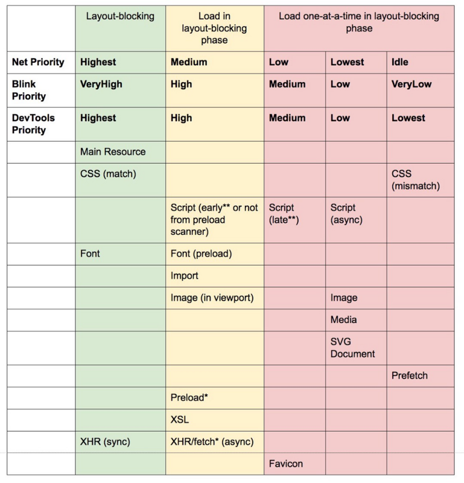
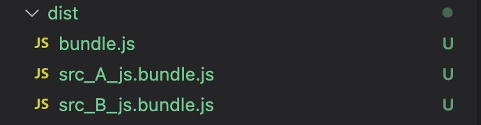
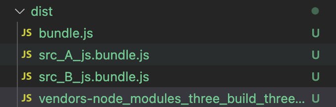

> 文档：[webpack 文档](https://webpack.js.org/guides/code-splitting/)
>
> 常用的代码切割为两种，第一种是用`SplitChunksPlugin`将第三方 vendor 切割以增强缓存效果，第二种是利用动态 import，对业务代码进行切割。这里更多地讨论第二种切割形式。

## 按路由切割

按路由切割是最常见的代码切割形式。不做过多赘述。

```jsx
import { lazy } from 'react';
<Switch>
	<Route path="/" component={lazy(() => import(
    /* webpackChunkName: "index" */ "./Index"
  ))}
</Switch>
```

如果不手动指定 chunkname，生成的 js 会按照 webpack 配置的的`chunkFilename`规则生成文件名。

按路由切割代码可以极大地降低首屏加载时间，每个多路由的 app 都应该对其路由进行代码切割。

## 按需加载

场景：

1. 需要用户操作过后才执行的 JS。比如点击按钮才出现的弹窗等。
2. 不同权限的用户。部分功能限制了权限，没必要将所有代码都下载下来。
3. DOM 节点过多的页面，初次渲染会非常卡，这时候可以类似于图片懒加载或虚拟 list，搭配上[react-intersection-observer](https://www.npmjs.com/package/react-intersection-observer)等库减少页面 DOM 节点数量

```jsx
import { lazy } from 'react';
const HeavyComponent = lazy(() => import('./HeavyComponent'));
const Container = () => {
  const [show, setShow] = useState(false);

  return show ? (
    <HeavyComponent />
  ) : (
    <button onClick={() => setShow(true)}>Show component</button>
  );
};
```

**注意**：当用户点击按钮的时候我们才会去向后端请求相应的 component 代码（缓存有效），所以按需加载会导致用户在第一次使用功能时有一段请求代码的等待时间。为了降低用户的等待焦虑，可以添加过渡的 UI

```jsx
import { lazy, Suspense } from 'react';
const HeavyComponent = lazy(() => import('./HeavyComponent'));
const Container = () => {
  const [show, setShow] = useState(false);

  return (
    <Suspense fallback={<div>loading...</div>}>
      show ? <HeavyComponent />:{' '}
      <button onClick={() => setShow(true)}>Show component</button>
    </Suspense>
  );
};
```

## 预加载/预获取

- **prefetch**(预获取)：将来某些导航下可能需要的资源
- **preload**(预加载)：当前导航下可能需要资源

prefetch/preload 的目的是解决上一步按需加载的等待问题。

```jsx
import { lazy, Suspense } from 'react';
const HeavyComponent = lazy(() =>
  import(/* webpackPrefetch: true */ './HeavyComponent')
);
const Container = () => {
  const [show, setShow] = useState(false);

  return (
    <Suspense fallback={<div>loading...</div>}>
      show ? <HeavyComponent />:{' '}
      <button onClick={() => setShow(true)}>Show component</button>
    </Suspense>
  );
};
```

与 prefetch 指令相比，preload 指令有许多不同之处：

- preload chunk 会在父 chunk 加载时，以并行方式开始加载。prefetch chunk 会在父 chunk 加载结束后开始加载。
- preload chunk 具有中等优先级，并立即下载。prefetch chunk 在浏览器闲置时下载。
- preload chunk 会在父 chunk 中立即请求，用于当下时刻。prefetch chunk 会用于未来的某个时刻。
- 浏览器支持程度不同。

**预加载 preload**

通过代码切割将一些优先级较低但会阻塞页面初次渲染的脚本延迟加载。

例如本博客的 header，因为包含有音乐播放器等代码，gzip 过后也接近 40kb，在初次渲染的时候完全用不到，所以可以进行代码拆分，然后用 preload 降低其优先级。

preload 最常用于首屏优化，将一些对 UI 影响不大但本身体积较大的资源延迟加载，比如字体，比较小但逻辑代码量大的 UI 组件，异步加载渐进增强的 CSS 等。对于 UI 代码的 preload，可以配合上`react-content-loader`等过渡手段。

```js
import(/* webpackLoad: true */ './Breadcrumb.js');
```

**预获取 prefetch**

prefetch 在官方文档里虽然说的是用于提前获取其他页面的内容。但实际上 prefetch 更常用的地方就是按需加载。

例如：有一个 `HomePage` 组件，其内部渲染一个 `LoginButton` 组件，然后在点击后按需加载 `LoginModal` 组件。

LoginButton.js

```js
import(/* webpackPrefetch: true */ './path/to/LoginModal.js');
```

这会生成 `<link rel="prefetch" href="login-modal-chunk.js">` 并追加到页面头部，指示着浏览器在闲置时间预取 `login-modal-chunk.js` 文件。

当用户再去点击`LoginButton`的时候，就可以直接显示 modal 而不需要等待。

附带资源优先级表：



图片来源和详细解释：[preload-prefetch-and-priorities-in-chrome](https://medium.com/reloading/preload-prefetch-and-priorities-in-chrome-776165961bbf)

## code-splitting 的误区

Code-splitting 不是解决前端性能的银弹，相反，它可能引入更多的问题。

### 负优化

1. code splitting 会增加整体代码的体积。
2. code splitting 会增加请求的数量, 阻塞 http 请求。
3. 错误的代码分割会导致页面多次重排甚至页面闪烁。

通过检查 web-vitals，控制台 performance 或者 google page insights 量化性能优化的结果，

不要做提前优化或者过度设计。

### Tree-shaking 的问题

> [Dynamic Import and Tree Shaking in JavaScript](https://betterprogramming.pub/dynamic-import-and-tree-shaking-in-javascript-ddc2f3cd69f)

**动态 Import 不支持 tree-shaking**

你有一个工具库

util.js

```js
export const add = (a, b) => a + b;
export const subtract = (a, b) => a - b;
export const multiply = (a, b) => a * b;
export const divide = (a, b) => a / b;
```

你想在其他地方用它

```js
async function container() {
  const { add } = await import('./util.js');
}
```

webpack 并不会对 util.js 做 tree shaking，另外三个 named export 都会被标记为`harmony export`而不是` unused harmony exports`。

还有一个更要命的场景：

假如我有两个切割出去的 bundle 用到了上面的 util.js, 此时我们不对 utils 进行动态加载，但是我们对 A，B 两个文件进行动态加载：

```js
// 文件A
import { add } from './util.js';

export const a = () => {
  console.log(add(1, 1));
};
```

```js
// 文件B
import { subtract } from './util.js';

export const b = () => {
  console.log(subtract(2, 1));
};
```

```js
// container
const A = import('./A.js');
const B = import('./B.js');
```

通过 webpack 打包，最后打出来的



其中 A 的 bundle:

```js
eval(
  '/* harmony export */ __webpack_require__.d(__webpack_exports__, {\n/* harmony export */   "pow": () => (/* binding */ pow),\n/* harmony export */   "subtract": () => (/* binding */ subtract)\n/* harmony export */ });\n/* unused harmony exports multiply, divide */\nconst pow = (a, b) => a ** b;\nconst subtract = (a, b) => a - b;\nconst multiply = (a, b) => a * b;\nconst divide = (a, b) => a / b;\n\n\n//# sourceURL=webpack://test-split/./src/util.js?'
);
```

被标记为`unused harmony exports`的部分会在 production mode 下删除，所以 util 文件可以正常 tree-shaking。

但在 A 文件内，我实际上只需要`add`方法，`subtract`是不需要的，但是 webpack 管不了那么多，这是因为在 webpack 的 process 中，tree-shaking 属于 minification，是构建过程中较靠后的一步，在 code-splitting 之后执行。

除了 A 的 bunddle 中打进去了不需要的引入外，B 中也有一份重复的代码，app 的整体代码量就增加了。

如果我们用`SplitChunksPlugin`将第三方库作为 vendor 分离出去，如下

将上面例子里的 util.js 替换成前端 3D 库 three.js:



那么这个 vendor 会导出 A 和 B bundle 用到的所有的代码，并不会做区分。

按路由来进行代码切割的时候，不同路由对应的页面，可能会因为 tree-shaking 的问题，下载该路由本身不需要的代码。
