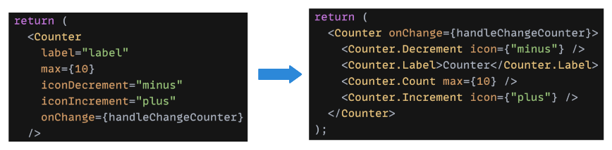
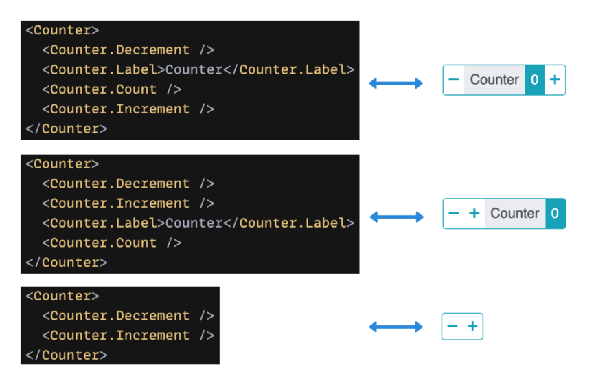
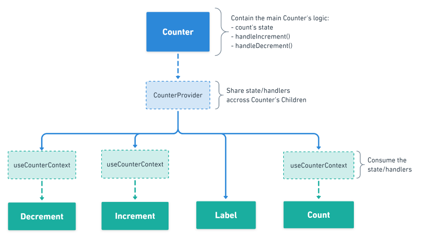
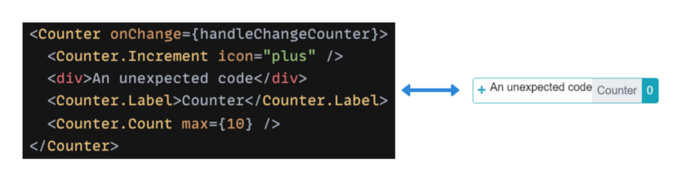
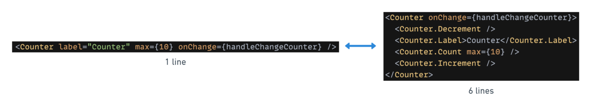
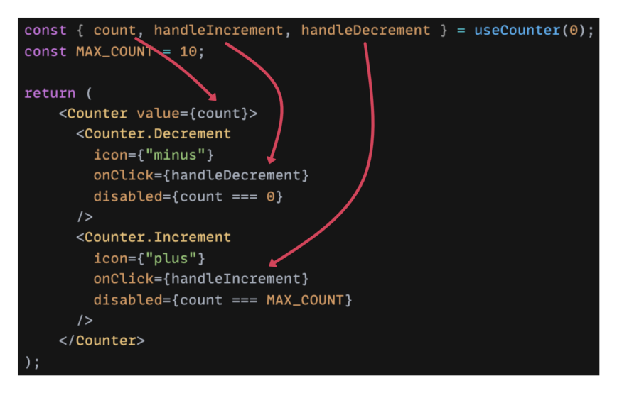
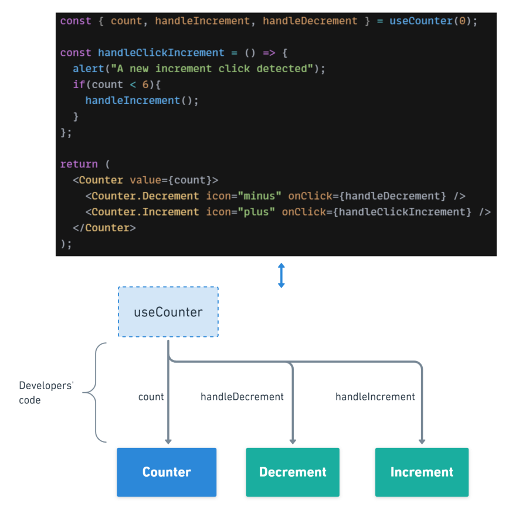

> 参考文章:
>
> [5 Advanced React Patterns](https://javascript.plainenglish.io/5-advanced-react-patterns-a6b7624267a6) 
>
> [React Hooks的体系设计之二 - 状态粒度](https://zhuanlan.zhihu.com/p/108432109)

## 前言

近日被国外前团队遗留的前端代码折磨得够呛，刷新了我对 react 代码混乱程度的认知，很长一段时间我每天都带着痛苦面具去阅读他们的代码。

在不断地往屎山上继续糊屎的同时，我也一直在反省：我自己以前写的代码是否也有这些问题？他们为什么会选择这样设计？对于这种复杂程度高，业务容易变化以及高度集成了第三方库的UI，我应该怎么设计？

本文就是搜集一些资料，整理一下 react hooks 组件的粒度控制、设计模式以及对上个项目代码的痛点的一些反思。

## React 组件设计模式

以实现一个加减的`Counter`为例:


如何判断一个组件设计的好坏？根据实际工作中的需求，我认为判断的标准有以下几点：

- api 数量：api 的数量不宜过多，如果 api 数量过多，就该考虑进一步拆分组件或者重新整理逻辑把次要 api 合并为 option 对象。
- 解耦程度：与业务或者其他组件的耦合程度直接影响单元测试或者复用难度，前端组件也应最大限度地遵循低耦合高内聚的原则，当然，把所有相似逻辑写在一个文件里这不叫高内聚，这叫高耦合, 这也是上个项目最令人头痛的一点。
- 可拓展性，可复用性：主要是组件接口设计的灵活度，比如一个`Modal`组件暴露了一个传入`title`的接口，可以选择接受一个 `ReactNode`，也可以只接受一个字符串，从扩展性和复用性来说，前者无疑碾压了后者。早期设计的组件不可能覆盖掉未来的业务场景，但是如果提前过度设计又会无端增加组件的复杂度。
- 可维护性：严格来说，以上三点都属于可维护性这一条。命名是否规范，该有的注释是否存在, 逻辑封装得是否恰当？好的代码往往结构分明风格统一，而烂代码总是烂得清新脱俗。

### 复合组件

> [代码示例](https://github.com/alex83130/advanced-react-patterns/tree/main/src/patterns/compound-component)

```tsx
import React from "react";
import { Counter } from "./Counter";

function Usage() {
  const handleChange = (count) => {
    console.log("count", count);
  };

  return (
    <Counter onChange={handleChange}>
      <Counter.Decrement icon="minus" />
      <Counter.Label>Counter</Counter.Label>
      <Counter.Count max={10} />
      <Counter.Increment icon="plus" />
    </Counter>
  );
}

export { Usage };
```

这种设计模式常见于各UI库的`Form`表单组件, 比如 antd, bootstrap 等。

**优点:**

1. 降低组件 API 复杂度

不再把所有的 `props` 都放在一个大的父容器组件中, 再传递给子组件； 而是直接将相应的`props`附加在相应的子组件上。这样做`API`的复杂度是最低的。



2. 灵活的UI结构:

这种模式下；开发出的组件有较强的的 `UI` 灵活性；允许从单个组件创建各种情况。例如，用户可以更改子组件的顺序或者定义应该显示哪一个



3. 职责分离:

更多的逻辑以及组件的 `state` 在 `Counter` 组件中，通过 `React.Context` 共享 `state` 以及方法给所有的子节点，做到组件间的`通讯`；每个组件都有比较明确的分工



**缺点:**

1. 界面灵活性太大:

拥有灵活性的同时，还有可能引发意外行为； 例如

- 将不需要的组件的子组件放置在一起
- 将组件的子组件弄乱
- 忘记包含强制子组件

使用不当，就会出现各种奇怪问题，而且会导致做出来的系统没有按照标准的公司交互规范去做



2. 写更多的 JSX:

这样设计出的组件将会增加`JSX`的行数；如果过使用的 `eslint、Prettier` 等code formatter工具可能行数更多；

从单个组件来看没有大问题，整个页面随着使用组件的变多，就会出现较大的影响



复合组件的可拓展性和复用性都相当优秀, 除了会拖慢码字效率之外, 是相当优秀的设计模式。

### Props 受控

> [代码示例](https://github.com/alex83130/advanced-react-patterns/tree/main/src/patterns/control-props)

这个模式理解比较容易, 而且几乎是最常见的 react 代码设计模式, 将组件转换为受控组件，通过直接修改 `Props` 影响组件内部的状态；

```jsx
import React, { useState } from "react";
import { Counter } from "./Counter";

function Usage() {
  const [count, setCount] = useState(0);

  const handleChangeCounter = (newCount) => {
    setCount(newCount);
  };
  return (
    <Counter value={count} onChange={handleChangeCounter}>
      <Counter.Decrement icon={"minus"} />
      <Counter.Label>Counter</Counter.Label>
      <Counter.Count max={10} />
      <Counter.Increment icon={"plus"} />
    </Counter>
  );
}

export { Usage };
```

**优点:**

提供更多的控制, 组件的状态暴露在组件之外, 用户可以方便地集中管理

**缺点:**

1. 对于相对复杂的UI来说, 如果状态全部由父组件控制, 会导致父组件状态相当多, 后期难以维护.
2. 子组件需要对父组件传入的值进行监控和验证, 增加了组件复杂度

### 自定义钩子

> [代码示例](https://github.com/alex83130/advanced-react-patterns/tree/main/src/patterns/custom-hooks)

将业务逻辑逻辑转移到一个**自定义钩子**中。用户可以访问这个钩子，并公开了几个内部逻辑(状态、处理程序) ，通过依赖监听，让程序员更好地控制组件。

```jsx
import React from "react";
import { Counter } from "./Counter";
import { useCounter } from "./useCounter";

function Usage() {
  const { count, handleIncrement, handleDecrement } = useCounter(0);
  const MAX_COUNT = 10;

  const handleClickIncrement = () => {
    //Put your custom logic
    if (count < MAX_COUNT) {
      handleIncrement();
    }
  };

  return (
    <>
      <Counter value={count}>
        <Counter.Decrement
          icon={"minus"}
          onClick={handleDecrement}
          disabled={count === 0}
        />
        <Counter.Label>Counter</Counter.Label>
        <Counter.Count />
        <Counter.Increment
          icon={"plus"}
          onClick={handleClickIncrement}
          disabled={count === MAX_COUNT}
        />
      </Counter>
      <button onClick={handleClickIncrement} disabled={count === MAX_COUNT}>
        Custom increment btn 1
      </button>
    </>
  );
}

export { Usage };
```

**优点:**

灵活而简洁。自定义 hooks 的依赖和返回值可以自由控制，而且多个 hooks 可以组合使用，通过自定义 hooks 可以极大减少父组件文件的代码量，对于子组件来说，状态的管理类似于 Props 受控，总的来说是 props 受控模式的优化版。

**缺点：**

1. 由于**逻辑部分**与**呈现部分**分离，因此用户必须将两者连接起来。要正确实现组件，需要对组件的工作方式有很好的理解。
2. 代码实现起来较为复杂。



### Props Getter

> [代码示例](https://github.com/alex83130/advanced-react-patterns/tree/main/src/patterns/props-getters)

自定义 `Hooks` 提供了很好的控制方式；但是比较难以集成；提高了集成的复杂度；

Props Getters 模式试图去掩盖这种模式的复杂度；通过自定义` hooks` 或者 `ref`，返回一系列的函数或者属性；每个函数和属性都有比较明确的命名，方便使用者将 `JSX` 正确的关联起来；

```jsx
import React from "react";
import { Counter } from "./Counter";
import { useCounter } from "./useCounter";

const MAX_COUNT = 10;

function Usage() {
  const {
    count,
    getCounterProps,
    getIncrementProps,
    getDecrementProps
  } = useCounter({
    initial: 0,
    max: MAX_COUNT
  });

  const handleBtn1Clicked = () => {
    console.log("btn 1 clicked");
  };

  return (
    <>
      <Counter {...getCounterProps()}>
        <Counter.Decrement icon={"minus"} {...getDecrementProps()} />
        <Counter.Label>Counter</Counter.Label>
        <Counter.Count />
        <Counter.Increment icon={"plus"} {...getIncrementProps()} />
      </Counter>
      <button {...getIncrementProps({ onClick: handleBtn1Clicked })}>
        Custom increment btn 1
      </button>
      <button {...getIncrementProps({ disabled: count > MAX_COUNT - 2 })}>
        Custom increment btn 2
      </button>
    </>
  );
}

export { Usage };
```

**优点:**

方便将组件集成到已有的页面中；使用者只需要将相应的 `getter` 放置在合适的 `JSX` 中，而不需要再定义一些 `state` 赋值给组件



**缺点:**

缺乏可见性。由于整个组件的使用以及赋值等操作，均有 `getter` 进行管理；导致整个使用流程是不透明的。用户想要修改部分逻辑，就需要要详细的知道每个 `getter` 相应的逻辑。

## HoC 高阶组件

高阶组件一般可以直接被自定义 hooks 替代。

上一个项目深度集成了一个grid插件-[ag-grid](https://www.ag-grid.com/documentation/)

该组件最大的问题就是不能受控，UI 组件的视图只和插件内部的状态相关，处于一个黑盒状态。

我们如果想控制 ag-grid 的 UI, 只能通过它暴露的API来控制, 但项目深度集成了这个插件，使用该插件的地方很多，会产生大量重复的代码（比如验证，复制粘贴，setter及getter等），我们选择将这部分逻辑作为HoC，扩展到了一般的组件上，减少了大量业务代码。

## 状态粒度控制

状态的粒度也是我们做组件设计时需要考虑的事。

`useState`出现过后, 我们可以很方便地拆分状态, 但并不是所有的状态都要拆分开，过多的状态会让取名困难症患者陷入痛苦，而且样板代码会变得非常多。

### 粒度过细

```jsx
const TodoList = () => {
    const [dataSource, setDataSource] = useState([]);
    const [isLoading, setLoading] = useState(true);
    const [filterText, filterByText] = useState('');
    const [filterType, filterByType] = useState('all');
};
```

实际上项目里经常看到十几个`useState`排下来的情况。

### 粒度过粗

```jsx
const DEFAULT_STATE = {
    dataSource: [],
    isLoading: true,
    filterText: '',
    filterType: 'all',
};

const TodoList = () => {
    const [state, setState] = useState(DEFAULT_STATE);
};
```

这种代码估计只有刚从class组件过渡到hooks的新手写得出，状态的合并会让状态的复用变得不够清晰，属于代码优化层面的事，不应该在一开始就合并状态。

在使用对象或数组作为状态的时候, 最好使用`immer`或者`useImmer`, 将可变对象转为不可变对象, 减少`setState`时书写的代码

### 折中的粒度解决办法

粒度控制不能太粗不能太细, 以下是一些辅助粒度控制的这种办法.

#### useReducer

使用`useReducer`可以在不少轻量级的场景里快速地将状态声明和状态更新放在一起

```jsx
const SelectableList = () => {
    const [selectionState, dispatchSelectionState] = useReducer(
        (state, action) => {
            switch (action.type) {
                case 'select':
                    return {
                        selection: state.selection.concat(action.payload),
                        lastSelected: action.payload,
                    };
                default:
                    return state;
            }
        },
        {selection: [], lastSelected: 0}
    );
};
```

#### 自定义hook

这是我很常用的一种方式, 与设计模式中的自定义hook稍微有点区别, 此处的自定义hook往往只抽离出去特定业务逻辑的状态, 然后多个自定义hook组合起来。

自定义hook的好处是，隐藏逻辑，以及方便逻辑复用。

```jsx
const SelectableList = () => {
  	const [active, setActive] = useState(false)
    const [list, setList] = useList();
  	const {stateWithActive} = useStateWithActive(active)
    return ...
};
```

粒度控制需要视具体业务场景而定, 最常见的两种场景:

1. 逻辑类似的几个组件, 有可复用的状态和`handle`函数，我会抽离hook
2. 维护老代码，文件已经面目全非不能阅读，我不敢删减，又不想再增加代码长度，选择抽离一个hook，来实现自己的逻辑。

## 上个项目的优劣

维护项目已有两个月，我已经很熟悉项目的大部分代码，也了解了项目从无到屎山的进化路程。

### 做得好的点

1. 虽然代码很乱，但是很神奇的是居然能上线使用并且没出太多茬子。
2. 前端的架构者封装了很全的 Helper 工具类，一定程度上减少了接手者的负担
3. 变量名很标准，虽然没有任何注释，但是通过读变量名我可以知道个大概

### 不足的地方

1. api 请求没有二次封装，请求的错误没有集中处理，没办法用proxy中间件和axios拦截器。
2. UX设计很落后，没有用`Portals`实现全局的`Modal`和`Message`, 增加了不必要的业务代码
3. 没有404页面
4. 几乎没用过 `memo`, `useCallback`, `useMemo`优化性能, 函数组件经常重复执行十几次, 性能就是一坨屎
5. 前端项目目录结构就是一坨屎, 文件经常乱放, 且文件以职能而不是具体UI功能分类, 导致改一个功能的时候需要反复跳转文件
6. 逻辑过度优化, 理论上都成这个样了, 直接写成面条代码可能还好一点, 但他们偏偏喜欢"高内聚, 高耦合", 一些完全没有复用价值的逻辑被抽成函数放在了另外的文件夹里, 并且入参和调用的时候的入参名还不一样, 我的妈, 这酸爽, 连跳三四个文件, 我都忘记我的问题是啥了
7. 前端自适应做的一坨屎, `vw/vh`单位和`px`单位混用, 可视区域一变, UI就崩了
8. 路由没有拆出来单独管理, 路由所在文件陷入了`if/else`嵌套地狱
9. 组件设计模式基本上遵循了 **Props受控** 和 **Props Getter**这两种设计模式, 但是API设计得很垃圾, 扩展性极差, 一些可以传`ReactNode`的地方被限制死了是字符串, 实现同一功能设计的api过多
10. 没有用状态管理库, 使用的react自带的`context`, 但是没有用reducer合理地拆分和合并状态, 导致context文件极长, 极难管理, 并且状态极难跟踪。如果他们当时采用了redux， 然后用devtool跟踪状态，前端的复杂度会减少一半。
11. 大大小小的bug，欺骗用户的补丁数不胜数，有时候真的能感受到印度人的幽默感。