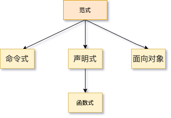

> 参考：[mostly-adequate-guide](https://github.com/MostlyAdequate/mostly-adequate-guide)

## 什么是函数式编程



函数式编程是声明式的一种类型，声明式强调目标而不是具体过程。

```js
// 把大象放进冰箱需要三步
// 冰箱和大象
const elephant = {
  name: 'Bob',
  species: 'animal',
};
const refrigerator = {
  open: false,
  item: null,
};
```

**命令式：**

以非常具体的方式，准确地规定计算机必须做什么。没有组织的长篇命令式代码，业界俗称面条代码。

```js
// 打开冰箱门
refrigerator.open = true;
// 把大象放进冰箱
refrigerator.item = elephant;
// 关冰箱门
refrigerator.open = false;
```

**面向对象：**

OOP 的特点就是关注点和职责分离。比如这里我除了可以造一个冰箱处理器，还可以造一个冰箱看门员和大象移动工程师。

```js
class RefrigeratorHandler {
  constructor(refrigerator) {
    this.refrigerator = refrigerator;
  }
  open() {
    this.refrigerator.open = true;
  }
  close() {
    this.refrigerator.open = false;
  }
  put(item) {
    this.refrigerator.item = item;
  }
}
// 冰箱操作手册
const refrigeratorHandler = new RefrigeratorHandler(refrigerator);
refrigeratorHandler.open();
refrigeratorHandler.put(elephant);
refrigeratorHandler.close();
```

**声明式：**

声明式编程更关注结果而不是过程，用声明的函数替代具体的操作指令，隐藏了复杂性，使编程语言更接近人类的语言和思维。

```js
const putItemIntoRefrigerator = (refrigerator, item) => {
  // 打开冰箱门
  refrigerator.open = true;
  // 把大象放进冰箱
  refrigerator.item = elephant;
  // 关冰箱门
  refrigerator.open = false;
};
putItemIntoRefrigerator(refrigerator, elephant);
```

**函数式：**

将大量操作简化成容易理解的函数，并且函数可作为回调变量使用。

```js
// 把大象放进冰箱需要三步，开/放/关
const open = (obj) => ({ ...obj, open: true });
const close = (obj) => ({ ...obj, open: false });
const put = (obj, item) => ({ ...obj, item });
// 把大象放进冰箱
const newRefrigerator = close(put(open(refrigerator), elephant));
```

**声明式和函数式的目的都是隐藏实现细节，让代码更易于理解。**其对性能有影响，但大多数情况下可以忽略。

## Ramda / fp-ts

- [Ramda](https://ramda.cn/) 函数式编程版本的 lodash
- [fp-ts](https://grossbart.github.io/fp-ts/recipes/ramda) Ts 支持更强大，工具函数更多的函数式编程库，缺点在于文档做的不好也没中文 🐶

## JS 函数是一等公民

- 可作为函数参数
- 可作为返回值
- 可赋值给变量

这个一等公民是相对于其他语言来说的，部分语言的函数并不满足上面三个条件。

一等公民保证了函数可以像基本数据类型一样进行处理，这是函数式编程的前提条件。

在 Scala 中函数也是一等公民，所以理论上 Scala 也可以函数式编程。

## 纯函数与副作用

### 纯函数

- 不依赖外部状态

- 不修改外部数据

- 不修改入参

同样的输入，不管什么情况永远返回同样的输出。

```js
// 不纯的, 如果外部参数变了，函数返回值会受影响
let minimum = 21;
const checkAge = (age) => age >= minimum;

// 纯的，对外部状态没有依赖
const checkAge = (age) => {
  const minimum = 21;
  return age >= minimum;
};
```

```js
const xs = [1, 2, 3, 4, 5];

// 纯的, 不修改原数据
xs.slice(0, 3); // => [1,2,3]
xs.slice(0, 3); // => [1,2,3]

// 不纯的, 会修改原数据
xs.splice(0, 3); // => [1,2,3]
xs.splice(0, 3); // => [4,5]
```

同理，react 中有个概念叫纯组件，在 react hooks 中，即没有副作用，组件渲染的结果完全依赖于传入的 props 和内部的 state，只要 props 相同，渲染结果一定相同。

```jsx
const PureComponent = ({ name }) => {
  const [count] = useState(0);
  return <div>{`${name} - ${count}`}</div>;
};
```

纯组件的好处在于性能优化，如果我们保证了函数在相同的 props 下执行结果一定不变，那么我们可以对 props 做一次浅对比，只要 props 不变，我们将不进行函数计算而直接返回计算结果。这就是`React.memo`，`useCallback`,`useMemo`性能优化的原理。

### 副作用

**副作用**是在计算结果的过程中，系统状态的一种变化，或者与外部世界进行的**可观察的交互**。

包括并不限于：

- 更改文件系统
- 往数据库插入记录
- 发送一个 http 请求
- 可变数据
- 打印/log
- 获取用户输入
- DOM 查询
- 访问系统状态
- ......

只要是跟函数外部环境发生的交互就都是副作用，副作用不可能完全避免，函数式编程需要将副作用很好地管理起来让其可控。

在 React 中使用`useEffect`，或`saga`，`rematch`等副作用管理工具。

## 高阶函数

接受或返回函数的函数

```js
const add = (x, y, f) => {
  return f(x) + f(y);
};
```

react 最常见的 HOC 也是一个原理，接受或返回组件的函数。

函数式编程中的几个核心概念的实现都基于高阶函数。

## 柯里化 curry

柯里化是函数式编程最常见也最重要的用法。柯里化是对高阶函数的降阶处理。

柯里化的概念很简单：只传递给函数一部分参数来调用它，让它返回一个函数去处理剩下的参数。

```js
const add = (x, y, f) => {
  return f(x) + f(y);
};

const double = (v) => {
  return v * 2;
};

const curryAdd = (f) => {
  return (x, y) => {
    return f(x) + f(y);
  };
};
add(1, 2, double); // 6
const AddDouble = curryAdd(double);

AddDouble(1, 2); // 6
```

提前传参可以增加函数的适用度和灵活性，以上面的代码为例，我们可以通过提前传参，构造一个更具针对性的函数：

```js
const doubleAdd = curryAdd(double);
doubleAdd(1, 2);
```

灵活运用柯里化可以减少样板代码。

我们是不需要手动实现柯里化的。lodash 和 Ramda 都提供 curry 函数, 以 Ramda 为例：

```js
import { curry } from 'ramda';

const addFourNumbers = (a, b, c, d) => a + b + c + d;

const curriedAddFourNumbers = curry(addFourNumbers);

// 你可以自由地选择传几个参数进去，以及传几次
const f = curriedAddFourNumbers(1, 2);
const g = f(3);
g(4); //=> 10
```

## 组合 compose

```js
// 简单实现，复杂实现可以传递多个函数用于组合
const compose = (f, g) => {
  return (x) => {
    return f(g(x));
  };
};
```

以 ramda 为例：

ramda 的`compose`是从右到左执行，最后一个函数可以是任意元函数（参数个数不限），其余函数必须是一元函数。

另一个 API `pipe`是从左到右执行，第一个函数可以是任意元函数（参数个数不限），其余函数必须是一元函数。

用哪一个全看个人倾向。

```js
const { compose, add, filter, sort, map } = require('ramda');
// 对一个整型列表先去除奇数，再倒叙，再过滤非正整数，再每项都+2
// 思考一下怎么做最好
const list = [1, 2, 3, 4, -1, -10];

const isOdd = (num) => (num & 1) === 0;
const isPositive = (num) => num > 0;
// ramda 提供了descend并且可以对对象进行排序，为了演示这里用自己写的
const descend = (a, b) => b - a;

const getResult = compose(
  map(add(2)),
  filter(isPositive),
  sort(descend),
  filter(isOdd)
);
console.log(getResult(list)); //[ 6, 4 ]
```

业务场景更多的是对数据的 format，对于简单的场景来说，使用组合的好处就是代码更简洁和语义化：

```js
// 将对象按map格式化(如果falsy返回原值)，拿到values，再过滤空值
const { compose, values, isNil, mapObjIndexed, filter } = require('ramda');
const data = {
  a: null,
  b: 100,
  c: 1,
  e: 999,
};
const configMap = {
  a: (v) => v,
  b: (v) => v * 2,
  c: (v) => v * 3,
  d: (v) => v * 4,
};

const format = (v, k) => {
  if (isNil(v)) {
    return v;
  }
  if (configMap[k]) {
    return configMap[k](v);
  }
};

const getResult = compose(filter(Boolean), values, mapObjIndexed(format));
console.log(getResult(data)); // [ 200, 3 ]
```

## 误区：拆分并非都有益

- 团队水平要求高，能被人读的懂和易维护的代码才是好的业务代码
- 命名水准要求高。柯里化逼迫程序员拆分更多的函数，每个函数需要单独的命名以体现其纯函数的功能
- 副作用总是不可避免的。

## 总结

函数式编程不仅仅是一种程序范式，更是一种思维方式，会下意识让我们拆分复杂逻辑到无副作用的单元函数，

我的结论就是可以一学，从学会使用 fp-ts 开始。
