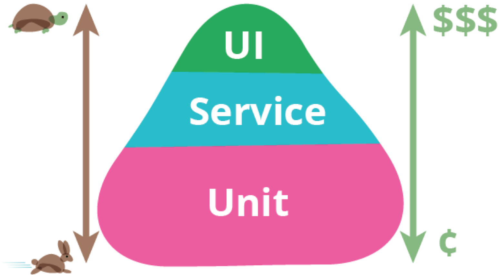

> 测试是敏捷开发很重要的一环，但是实际工作中写测试往往伴随着痛苦，随时变动的需求和翻倍的开发工时以及麻烦的 UI 单元测试让大部分前端对写测试望而却步。（TDD？可以有 TDD 的意识，但实践 TDD 的时间，别人都下班回家抱娃了）
>
> 如果开发工时充裕，测试覆盖量大管饱，拉到 99%是没什么问题的。当面对工期吃紧，项目复杂度高，迭代周期长，人员流动频繁的项目的时候，写一些毫无意义的测试是在浪费自己和项目的生命，但不写测试则是删库跑路级别的不负责任。
>
> 测试好，好测试，测好试。本文整理一些测试策略和最佳的测试实践，用于团队内部分享和指导自己的日常工作。

> 参考文章： [React 单元测试策略及落地](https://insights.thoughtworks.cn/react-strategies-for-unit-testing/)

# 测试的目的

作为一个经历过多个有测试和没测试的持续迭代项目的开发者，我想来谈谈测试的意义。
一个覆盖全面且有效的测试可以：

1. 保证当前代码符合预期需求：BA 会把业务拆分成大量的 AC，一个优秀的 BA 写出来的 AC 只需补充一些边界细节即可直接用于编写测试代码，测试代码可以直接反应业务逻辑。
2. 提升重构和修改时的信心：没有测试的重构极容易写出 bug，尤其是当你重构其他同事或者好几年前的代码的时候。
3. 防止甩锅：出 bug 的时候，如果 user journey 和测试用例一致，那我有足够的自信说问题不是我的。
4. 提升系统稳定性：所有的系统，从架构完就开始慢慢走向腐败，有测试的就是一坨健壮的屎，全面的测试覆盖能让这坨屎保持健壮的外形更久一点，没测试的系统可能早就拉垮了。

## 为何前端开发者普遍不愿意写测试？

1. 前端业务代码的调整频率普遍比后端高：前端是夹在产品，UX 和后端之间的人，后端需求通常比前端稳定，这就导致了大部分业务改动会优先考虑让前端做。
2. 测试 UI 很麻烦：单元测试是测试输入和预期，后端的纯逻辑代码很容易拆分代码和测试，但是前端很难。前端逻辑代码和 UI 耦合，对于一些状态复杂的 UI，写测试相当痛苦。
3. 黑盒测试基本可以保证前端测试需求：前端的错误很容易被发现和修复，从商业价值上考虑，投入和产出并不成正比。
4. 太耗时间：测试的代码量远比业务代码多，当你业务都写不完的时候，测试就变成了负担。大部分国内的老板并不在意持续迭代和重构的价值（重构就是你原来的代码没写好，扣钱），不少网页的生命周期不长，进一步降低了测试的意义。

总结下来就是测试很有用，关键逻辑必须有测试覆盖，但是测试覆盖率要视工期和项目性质渐进要求。

# 测试框架

测试框架殊途同归，区别不大，以当前较流行的框架为例：

- 单元测试： `Jest` + `testing-library`，
- e2e 测试：`cypress`，
- 可视化：`storybook`

# 测试金字塔

考虑到成本与收益，测试通常分为三层，应对不同的业务场景。

不同测试的成本和效率如图所示。



- UI 层：通常用 e2e 测试和黑盒测试覆盖，目的是覆盖关键的用户操作流程，保证最低限度的功能可用性
- Service 层
- Unit 层：单元测试成本最低速度最快，且对单元的保护价值更大。在金字塔体系中，低层级的单元测试占比最多。

# E2E 测试

对于端到端测试这一块我的了解也不深入，接触最多的是 `cypress` 和 `selenium`，其中`selenium`刚好就是自己所在的公司开发的框架。

`selenium` 的原理是通过 webdriver 将 python 或其他语言写的脚本转化成指令发送给浏览器驱动，然后操纵浏览器模拟用户操作。因为是基于浏览器原生 API，所以可以支持所有兼容 webdriver 的浏览器。由于技术成熟社区丰富，所以比较适合团队的专业测试人员。不过我接触最多的`selenium`应用是爬虫 😅，而不是前端测试。

`cypress` 将测试代码和 web 应用运行在同一域名下的不同 iframe 内，因此`cypress`脚本可以直接调用 DOM api，通过 node 还可以代理请求。`cypress`只支持 js 和 chrome 浏览器，对前端开发人员更友好，相比`selenium`也更快。

由于成本高，自动化 e2e 测试关注业务胜过关注技术细节，常用于核心业务的回归测试。一般的组件测试太会用到。

# snapshot

jest 提供了 snapshot 快照的功能，可以生成一个可供测试的快照。

当我们写完组件，对每一种逻辑分支的 UI 保存一个快照，这样当代码发生修改的时候，可以通过对比快照来判断测试是否通过。

创建和维护 snapshot 的成本很低，但实践下来发现 snapshot 面临一些问题：

1. 高风险：快照测试很脆弱，任何更改，哪怕和想测试的功能没有关系，也可能导致快照测试失败，然后需要开发人员认真对比快照，如果有人漏看而直接更新了快照，很容易把错误直接略过了。
2. 可读性差：快照测试代码实际上并没有表明任何关于预期输出的信息，只是表明它不应该改变。与单元测试和功能测试不同，快照测试不包含有针对性的、有意义的断言或期望。当测试挂掉的时候，开发者需要去阅读快照代码以分辨出问题的代码是否和我们期望的输出有关，如果这个开发者对代码不熟悉，那他可能会遇到麻烦。
3. 不适合动态内容：输入的内容如果是动态的，快照通常会直接挂掉（也可以通过`expect.any()`来避免），对于输入内容不固定的测试，最好还是不要用快照测试。
4. 占用空间：滥用 snapshot 会极大地增加项目的大小。

## 什么时候用 snapshot？

如上面所说，为了系统的稳定性，单元测试/功能测试是优先于快照测试的，但当满足以下条件的时候，我们可以优先考虑使用快照测试。

1. 组件不常更新：如果组件经常改变，更新快照测试的时候很容易漏掉 bug
2. 组件逻辑不复杂：如果组件太复杂，开发者很难确定快照测试到底测的是什么功能
3. 很容易在浏览器看到要测试的内容：便于当开发者不确定快照到底在测什么的时候可以通过浏览器复现

在使用 snapshot 的时候一定要把测试名称写好，因为以后真的很容易忘掉这个 snapshot 到底在测什么。

# 单元测试

## 什么是好的单元测试

> 这一部分主要参考林丛羽的博客，感兴趣建议读原文

一个最简单的 JavaScript 单元测试长什么样:

```js
// production code
const computeTotalAmount = (products) => {
  return products.reduce((total, product) => total + product.price, 0);
};

// testing code
describe('computeTotalAmount', () => {
  it('should return summed up total amount 1000 when there are three products priced 200, 300, 500', () => {
    // given - 准备数据
    const products = [
      { name: 'nike', price: 200 },
      { name: 'adidas', price: 300 },
      { name: 'lining', price: 500 },
    ];

    // when - 调用被测函数
    const result = computeTotalAmount(products);

    // then - 断言结果
    expect(result).toBe(1000);
  });
});
```
遵循 given-when-then 的结构。一个高效的的单元测试应符合：

- 只关注输入输出，不关注内部实现
- 只测一条分支
- 表达力极强
- 不包含逻辑
- 运行速度快

**只关注输入输出，不关注内部实现**

比如上面那个例子，测试本身不关注你是如何完成“求总价格”的，因此你可以用 `reduce` 实现，也可以自己写 `for` 循环实现。**只要测试输入没有变，输出就不应该变**。

**只测一条分支**
只测一条分支，才能给测试代码写一个好的描述，这个测试才能保护这个特定的业务场景，挂了的时候能给你细致到输入输出级别的业务反馈。

**表达力极强**
表达力强的测试，能在失败的时候给你非常迅速的反馈。它讲的是两方面：

- 看到测试时，你就知道它测的业务点是啥
- 测试挂掉时，能清楚地知道失败的业务场景、期望数据与实际输出的差异

总结起来，这些表达力主要体现在以下的方面：

- **测试描述**。遵循上一条原则（一个单元测试只测一个分支）的情况下，描述通常能写出一个相当详细的业务场景。这为测试的读者提供了极佳的业务上下文
- **测试数据准备**。无关的测试数据（比如对象中的很多无关字段）不应该写出来，应只准备能体现测试业务的最小数据
- **输出报告**。选用断言工具时，应注意除了要提供测试结果，还要能准确提供“期望值”与“实际值”的差异

**不包含逻辑**
跟写声明式的代码一样的道理，测试需要都是简单的声明：准备数据、调用函数、断言，让人一眼就明白这个测试在测什么。如果含有逻辑，你读的时候就要多花时间理解；一旦测试挂掉，你咋知道是实现挂了还是测试本身就挂了呢？

**运行速度快**
单元测试只有在毫秒级别内完成，开发者才会愿意频繁地运行它，将其作为快速反馈的手段也才能成立。那么为了使单元测试更快，我们需要：

- 尽可能地避免依赖。除了恰当设计好对象，关于避免依赖我已知有两种不同的看法：
    1. 使用 mock 适当隔离掉三方的依赖（如数据库、网络、文件等）
    2. 避免 mock，换用更快速的数据库、启动轻量级服务器、重点测试文件内容等来迂回
- 将依赖、集成等耗时、依赖三方返回的地方放到更高层级的测试中，有策略性地去做

## React 单元测试策略

以常见的 react + redux 架构为例，同理可以衍生到任何用了redux思想的架构（rematch，dva，context，swr，etc）。

通常官网都会有测试引导，所以不做详细演示。

| 架构层级          | 测试内容                                               | 测试策略                          | 解释                                                         |
| ----------------- | ------------------------------------------------------ | --------------------------------- | ------------------------------------------------------------ |
| action(creator)层 | 是否正确创建 action 对象                               | 一般不需要测试，视信心而定        | 这个层级架构上非常简单，设施搭好以后一般不可能出错           |
| reducer 层        | 是否正确完成计算                                       | 有逻辑的 reducer 要求 100%覆盖率  | 这个层级输入输出明确，又包含业务计算，非常适合单元测试       |
| selector 层       | 是否正确完成计算                                       | 有逻辑的 selector 要求 100%覆盖率 | 这个层级输入输出明确，又包含业务计算，非常适合单元测试       |
| saga 层           | 是否获取了正确的参数                                   | 这五个业务点建议 100% 覆盖        | 这个层级主要包含前述 5 大方面的业务逻辑，进行测试很有重构价值 |
|                   | 是否正确地调用了 API                                   |                                   |                                                              |
|                   | 是否使用了正确的返回值存取回 redux 中                  |                                   |                                                              |
|                   | 业务分支逻辑                                           |                                   |                                                              |
|                   | 异常逻辑                                               |                                   |                                                              |
| component 层      | 组件分支渲染逻辑                                       | 要求 100%覆盖                     | 这个层级最为复杂，还是以「代价最低，收益最高」为指导原则进行 |
|                   | 交互事件是否以正确的参数被调用                         | 要求 100%覆盖                     |                                                              |
|                   | redux connect 过的组件（或者有context provider的组件） | 不测                              |                                                              |
| UI 层             | 组件是否渲染了正确的样式                               | 目前不测                          | 测试较难稳定，成本又较高                                     |
| utils 层          | 各种帮助函数                                           | 没有副作用的必须 100% 覆盖        |                                                              |

# React 单元测试落地

## 副作用 saga / thunk

对五个业务点进行测试，需要mock掉实际API请求。

主要观察

- 是否使用正确的参数（通常是从 action payload 或 redux 中来），调用了正确的 API
- 对于 mock 的 API 返回，是否保存了正确的数据（通常是通过 action 保存到 redux 中去）
- 主要的业务逻辑（比如仅当用户满足某些权限时才调用 API 等分支逻辑）
- 异常逻辑（比如找不到用户等异常逻辑）
- 其他副作用是否发生（比如有时有需要 Emit 的事件、需要保存到 IndexDB 中去的数据等）

## 组件测试

组件测试其实是实践最多、测试实践看法和分歧也最多的地方。React 组件是一个高度自治的单元，从分类上来看，它大概有这么几类：

- 展示型业务组件
- 容器型业务组件
- 通用 UI 组件
- 功能型组件

先把这个分类放在这里，待会回过头来谈。对于 React 组件测什么不测什么，我有一些思考，也有一些判断标准：除去功能型组件，其他类型的组件一般是以渲染出一个语法树为终点的，它描述了页面的 UI 内容、结构、样式和一些逻辑 `component(props) => UI`。内容、结构和样式，比起测试，直接在页面上调试反馈效果更好。测也不是不行，但都难免有不稳定的成本在；逻辑这块，有一测的价值，但需要控制好依赖。综合上面提到的测试原则进行考虑，我的建议是：两测两不测。

- 组件分支渲染逻辑必须测
- 事件调用和参数传递一般要测
- 连接 redux 的高阶组件（或context的provider高阶组件）不测
- 渲染出来的 UI 不在单元测试层级测

组件的分支逻辑，往往也是有业务含义和业务价值的分支，添加单元测试既能保障重构，还可顺便做文档用；事件调用同样也有业务价值和文档作用，而事件调用的参数调用有时可起到保护重构的作用。

纯 UI 不在单元测试级别测试的原因，因为不好断言。

然后，基于上面第 1、2 个结论，映射回四类组件的结构当中去，我们可以得到下面的表格，然后发现…每种组件都要测**渲染分支**和**事件调用**，跟组件类型根本没必然的关联…不过，功能型组件有可能会涉及一些其他的模式，因此又大致分出一小节来谈。

| 组件类型 / 测试内容 | 分支渲染逻辑 | 事件调用 | 纯 UI |
| :------------------ | :----------- | :------- | :---- |
| 展示型组件          | ✅            | ✅        | ✖️     |
| 容器型组件          | ✅            | ✅        | ✖️     |
| 通用 UI 组件        | ✅            | ✅        | ✖️     |
| 功能型组件          | ✅            | ✅        | ✖️     |

### 业务型组件 - 分支渲染

```jsx
export const CommentsSection = ({ comments }) => (
  <div>
    {comments.length > 0 && (
      <h2>Comments</h2>
    )}

    {comments.map((comment) => (
      <Comment content={comment} key={comment.id} />
    )}
  </div>
)
```

对应的测试如下，测试的是不同的分支渲染逻辑：没有评论时，则不渲染 Comments header。

```jsx
import { render, screen } from '@testing-library/react'
import { CommentsSection } from './index'
import { Comment } from './Comment'

jest.mock('./Comment', () => ({
  Comment: () => <div>Comment</div>
}));
test('should not render a header and any comment sections when there is no comments', () => {
  render(<CommentsSection comments={[]} />)

  const header = screen.queryByRole('h2')
  const comments = screen.queryByText("Comment")

  expect(header).not.toBeInTheDocument()
  expect(comments).not.toBeInTheDocument()
})

test('should render a comments section and a header when there are comments', () => {
  const contents = [
    { id: 1, author: '男***8', comment: '价廉物美，相信奥康旗舰店' },
    { id: 2, author: '雨***成', comment: '所以一双合脚的鞋子...' },
  ]
 render(<CommentsSection comments={contents} />)

  const header = screen.queryByRole('h2')
  const comments = screen.queryByText("Comment")

  expect(header).toBeInTheDocument()
  expect(comments).toBeInTheDocument()
})
```

### 业务型组件 - 事件调用

测试事件的一个场景如下：当某条产品被点击时，应该将产品相关的信息发送给埋点系统进行埋点。

```jsx
export const ProductItem = ({
  id,
  productName,
  introduction,
  trackPressEvent,
}) => (
  <TouchableWithoutFeedback data-testid="touchable-without-feedback" onPress={() => trackPressEvent(id, productName)}>
    <View>
      <Title name={productName} />
      <Introduction introduction={introduction} />
    </View>
  </TouchableWithoutFeedback>
)

import { render, screen, fireEvent } from '@testing-library/react'

test(`
  should send product id and name to analytics system 
  when user press the product item
`, () => {
  const trackPressEvent = jest.fn()
  render(
    <Productitem id={100832}
      introduction="iMac Pro - Power to the pro."
      trackPressEvent={trackPressEvent}></productitem>
  )

  const touchableWithoutFeedback = screen.findByTestId("touchable-without-feedback")
	fireEvent.click(touchableWithoutFeedback);
  
  expect(trackPressEvent).toHaveBeenCalledWith(
    100832,
    'iMac Pro - Power to the pro.'
  )
})
```

简单得很吧。这里的几个测试，在你改动了样式相关的东西时，不会挂掉；但是如果你改动了分支逻辑或函数调用的内容时，它就会挂掉了。而分支逻辑或函数调用，恰好是我觉得接近业务的地方，所以它们对保护代码逻辑、保护重构是有价值的。当然，它们多少还是依赖了组件内部的实现细节，比如说 `find(TouchableWithoutFeedback)`，还是做了“组件内部使用了 `TouchableWithoutFeedback` 组件”这样的假设，而这个假设很可能是会变的。也就是说，如果我换了一个组件来接受点击事件，尽管点击时的行为依然发生，但这个测试仍然会挂掉。这就违反了我们所说了“不关注内部实现”原则，这对于组件测试来说，确实是不够完美的地方。

但这个问题无法避免。因为组件本质是渲染组件树，那么测试中要与组件树关联，必然要通过组件名、id这样的 selector，这些 selector 的关联本身就是一些“内部实现”的细节。但对组件的分支、事件进行测试又有一定的价值，无法避免。所以，我认为这个部分还是要用，只不过同时需要一些限制，以控制这些假设为维护测试带来的额外成本：

- 不要断言组件内部结构。像那些 `expect(component.find('div > div > p').html().toBe('Content')` 的真的就算了吧
- 正确拆分组件树。一个组件尽量只负责一个（或一组高度相关的）功能，不允许堆叠太多的函数和功能

也就是说，如果你发现你很难快速地准备对组件的测试，那么有可能是你的组件太复杂了，这也是一个坏味道。多数情况下是组件承担了太多的职责，你应该将它们拆成更小的组件，使其符合单一职责原则。

如果你的每个组件都十分清晰直观、逻辑分明，那么像上面这样的组件测起来也就很轻松，一般就遵循 `shallow` -> `find(Component)` -> 断言的三段式，哪怕是了解了一些组件的内部细节，通常也在可控的范围内，维护起来成本并不高。这是目前我觉得平衡了表达力、重构意义和测试成本的实践。

### 功能型组件 - `children` 型高阶组件

功能型组件，指的是跟业务无关的另一类组件：它是功能型的，更像是底层支撑着业务组件运作的基础组件，比如路由组件、分页组件等。这些组件一般偏重逻辑多一点，关心 UI 少一些。其本质测法跟业务组件是一致的：不关心 UI 具体渲染，只测分支渲染和事件调用。但由于它偏功能型的特性，使得它在设计上常会出现一些业务型组件不常出现的设计模式，如高阶组件、以函数为子组件等。下面分别针对这几种进行分述。

```jsx
export const FeatureToggle = ({ features, featureName, children }) => {
  if (!features[featureName]) {
    return null
  }

  return children
}

export default FeatureToggle

import React from 'react'
import { render, screen } from '@testing-library/react';
import { View } from 'react-native'

import { FeatureToggle } from './index'

const DummyComponent = () => () => <div>DummyComponent</div>

test('should not render children component when remote toggle does not exist', () => {
 render(
    <FeatureToggle features={{}} featureName="promotion618">
      <DummyComponent />
    </FeatureToggle>
  )
	const dummyComponent = screen.queryByText("DummyComponent")
  expect(dummyComponent).not.toBeInTheDocument()
})

test('should render children component when remote toggle is present and is on', () => {
  const features = {
    promotion618: FeatureToggles.on,
  }

  render(
    <FeatureToggle features={features} featureName="promotion618">
      <DummyComponent />
    </FeatureToggle>
  )

  const dummyComponent = screen.queryByText("DummyComponent")
  expect(dummyComponent).toBeInTheDocument()
})

test('should not render children component when remote toggle is present but is off', () => {
  const features = {
    promotion618: FeatureToggles.off,
  }

  render(
    <FeatureToggle features={features} featureName="promotion618">
      <DummyComponent />
    </FeatureToggle>
  )

  const dummyComponent = screen.queryByText("DummyComponent")
  expect(dummyComponent).not.toBeInTheDocument()
})
```

## 纯函数 utils / reducer / selector 测试

每个项目都会有 utils。一般来说，我们期望 util 都是纯函数，即是不依赖外部状态、不改变参数值、不维护内部状态的函数。这样的函数测试效率也非常高。测试原则跟前面所说的也并没什么不同，不再赘述。不过值得一提的是，因为 util 函数多是数据驱动，一个输入对应一个输出，并且不需要准备任何依赖，这使得它多了一种测试的选择，也即是参数化测试的方式。参数化测试可以提升数据准备效率，同时依然能保持详细的用例信息、错误提示等优点。jest 从 23 后就内置了对参数化测试的支持，如下：

```javascript
test.each([
  [['0', '99'], 0.99, '(整数部分为0时也应返回)'],
  [['5', '00'], 5, '(小数部分不足时应该补0)'],
  [['5', '10'], 5.1, '(小数部分不足时应该补0)'],
  [['4', '38'], 4.38, '(小数部分不足时应该补0)'],
  [['4', '99'], 4.994, '(超过默认2位的小数的直接截断，不四舍五入)'],
  [['4', '99'], 4.995, '(超过默认2位的小数的直接截断，不四舍五入)'],
  [['4', '99'], 4.996, '(超过默认2位的小数的直接截断，不四舍五入)'],
  [['-0', '50'], -0.5, '(整数部分为负数时应该保留负号)'],
])(
  'should return %s when number is %s (%s)',
  (expected, input, description) => {
    expect(truncateAndPadTrailingZeros(input)).toEqual(expected)
  }
)
```

[](https://insights.thoughtworks.cn/wp-content/uploads/2019/07/8.png)

当然，对纯数据驱动的测试，也有一些不同的看法，认为这样可能丢失一些描述业务场景的测试描述。所以这种方式还主要看项目组的接受度。

## Jest官方模拟示范代码

包括`异步测试`，`计时器`和 `mock模块`等

建议直接按照官网的例子写 [Jest doc](https://jestjs.io/zh-Hans/docs/tutorial-async)

## test-library实践

### 选择合适的查询语句

以最接近用户的方式查询

```jsx
// bad
// assuming you've got this DOM to work with:
// <label>Username</label><input data-testid="username" />
screen.getByTestId('username');

// good
// change the DOM to be accessible by associating the label and setting the type
// <label for="username">Username</label><input id="username" type="text" />
screen.getByRole('textbox', { name: /username/i });

// bad
const { container } = render(<Example />);
const button = container.querySelector('.btn-primary');
expect(button).toHaveTextContent(/click me/i);

// good
render(<Example />);
screen.getByRole('button', { name: /click me/i });

// bad
screen.getByTestId('submit-button');

// good
screen.getByRole('button', { name: /submit/i });
```

### 查询优先级

#### 1. Queries Accessible to Everyone（每个人都可以访问的查询）

- `getByRole`

它可以用于查询处于 `accessibility tree` 中的所有元素，并且可以通过 `name` 选项过滤返回的元素。

它应该是我们查询的首选项。大多数情况下，它都会带着 name 选项一起使用，就像这样：`getByRole('button', {name: /submit/i})`。这里是 Roles 的列表可供参考 [Roles list](https://developer.mozilla.org/en-US/docs/Web/Accessibility/ARIA/Roles)

- `getByLabelText`

这是查询带`label`的表单元素的首选项

- `getByPlaceholderText`

这是查询表单元素的一个代替方案

- `getByText`

它对表单没有用，但这是找到大多数非交互式元素（例如 `div` 和 `span`）的第一方法

#### 2. Semantic Queries（语义查询)

- `getByAltText`

如果我们查询的元素支持 alt text（例如 img area input），那么可以使用它来进行查询

- `getByTitle`

通过 title 属性查询，但是注意，一般通过屏幕查看页面的用户是无法直接看到 title 的

#### 3. Test IDs

- `getByTestId`

用于查询无法通过 Role 或者 Text 匹配到的元素，是最后的选择，需要在元素上添加`data-testid`属性
