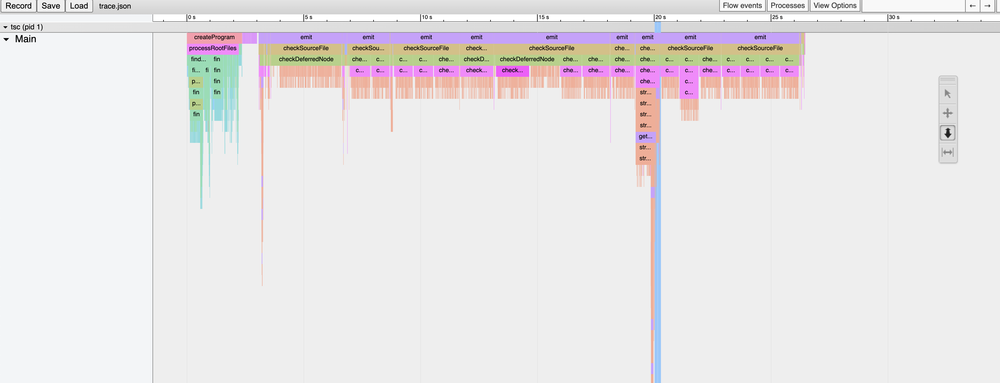

> 最近加入了一个新项目，在工作中发现vscode的 typescript intellisense 变得非常慢，每次写完代码需要等十几秒才能看到 ts 的提示。通过和其他本地的ts项目对比，我发现不是vscode版本的问题，大概率是项目代码本身的问题。
>
> 这里记载一下问题排查的过程和结论。实际上我也还没有解决变慢的问题，头痛。

## 问题

在 TS 项目中，每次ts server compiler运行的时间都超过10秒。

## 检查ts server log

发现在这个节点耗时最长`encodedSemanticClassifications-full`

```log
Perf 543  [17:11:49.490] 151::encodedSemanticClassifications-full: elapsed time (in milliseconds) 2740.4059

```

于是上谷歌搜了一下，找到了这个issue

[Semantic highlighting (`encodedSemanticClassifications-full`) extremely slow #44851](https://github.com/microsoft/TypeScript/issues/44851)

看完了整个thread，导致变慢的原因可能有以下几个

1. vscode新版本的bug：通过横向比较其他ts项目，及换回vscode老版本/切webstorm过后排除

2. typescript新版本的问题（vscode本地跑tsc默认用的最新版本4.6.3）：通过回溯版本到4.2及3.9，排除

3. vscode设置的问题：尝试了帖子里热心人给的方案

   vscode setting.json

   ```json
   {
   	"editor.semanticHighlighting.enabled": false,
    "typescript.suggest.autoImports": false
   }
   ```

   可能真的有优化，但效果很有限。还有一些其他的设置的尝试，都没什么效果，排除。

4. 其他插件的影响（eslint最有可能）：关闭掉所有插件，还是慢得要死，排除。

5. 框架nextjs的问题：新建了个空nextjs仓库，没发现很慢，排除。

6. **代码问题**

## tsc --extendedDiagnostics

我觉得大概率出在代码问题上了，但是项目本身并不大，所以问题出在业务代码上的可能性不大，极大可能是哪个第三方插件出了问题。

再次确认项目的tsconfig.json是开了lib类型检查跳过的

```json
{
	...,
  "skipLibCheck": true,
}
```

所以接下来开始大逃杀模式：通过覆盖类型声明，让 tsc 绕过node_modules内的类型检查

打开tsc的诊断模式`tsc --extendedDiagnostics`看到记录：

```
I/O Read time:               0.57s
Parse time:                  0.89s
ResolveModule time:          0.28s
ResolveTypeReference time:   0.02s
Program time:                1.92s
Bind time:                   0.42s
Check time:                 10.95s
transformTime time:          0.01s
commentTime time:            0.00s
printTime time:              0.04s
Emit time:                   0.04s
I/O Write time:              0.00s
Total time:                 13.32s
```

=> Check time 10s, 看起来是type check过程耗时太长：

1. 覆盖了nextjs 和 graphql 的类型声名：变快了一点点, Check time 变成了 7.95s
2. 覆盖了第三方UI框架的类型声名：！！！Check time 变成了2.21s。得，找到问题所在了

所以问题出在**第三方库的类型文件**，可是这个库从UI上来看并不复杂，为什么需要编译这么久？我明明开启了`skipLibCheck`，而且我并没有全量引入这个组件库，为什么还会编译7s？我感觉我对tsc的理解可能有一些问题，所以需要去官网再看一遍性能相关的文档。

## Performance Tracing

微软官方提供了一个性能跟踪的方法：[Performance Tracing](https://github.com/microsoft/TypeScript/wiki/Performance-Tracing)

实测了一下得到这样的图形

几个耗时较长的区间里并没有某一个特别耗时的。通过ID对照了下`types.json`发现除了type check次数过多并没有特别的异常。

这个工具的分析就此打住，唯一得到的结论就是类型检查的次数过多，原因是什么并不清楚。

## Performance Guide

在进度一筹莫展的时候，我去看了微软官方的 [ts 性能指南](https://github.com/microsoft/TypeScript/wiki/Performance#specifying-files)

绝大部分的性能优化其实我们已经做了。

最后确定的原因就是第三方UI库的类型文件太大太多，因为只要把他们的类型覆盖掉，tsc就会变得丝滑。

## 对`skipLibCheck`的错误认知

以上流程暴露了我一个一直以来的错误认知：`skipLibCheck`并不是跳过d.ts类型文件的检查，否则该第三方UI库绝大部分的类型文件不会影响tsc的性能

> 以下结论参考该博客[Understanding TypeScript’s skipLibCheck Once and For All](https://www.testim.io/blog/typescript-skiplibcheck/)

1. 当启用`skipLibCheck`时，tsc将忽略来自声明文件（d.T）的所有错误。由于错误被忽略了，某些类型可能会被视为any。但tsc仍将检查有效类型。

2. 如果项目编译速度快且没有错误，请禁用`skipLibCheck`选项（默认禁掉）。

3. 如果第三方库的代码中出现类型错误导致编译错误或编译时间过长，请启用`skipLibCheck`。

4. `skipLibCheck`无法在Monorepo项目中生效（至少目前是这样）。

d.ts文件过多的时候即便开启了这个设置，tsc还是慢得离谱，因为tsc仍将检查有效类型。

## 思考可能的解决方案

（当然升级硬件设备是最靠谱的。M1解救一切）

### 最蠢的方案-覆盖类型声明

如同文章刚开始用排除法测试的方法，仅在本地开发的阶段对第三方库的类型声明进行覆盖。这样可以最大限度保证tsc的正常功能同时不会减慢tsc的效率

但这样做对代码有侵入，每次提交代码必须删掉覆盖的代码，不是长久之计。

### 是否有屏蔽掉部分d.ts检查的可能

tsc检查的d.ts文件绝大部分其实压根就没有用到，是否有一种能让tsc只检查被用到了的组件的类型的办法（尝试过tsconfig的type选项，无效）？

### 是否有拆分第三方库的可能

目前看来很悲观，因为是第三方库，我只能提issue暴露问题。