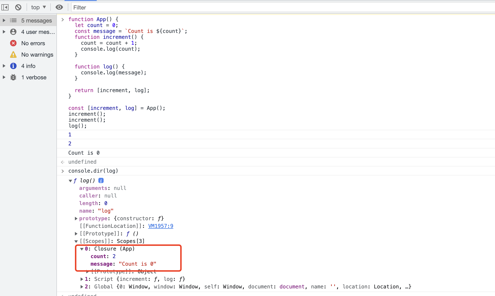
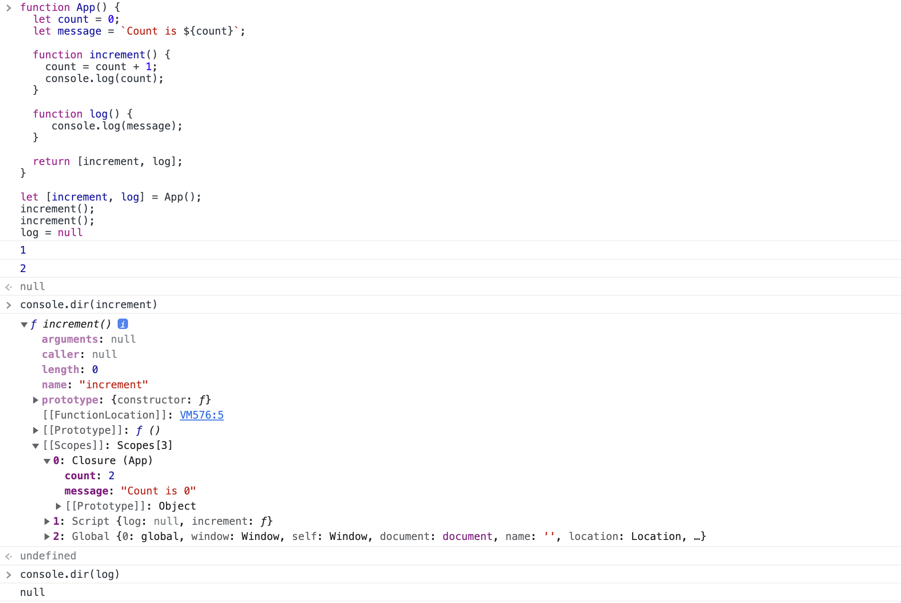
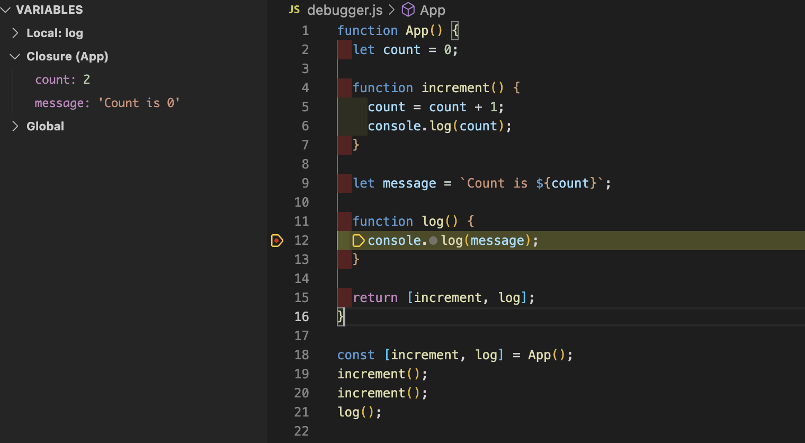
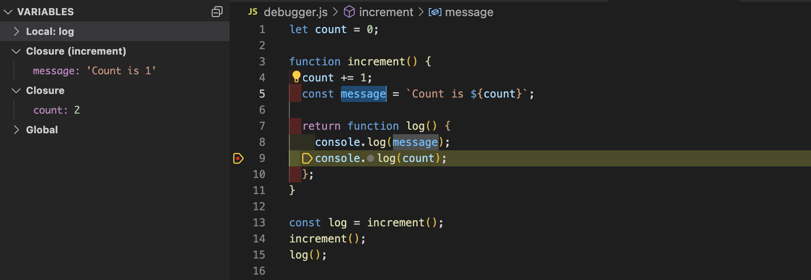
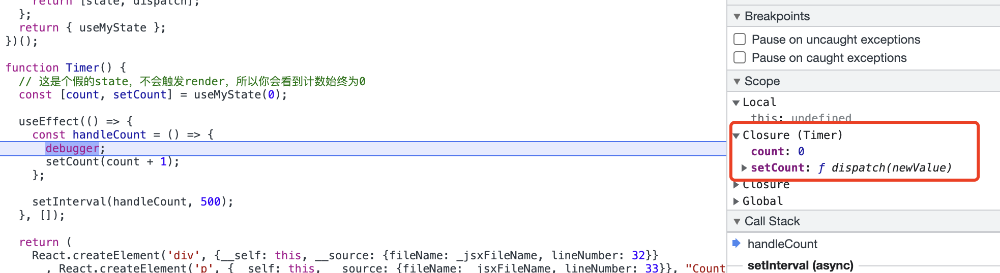
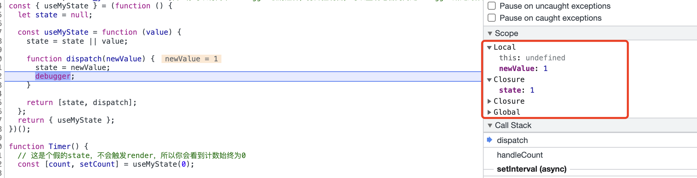
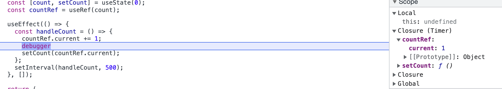

> 详细介绍 Memorization hooks 出现闭包陷阱的原因和应对方法。以及介绍 react 最新的尚处于提案阶段的 hook
>
> 我看了很多谈论闭包陷阱的文章，但大多数都是浅尝辄止，且绝大部分都是复制粘贴，很少有深入到闭包原理的，即便有涉及到的，作者自己也写的云里雾里，不知所云。

## 何为 React 的闭包陷阱

两种常见出现闭包 bug 的代码

**setInterval / setTimeout**

```jsx live name=定时器
function Timer() {
  const [count, setCount] = useState(0);

  useEffect(() => {
    const handleCount = () => {
      setCount(count + 1);
    };
    setInterval(handleCount, 500);
  }, []);

  return (
    <div>
      <p>Count: {count}</p>
    </div>
  );
}
```

```jsx live name=绑定事件
function EventListener() {
  const [count, setCount] = useState(0);
  const countRef = useRef(null);

  useEffect(() => {
    const handleCount = () => {
      setCount(count + 1);
    };
    countRef.current?.addEventListener('click', handleCount);
  }, []);

  return (
    <div>
      <div>Count: {count}</div>
      <button ref={countRef}>Count + 1</button>
    </div>
  );
}
```

这两段代码在触发定时器或点击按钮过后, count 将永远都是 1。（上面的 Live Editor 是可编辑的，可以自己调试一下。）

ChatGPT 给的闭包陷阱的文字描述：在 react 钩子中定义了一个函数(`handleCount`)并将其作为回调函数传递给另一个函数或组件时，由于 JavaScript 的[闭包特性](https://developer.mozilla.org/zh-CN/docs/Web/JavaScript/Closures)，这个函数将会捕获它所在的函数作用域中的变量，而不是传入的 props 或 state。

文字描述里有两个关键词 “闭包特性” 和 “捕获变量”。如果你不能深入理解这两个东西，那看完文字描述等于还是啥都不懂。

GPT 没有解释清楚(好险，差点被 AI 替代掉了 🐔🍚)。

## 闭包和过时闭包(stale closure)

> [Understading stale closures in javascript](https://dilshankelsen.com/understanding-stale-closures-in-javascript/)
>
> [JavaScript 中变量到底是存储在「栈」还是「堆」上？](https://zhuanlan.zhihu.com/p/362219811)

第一步，先搞懂闭包(clousure)以及过时闭包(stale clousure)

### 闭包

> 如果你还不知道什么是闭包，先去补扫盲知识 [闭包基础知识](https://zh.javascript.info/closure)
>
> 深入了解闭包需要知道：作用域链，执行上下文，JS 垃圾回收和词法环境的概念

闭包是很多语言的难点，只言片语肯定说不清楚。要从头到尾说的话，我自己也没有自信能解释清楚。

闭包即是在函数内可以访问函数外变量的函数，是函数与词法环境的结合。

词法环境是一个无法访问到的对象，从对象的角度来理解闭包会比较抽象晦涩。

闭包本意是一种让函数可以访问外部函数体内的变量的手段，内存得不到释放只是其副作用（并且通常有害）。但从内存和 GC 的角度来理解闭包刚好会更加容易理解过时闭包的产生原理。

### 闭包的值捕获

当你去找网上的资料的时候，会发现大部分人对保存外部引用的描述止步于`capture`，并没有说明这个`capture`究竟是如何实现的。

是值的拷贝还是词法环境对象引用地址的拷贝？存在哪里？同一函数的如果返回多个闭包，这些闭包`capture`的值会互相影响还是各管各的？如何释放？我们有必要搞懂这个问题，否则无法完全理解过时闭包的所有场景。下面就回答这些问题。

1. 是值的拷贝还是词法环境对象引用地址的拷贝？

闭包的实现依赖于函数对象的[隐藏属性](https://tc39.es/ecma262/#sec-ecmascript-function-objects)`[[Environment]]`, 这个属性储存了函数声明时的外部词法环境的引用地址(环境记录)。该属性无法读取和修改，但是我们可以通过编译器(V8)实现的`[[Scopes]]`作用域链属性中的`Closure`来观察。
所以第一个问题有了答案：`capture`捕获的是函数声明时的词法环境(对象)的引用地址，而不是新开辟一片内存把引用到的值复制进去。通过`[[scope]]`观察可以看到如下(该图片是过时闭包的例子，将在紧接的段落里详细解释)

可以看到`[[Scopes]]`内有一个`Closure(App)`

2. 储存在哪里？

上面其实已经回答了，词法环境的引用被保存在了闭包函数对象的隐藏属性`[[Enviroment]]`内

3. 同一函数返回多个闭包的情况是如何的？

这个其实可以从回答 1 的截图里看到。该`App`函数以数组对象的形式返回了两个闭包函数。`log`只引用了`message`，但是其`[[Scopes]]`属性内的`Closure`却有`count: 2`。
同样，打印`increment`会发现其`Closure`中有`message: "Count is 0"`
所以结论是，如果同一函数返回的多个闭包，他们`[[Enviroment]]`中储存的是同一个词法环境的引用地址。

4. 如何释放？

GC 会回收掉没有被引用的变量，只要还有作用域引用该词法环境，那其中的变量就不会被回收。
在上面的例子中，哪怕我们将`log`手动标记为清除：`log = null`，`Closure(App)`中的变量将因为`increment`的引用而一直存在于内存中。由于闭包产生于编译阶段，引用`message`的闭包函数`log`虽然已经被清除了，但却没有任何机制将`message: "Count is 0"`删除，这就容易导致性能问题，假如这个`message`是一个很大的对象，那这个对象占用的内存就不会被回收，可能会造成内存泄漏。
只有当`increment`也被标记为清除的时候，`Closure(App)`中的变量才会被 GC 回收。


### 复现过时闭包

```jsx name=staleClosure
function App() {
  let count = 0;

  function increment() {
    count = count + 1;
    console.log(count);
  }

  let message = `Count is ${count}`;

  function log() {
    console.log(message);
  }

  return [increment, log];
}

const [increment, log] = App();
increment();
increment();
log();
```

猜猜`log()`执行结果是什么？

不是 2，而是 0

```shell name=output
1
2
Count is 0
```

🔍 分析上面的代码的执行过程(口语化，忽略变量提升)：

1. 执行`App`函数
2. 声明局部变量`count`，分配内存，存入值`0`
3. 声明函数`increment`，在函数内引用`count`，形成闭包，在环境记录里存入`App`词法环境的引用
4. 声明局部变量`message`，分配内存，存入值`"Count is 0"`
5. 声明函数`log`，在函数内引用`message`，形成闭包
6. 全局作用域以解构的方式声明`increment`和`log`两个变量，分别来储存从函数`App` return 的两个函数的引用地址
7. `App`执行完毕，其函数执行上下文出栈销毁，但词法环境被闭包引用，避免被 GC。需要注意的是并不是整个词法环境被保留，而是只保留了编译阶段被引用的`count`和`message`
8. 执行`increment`, 直接修改`count`的值为 1
9. 执行`log`，直接打印`message`的值为`"Count is 0"`



`App` 函数在执行完过后其内部的局部变量就会被 GC 回收，但`count` 和 `message`由于分别被`increment`和`log`所引用，被闭包捕获，会一直存在于闭包堆内存(`Closure(App)`)中。

函数`increment`直接引用并修改`count`, 所以执行两次`increment()`都可以正常打印`count`的值。

`log`打印出旧值的原因是在`App`执行完毕过后，该函数执行上下文已经出栈销毁了，闭包内的`message`和`count`已经没有任何关系了。`increment`在闭包中修改了`count`的值，但并不会影响`message`。打印出来的还是`App`初始化的时候的值

**修正过后的代码**

```js name=fixStaleClosure line={10}
function App() {
  let count = 0;

  function increment() {
    count = count + 1;
    console.log(count);
  }

  function log() {
    const message = `Count is ${count}`;
    console.log(message);
  }

  return [increment, log];
}

const [increment, log] = App();
increment();
increment();
log();
```

```shell name=output
1
2
Count is 2
```

把 message 放在`log`里面，这样调用`log`时就会重新生成`message`。

### 另一个过时闭包的例子

```js name=staleClosure2
let count = 0;

const increment = () => {
  count += 1;
  const message = `Count is ${count}`;

  return () => {
    console.log(message);
    console.log(count);
  };
};

const log = increment();
increment();
log();
```

```shell name=output
Count is 1
2
```

函数`log`的执行结果依然没有拿到最新的`message`值。

🔍 分析上面的代码的执行过程：

1. 声明全局变量 `count`，存入值`0`
2. 执行 `increment`
3. 修改全局变量`count`为`1`
4. 声明局部变量`message`, 存入值 `Count is 1`
5. 返回匿名函数
6. 声明全局常量 `log` 并储存上步返回的匿名函数。`increment`执行完毕出栈。`log`引用并捕获`message`，`message`得以不被 GC 回收
7. 再次执行`increment`, 修改全局变量`count`为`2`，新声明局部变量`message`，分配内存，存入值 `Count is 2`, 这个`message`和上一步的`message`在不同的执行上下文，分配在不同的内存地址，将其假设为`message2`
8. 返回匿名函数，但并没有声明变量存下来，其引用的局部变量`message2`也被 GC 回收
9. 执行第六步的`log`函数，打印 `message`的值，该`message`为`message1`，即 `Count is 1`



`log`打印出 count 旧值的原因是闭包函数引用的是第一次执行`increment`时的词法环境，其`message`是第一次执行`increment`时的值。和上面的复现闭包第一个例子一模一样。

**修正过后的代码**

```js name=fixStaleClosure2 line={7}
let count = 0;

const increment = () => {
  count += 1;

  return () => {
    const message = `Count is ${count}`;
    console.log(message);
    console.log(count);
  };
};

const log = increment();
increment();
log();
```

同样地，将`message`的声明和赋值放到了匿名函数内。

## hooks 和闭包的关系

> 参考文章：[超性感的 React Hooks（二）再谈闭包](https://mp.weixin.qq.com/s/IMgHzeDXIbxMsVomnqx7AQ)

第二步，搞懂日常用的 hook 和闭包的关系。

简化版的 useState，实际的 hook 实现肯定比这复杂，但是原理都差不多。

```jsx name=state
let state = null;

export const useState = (value: number) => {
  state = state || value;

  function dispatch(newValue) {
    state = newValue;
    // 假设此方法能触发页面渲染
    render();
  }

  return [state, dispatch];
};
```

在其他模块中引用

```jsx name=Demo.jsx
import React from 'react';
import { useState } from './state';

export function Demo() {
  const [counter, setCounter] = useState(0);

  return (
    <div onClick={() => setCounter(counter + 1)}>hello world, {counter}</div>
  );
}
```

### 闭包在哪？

**ES Module 的原理**

1. ES6 之前: ES6 之前拆分模块和防止变量污染主要靠自执行函数，AMD/CMD 规范都是基于函数。webpack 打包 ES6 到 ES5 也会自动把代码里的 ES module 语法打包成函数和自执行函数。

```js name=自执行函数版state
(function () {
  var state = null;

  var useState = function (value) {
    state = state || value;

    function dispatch(newValue) {
      state = newValue;
      render();
    }

    return [state, dispatch];
  };

  return { useState };
})();
```

2. ES6 之后: 参考[ES modules: A cartoon deep-dive](https://hacks.mozilla.org/2018/03/es-modules-a-cartoon-deep-dive/), [掘金翻译版](https://juejin.cn/post/7098192216229117959)。

ES module 虽然原理和自执行函数不同，但表现形式十分相似。

被`useState`引用的`state`变量则会存在于内存中，只要该变量还被标记为引用状态，就不会被 GC 回收。

在 Demo module 内通过 `useState` 引用 state module (外部词法环境)里的变量，这就是一个标准的闭包。

### 再看 useEffect

```jsx name=定时器 live noInline
// 你可以将两个 debugger取消注释，打开控制台，可以直观地看到两处debugger所处的作用域
const { useMyState } = (function () {
  let state = null;

  const useMyState = function (value) {
    state = state || value;

    function dispatch(newValue) {
      state = newValue;
      // debugger;
    }

    return [state, dispatch];
  };
  return { useMyState };
})();

function Timer() {
  // 这是个假的state，不会触发render，所以你会看到计数始终为0
  const [count, setCount] = useMyState(0);

  useEffect(() => {
    const handleCount = () => {
      // debugger;
      setCount(count + 1);
    };

    setInterval(handleCount, 500);
  }, []);

  return (
    <div>
      <p>Count: {count}</p>
    </div>
  );
}
render(<Timer />);
```

`useEffect`的第二个参数如果是`[]`，那么该副作用只会在函数组建 mounted 时执行一次。

🔍 分析首次`useEffect`的代码的执行过程：

1. 组件 mounted, 触发`useEffect`，执行传入的匿名回调函数
2. 声明函数`handleCount`
3. `handleCount`内引用了外部词法环境`Timer`中的变量 `count`，形成了闭包，`[[Scopes]]`内新增`Closure(Timer)`。
   
4. 函数组件 `Timer`执行完毕，出栈销毁。变量`count`因为被`handleCount`引用得以保留。
5. 500ms 后执行`handleCount`，调用`dispatch`修改 `state` 的值
   
   可以看到`dispatch`的闭包内，`state` 已经变成了 1

你可能会疑惑，按照前面的结论，此时闭包函数`handleCount`和`dispatch`应该引用的同一个词法环境才对。实际上呢？

最简单的，看上面两个截图，在 scope 的`Closure`那里，一个是`Closure(Timer)`一个是`Closure`

`handleCount` 中引用的`count`, 是在`Timer`执行生成的:`const count = useMyState(0)[0]` 也就是 `count: 0`, 和第一个过时闭包的例子一模一样`let message = "count is " + count`

`useEffect`, `useMemo`, `useCallback` 等 memorization hooks 都会面临相同的过时闭包问题，而且这类型 bug 很难发现。这也是为什么最新的 react 文档建议开发者最好开启 deps eslint，以及最好不要 ban 掉 eslint 以 [欺骗 react](https://react.dev/reference/react/useEffect#specifying-reactive-dependencies)

结合 memorization hooks (后面都以`useEffect`为例)的特性，复盘一下：

在 `useEffect` 的回调函数中引用了外部作用域的变量，但是没有将该变量添加进 `useEffect` 的 deps 数组内。只有在 deps `useEffect` 中的回调函数才会重新执行。
由于我们少传或没有传相应的 deps，当漏网之鱼发生变化时，`useEffect` 并没有触发，`useEffect` 内的闭包函数所捕获的还是上一次 `useEffect` 执行时的词法环境中的变量，就产生了过时闭包的 bug。

## 不指定依赖就一定会出现 bug 吗？

从前一章节我们知道了闭包陷阱的原因。但实际项目里我们绝大部分人都写过下面这句 eslint-disable

```js 不要你觉得，我要我觉得
// eslint-disable-next-line react-hooks/exhaustive-deps
```

项目并不会出 bug，为什么？

因为从上面举的很多例子中我们可以看到，出过时闭包的 bug 需要满足几个条件：

1. 这个被忽略掉的 dep 本身是可变的。
2. 我们要在事件绑定或者定时器中用到这个可变的数据

另外，`useEffect` 的特性是只要 deps 数组中有一项数据发生了变化，就会执行回调函数，如果有一个变量`b`和被忽略的变量`a`总是同时更新(比如他俩来自于同一个接口数据)，那么哪怕 deps 数组里只有变量`b`，`useEffect` 的每次触发，闭包函数都能绑定最新的`a`

`useEffect`最大的心智负担就在这里：eslint 强迫我们将`useEffect`中所有用到的 prop，state 全部放到 deps 数组中，即将该数组当成了闭包会引用的变量的全家福。

但 `useEffect`本身的作用是响应状态变更的副作用，绝大部分场景下我们不想对所有的依赖进行响应，我们只想要能通过某个状态能 trigger effect，然后该 Effect 能拿到最新的依赖，执行我们想要的操作。

我们想要 deps 数组有业务含义，而不是长破天的全家福。我们想要 deps 数组里不用再传入毫无意义的 handle 或 dispatch 函数。

目前我们只能在熟悉上下文的情况下，手动添加 eslint-disable😅

但目前的 React 并不欢迎我们这么做。其理由是即便 开发 Dev 在了解上下文并保证没有 bug 的情况下 ban 掉了 eslint，他依然无法预知代码的后续维护者是否清楚上下文。这很容易给后续的维护留下隐患。

## 解决闭包陷阱的旧方案

除了写全 deps，还有一些方案可以用

### useState 回调函数

```jsx live name=定时器
function Timer() {
  const [count, setCount] = useState(0);

  useEffect(() => {
    const handleCount = () => {
      setCount((count) => count + 1);
    };
    setInterval(handleCount, 500);
  }, []);

  return (
    <div>
      <p>Count: {count}</p>
    </div>
  );
}
```

### ref

```jsx live name=定时器
function Timer() {
  const [count, setCount] = useState(0);
  const countRef = useRef(count);

  useEffect(() => {
    const handleCount = () => {
      countRef.current += 1;
      setCount(countRef.current);
    };
    setInterval(handleCount, 500);
  }, []);

  return (
    <div>
      <p>Count: {count}</p>
    </div>
  );
}
```

ref 的原理依旧是闭包，每次`Timer`执行，`useRef`都会返回同一个固定的对象引用。我们可以在闭包内通过访问对象的 current 属性拿到最新的`count`值


ref 的办法比较适合用来处理一些依赖较多的函数，比如下面的例子，
我只想 useEffect 在 mounted 的时候触发一次：

```jsx name=functionDemo line={10}
const Demo = ({ name, height, weight, onError, onOk, path }) => {
  const complexFunction = () => {
    console.log(name, height, weight, path);
    onError();
    onOk();
  };

  useEffect(() => {
    complexFunction();
    // eslint-disable-next-line react-hooks/exhaustive-deps
  }, []);
};
```

用 ref 就不用 ban eslint，也不会出现过时闭包。

```jsx name=refDemo
const Demo = ({ name, height, weight, onError, onOk, path }) => {
  const complexFunctionRef = useRef(() => {
    console.log(name, height, weight, path);
    onError();
    onOk();
  });
  useEffect(() => {
    complexFunctionRef.current();
  }, []);
};
```

## 新的 hook - useEffectEvent

[Declaring an Effect Event](https://react.dev/learn/separating-events-from-effects#declaring-an-effect-event)

`useEffectEvent` 的内部实现就是基于 ref，其作用就是减少 memorization hooks 不必要的 deps。

```jsx name=useEffectEventDemo
const Demo = ({ name, height, weight, onError, onOk, path }) => {
  const complexEvent = useEffectEvent(() => {
    console.log(name, height, weight, path);
    onError();
    onOk();
  });

  useEffect(() => {
    complexEvent();
  }, []);
};
```

有了这个 hook 之后，`useEffect`的 deps 就可以只保留业务上用于触发 effet 的状态，其他的都丢给`useEventEffect`
