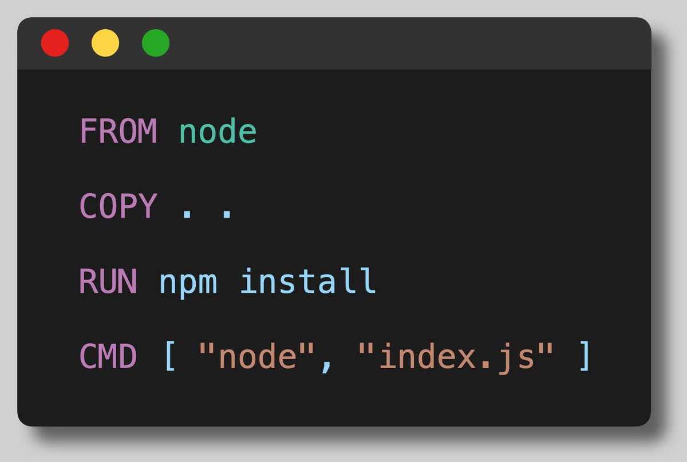
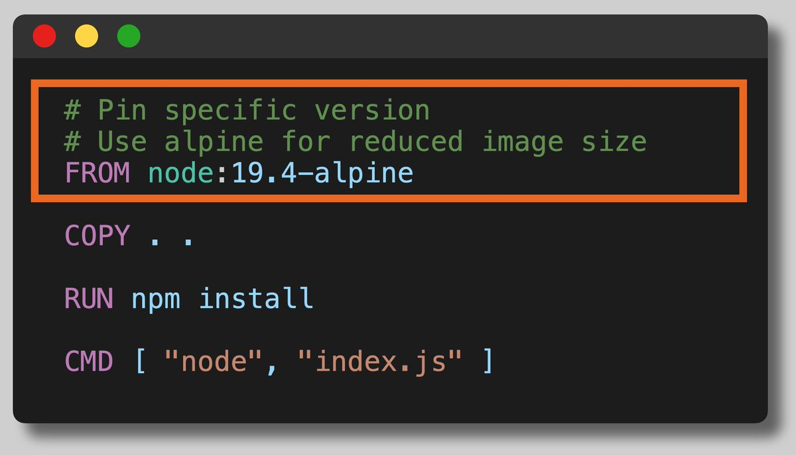
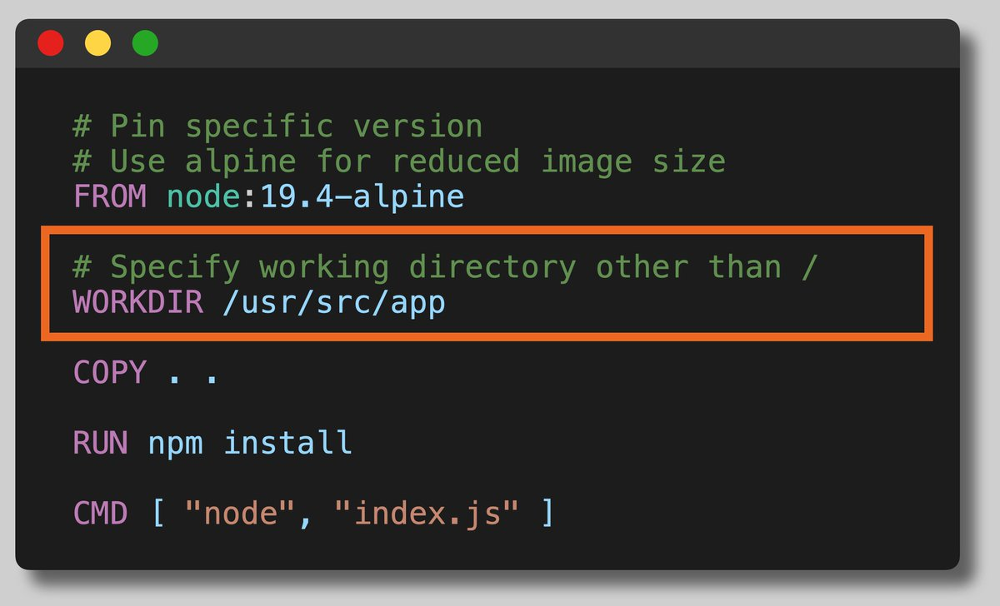
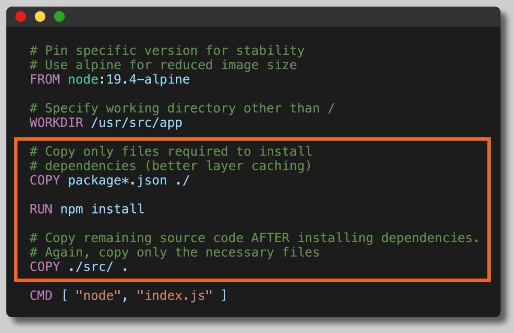
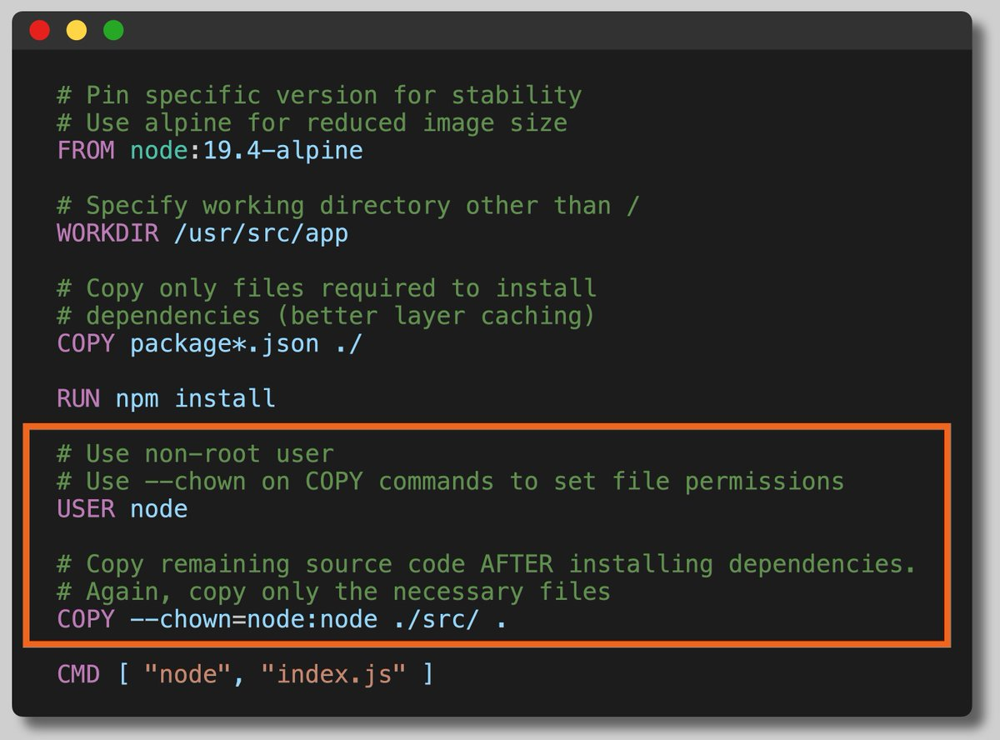
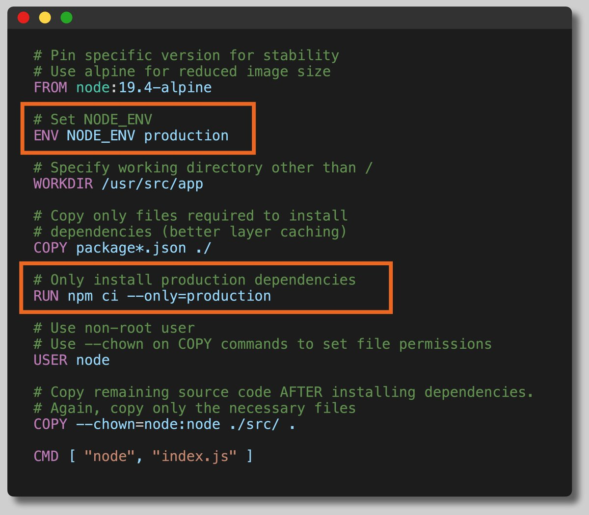
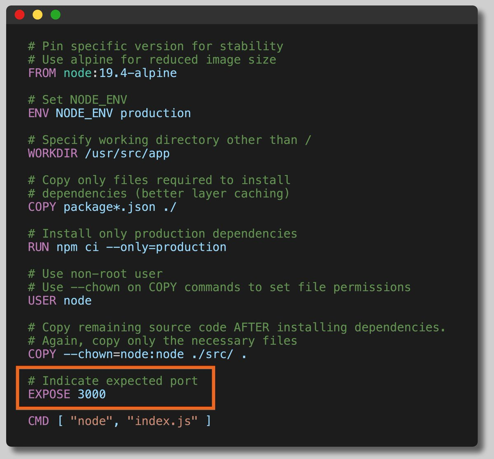
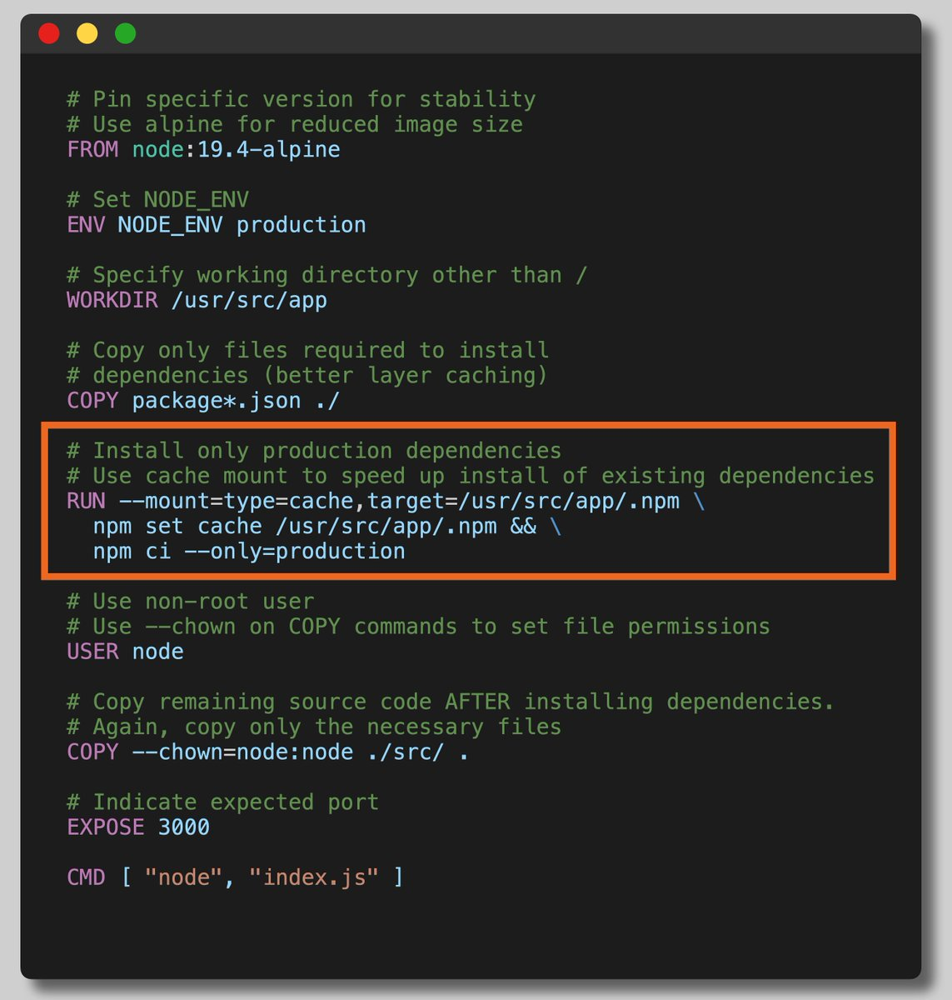
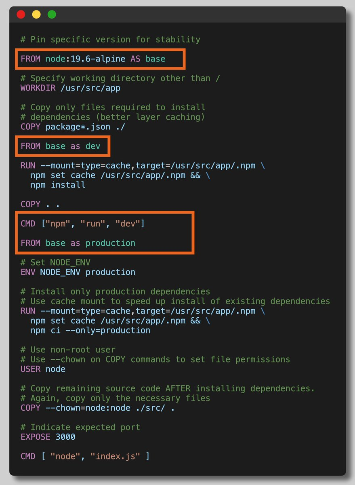

## 初始的 Dockerfile

能 work，但是很垃圾

## 固定基础镜像的版本

[Please Pin Your Docker Image Versions](https://nickjanetakis.com/blog/docker-tip-18-please-pin-your-docker-image-versions)

参考上文。如果不固定版本，则 docker 会默认拉最新的镜像，node 版本的不稳定很可能导致应用产生 bug。

好处：

1. 减少 image 大小，加快 build/transfer 过程
2. 减少攻击面
3. 减少因基础镜像版本不一致产生的 bug

## 指定工作目录

默认的工作目录是根路径（/），但你应该根据你的特定语言+框架的惯例，将其设置为其他路径。

这会给你的应用在文件系统中提供一个专门的位置。

## 单独拷贝 package.json 文件

只拷贝用于打包的文件到 docker 内，package.json 和 lock 文件，lock 文件用于统一版本，是必须的。

如图所示，参考[利用构建缓存机制缩短 Docker 镜像构建时间](https://segmentfault.com/a/1190000018222648)，docker 会分层构建，一条指令一层，在没有带`--no-cache=true`指令的情况下如果某一层没有改动，Docker 就不会重新构建这一层而是会使用缓存.

如果第 n 层有改动，则 n 层以后的缓存都会失效，大多数情况下判断有无改动的方法是判断这层的指令和缓存中的构建指令是否一致，但是对于 COPY 和 ADD 命令会计算镜像内的文件和构建目录文件的校验和然后做比较来判断本层是否有改动。

最理想的情况下，我们希望 package.json 变动的时候会重新的安装 node_modules，在没有变动的情况下使用缓存缩短构建时间。

## 使用非 root 用户

默认情况下，容器中的进程以 root 用户权限运行，并且这个 root 用户和宿主机中的 root 是同一个用户。因为这就意味着一旦容器中的进程有了适当的机会，它就可以控制宿主机。

docker 利用 linux 的 user namespace 会对 root 用户进行保护，但手动指定非 root 用户，可以更加提升 docker 的安全性。

## 配置 App 为 production 模式

`NODE_ENV=production` 环境变量会改变某些依赖的行为，提高性能。

使用 `npm ci` 而不是 `npm install`。ci 只会按照 lock 文件下载依赖，而 install 则会在 package 和 lock 不一致的时候更新 lock 文件。详细的区别：[What is the difference between "npm install" and "npm ci"?](https://stackoverflow.com/questions/52499617/what-is-the-difference-between-npm-install-and-npm-ci/53325242#53325242)

`--only production` 会忽略掉 devDependence 里的依赖

## 指定暴露的端口

## 使用 cache mounts

参考[docker 新增命令](https://yeasy.gitbook.io/docker_practice/buildx/buildkit)

利用 `RUN --mount=type=cache` 命令，在镜像构建时把 node_modules 文件夹挂载上去，在构建完成后，这个 node_modules 文件夹会自动卸载，实际的镜像中并不包含 node_modules 这个文件夹，这样我们就省去了每次获取依赖的时间，大大增加了镜像构建效率，同时也避免了生成了大量的中间层镜像

## 使用多阶段构建将生产和 dev 区分开

[Docker 多阶段构建](https://yeasy.gitbook.io/docker_practice/image/multistage-builds)

只构建某一阶段的镜像: `docker build --target prod`
