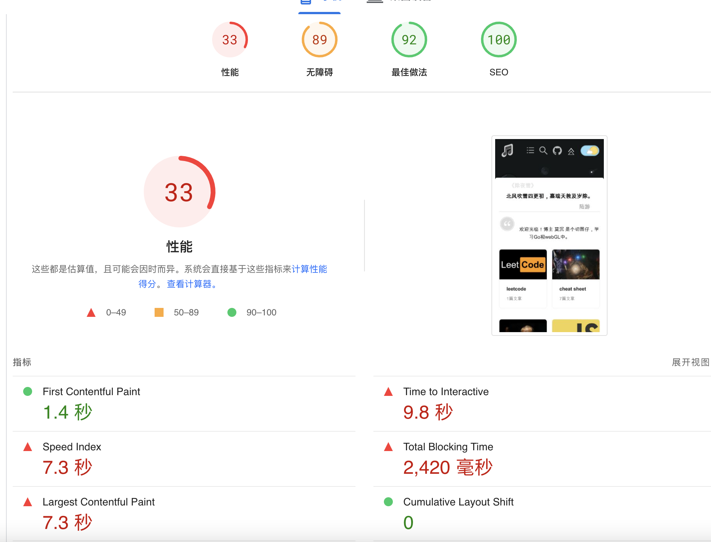
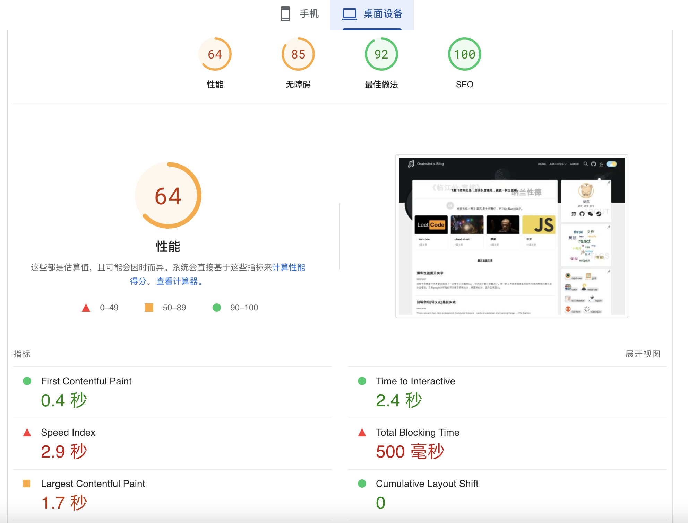

> 对所有依赖进行大更新过后出了一大堆令人头痛的bug，但大部分都已经解决了。
> 剩下的工作就是排查版本迁移导致的性能问题以及水合错误。
>
> 目前google分析给的评分是手机端30分，桌面端60分，提升空间很大，但是很难搞到90分以上，因为首页的threejs和loader设计会对评分有很大负面影响。
>
> 另外因为gatsby的一个bug，导致部分SSR失效：https://github.com/gatsbyjs/gatsby/issues/36678

移动端

桌面端
