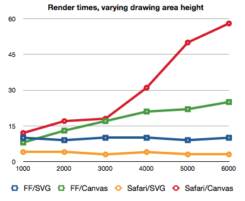

> 本篇假设你已经对 SVG 已经有了初步了解，如果还不知道，建议看看以下资料
>
> [MDN_SVG](https://developer.mozilla.org/zh-CN/docs/Web/SVG/Tutorial)
>
> [深入理解 SVG](https://www.books.com.tw/products/CN11486864)
>
> [CodePen 中的 SVG 作品](https://codepen.io/search/pens?q=svg)

## 引入方式的区别

### img 标签或 css `background-image`

当你只想用 svg 矢量图形的特性，并不需要用 css 或者 js 制作 svg 动画的时候，最简单的方式就是通过 img 标签或`background-image`来引入 svg。

这样做的好处是

1. 作为图片渲染的 svg，其顶点或标签的数量只会影响图片的大小，而不会渲染成 SVG DOM 而影响 DOM 的性能。
2. svg 文件可作为静态资源，享受前端缓存的好处。
3. 与引入 PNG 的方式完全相同，所以我们可以制作雪碧图以减少静态资源请求的数量（但在 Http2 多路复用和首部压缩的条件下，雪碧图已经越来越没有意义了）
4. 兼容性强。很多浏览器都声称支持 SVG，但实际上依旧只支持 SVG 的部分特性。更不用提国内更多的业务场景小程序和千奇百怪的手机浏览器，他们对 SVG 的支持很弱（小程序目前还只支持 img 或 background 引入 SVG）。

### 内联，作为 DOM 渲染

浏览器支持以 DOM 的形式渲染 SVG，SVG 有自己的 DOM 接口，但这些接口的兼容性并不好。

内联的好处：

1. 减少文件请求。
2. 支持以 JS 或 CSS3 来控制 SVG 元素。
3. React SVGR 可将 SVG 转化为 React component，进一步增强了 svg 的自定义能力。

### base64

转化成 base64 可以减少一次静态资源请求，但是同样也用不了前端缓存。

base64 会增大文件大小，所以需要转化成 base64 的图片需要尽量小（小于 5kb）。

因为 SVG 支持 XML 直接渲染，所以与其转化成 base64，还不如直接渲染成 DOM。

## 基于 XML

SVG 基于 XML，所以会有一些和 HTML 语法上的区别

1. 标签大小写敏感

2. 严格按照书写顺序渲染，后面的覆盖前面的，无`z-index`层叠概念。

   等等...不是重点所以略过。感兴趣可以看[XML 和 HTML 的区别](https://www.html.cn/qa/html5/10300.html)

## 与 Canvas 对比

canvas 和 SVG 是数据可视化最常接触到的两种技术。实际工作中我们可能更多地是直接使用 D3，Echarts 等成熟的第三方库，而不会去手动绘制图表。

> 图表参考 [when to use svg. or canvas](https://css-tricks.com/when-to-use-svg-vs-when-to-use-canvas/)

### 特性对比

| 特性                   | SVG | Canvas |
| ---------------------- | --- | ------ |
| 矢量图                 | 🍏  | 🍎     |
| 栅格化                 | 🍎  | 🍏     |
| 3D                     | 🍎  | 🍏     |
| 事件处理器             | 🍏  | 🍎     |
| DOM 访问               | 🍏  | 🍎     |
| 可访问性               | 🍏  | 🥭     |
| 展示文字               | 🍏  | 🍏     |
| 渐变和图案             | 🍏  | 🍏     |
| CSS 动画               | 🍏  | 🍎     |
| CSS 选择器             | 🍏  | 🍏     |
| 媒体内容（视频和图片） | 🍎  | 🍏     |
| 暴露内部状态           | 🍎  | 🍏     |
| 像素操作               | 🍎  | 🍏     |
| 离屏渲染支持           | 🍎  | 🍏     |

### 性能差异

当对象数量（svg 标签）过多时，canvas 的性能优于 svg；

当绘制区域过大时，svg 的性能优于 canvas；

需要注意的是 svg 和 canvas 的顶点数量过多会有一定的性能影响，但是和对象数量相比对性能的影响不是一个量级的。

### 维护难度

SVG 的语法和 html 类似，并且支持事件绑定，可以在控制台直接看到 DOM。

Canvas 内的对象几乎都是黑盒状态，只能通过 GUI 插件将部分对象的属性显示出来，对象不能直接绑定事件。

从上手和维护难度来说，svg 是比 canvas 简单得多的。

### 适用场景

SVG 应该是我们做数据可视化或者前端动画的优先选项。

只有在 SVG 不能应付的场景（或者性能/矢量图效果不那么好的场景）才考虑 canvas。比如 3D 场景，图像对象数量过多的场景。

## 常见 SVG 的问题

### `use`复用 SVG

> [`use`的文档](https://developer.mozilla.org/zh-CN/docs/Web/SVG/Element/use)

使用`use`可以复用 SVG，但有一个点需要注意，svg 的 id 和 html 的 id 一样，必须保证 id 的唯一。并且当你通过 js 或 css 控制对应 id 的图像的样式时，当前页面所有复用了该 id 对应的图像的 svg 都会跟着变样式。

由于 svg 的 id 在 svg 文件内很难管理，所以这可能导致意想不到的问题。如果不是必要，不要用`use`。

### 减小 SVG 文件大小

> [high performance svg](https://css-tricks.com/high-performance-svgs/)

1. SVGO 压缩，可配置 webpack 插件
2. 直接检查 SVG 文件代码，删掉无用的路径或样式。（通常是因为设计师不懂，导出 SVG 的时候携带了多余的信息）
3. 学会使用 AI，通过 AI 的减少路径顶点的功能，减少顶点数。（这是效果最明显的方法）。

### 做出漂亮的 SVG 图形

学习 AI，或者抱设计师 🦵

### SVG 动画

> [SVG 动画开发实战](https://svg-animation-booklet.vercel.app/overview.html)

### `xmlns` 和 `xmlns:slink`的作用

SVG 的命名空间，如果该 SVG 是内联引入的，则可以直接删掉这两个东西（前端编写过程中，ts 也会提示这两个东西多余。）

他们用于 img 标签或 background-image 引入 SVG 文件。
