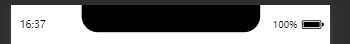

## Text 设置 padding 失效

有时候会出现的奇怪的问题。

建议都转为块级元素，并且用盒模型。

## 诡异的 column flex

```css
flex-flow: column;
justify-content: space-between;
align-items: center;
```

`flex` 布局的方向为 `column`的情况下，会出现个别机型布局失效。

建议不要使用 `column`布局，转而直接用`padding`撑开间距，用`margin`水平居中。

## 万恶的橡皮筋效果

[小程序取消橡皮筋回弹效果解决方案及坑总结](https://developers.weixin.qq.com/community/develop/article/doc/000c4e2e3446e8243739e441051013)

上面这篇文章总结的还不错，不过在 iphoneX 及最新版本的 iphone 上增加了左右范围的橡皮筋效果 🤮，上面的内容不一定能解决你所有的问题，尤其是当你在实现一些很复杂的 UI 的时候，总会存在该滚动不滚动，不想回弹又回弹的时候。

## 经典的 1px 边框问题

```css
.border-b:after {
  position: absolute;
  content: '';
  width: 100%;
  left: 0;
  bottom: 0;
  height: 1px;
  background-color: #e3e5e9;
  -webkit-transform: scale(1, 0.5);
  transform: scale(1, 0.5);
  -webkit-transform-origin: center bottom;
  transform-origin: center bottom;
}
```

## input 输入框的不一致

Taro UI 或者微信的原生 input 组件支持`maxLength`属性，可以限制输出字符的长度。

这在安卓机上表现得很正常，但在 iphone 上就会出现问题。iphone 机在输入中文的时候，该限制会直接应用到拼音上，比如你想打`郑爽`这两个字，结果你打到 `zhengshuan`的时候就不能往下打了。

解决办法是不要在中文输入的时候使用`maxLength`，转而在`onConfirm`时判断输入的长度是否超过上限。

只不过这种实现方式的反馈逻辑和直接限制相比不太好罢了。算是不得已为之。

## ScrollView scrollX 失效

这个问题目前还没解决。

在 iphone 上正常，在小米上正常，在华为手机上正常，在一加手机上就跪了。。。why？

网上的通用方案是

```css
/* scroll-view加上禁止换行 */
.wrap {
  white-space: nowrap;
}
/* scroll-view内的子元素设为inline-block */
.child {
  display: inline-block;
}
```

这可能对其他人有效， 但是对我来说没什么用。

## 无侵入的点击热区

> 设计喜欢搞一些芝麻大小的按钮，结果到了手机上用小拇指都点不到，如果这时候改 UI 则会对整体布局产生很大的影响。

```css
.touch {
  position: relative;
}

.touch::after {
  content: '';
  width: 100%;
  height: 100%;
  position: absolute;
  left: 0;
  top: 0;
  transform: scale(1.5);
}
```

伪元素在事件冒泡过程中视为宿主元素的子元素，利用绝对定位的伪元素可以扩大宿主元素的点击区域。

可以把这个样式作为公共的点击热区类。

## 原生组件的覆盖

用`CoverView`, 另外模拟器上和真机上的表现并不一致，例如在使用 charts 时模拟器上 chart 层级是最上级，但是真机上表现正常，非必要情况下不要使用`CoverView`。

## iphoneX，天杀的刘海屏



如图，如果你需要对页面顶端设置一些`fixed`或者`sticky`定位的元素，那么你得小心上面那个刘海了。

尤其是当你想使用 Taro 的`Message`组件的时候，`Message`的消息会被这个刘海完全遮住。

解决办法是通过获取手机信息的接口获取手机状态栏的高度，再给组件加一个 padding。

相关文档： [getMenuButtonBoundingClientRect](https://developers.weixin.qq.com/miniprogram/dev/api/ui/menu/wx.getMenuButtonBoundingClientRect.html)， [getSystemInfoSync](https://developers.weixin.qq.com/miniprogram/dev/api/base/system/system-info/wx.getSystemInfoSync.html)

```js
// 状态栏高度
const { statusBarHeight } = Taro.getSystemInfoSync();
// 获取菜单按钮（右上角胶囊按钮）的布局位置信息。坐标信息以屏幕左上角为原点
const { height, top: navTop } = Taro.getMenuButtonBoundingClientRect();
// 计算刘海高度和胶囊栏合在一起占有的总高度
const navHeight = statusBarHeight + height + (navTop - statusBarHeight) * 2;
```

## SVG 与图片压缩

在 web 应用中，svg 可以被 svgr 渲染成 dom，这样我们可以很方便地通过`currentColor`或者 css 直接空值图片，但是小程序并不支持直接渲染 svg。

小程序只能通过`<Image>`标签或者`background-image`引入 svg，所以也不支持用 css 直接改变 svg 地属性，`currentColor`也不会生效，所以对于那些变色地按钮，还是只能用多张图片实现。

可以配置一下 svgo 整一下 svg 压缩。但是不推荐转码成 base64，这样图片的大小会变得更大。

## Echarts

Echarts 是一个大的对象，所以我们在使用 echarts 的时候要注意不要不小心触发地 Echarts 对象的重建。需要使用`useState`或者`useRef`储存对象的引用。

[Echarts for wexin](https://github.com/ecomfe/echarts-for-weixin)

## 使用 Modal 中的 Input 自动聚焦功能的 bug

使用 Taro UI 时遇到的问题，

## Modal 中的值在 onCancel 回调中不能清空
