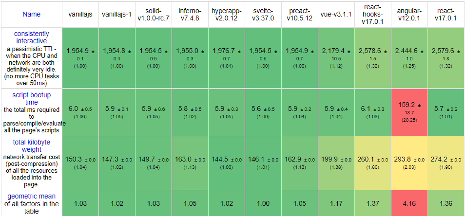
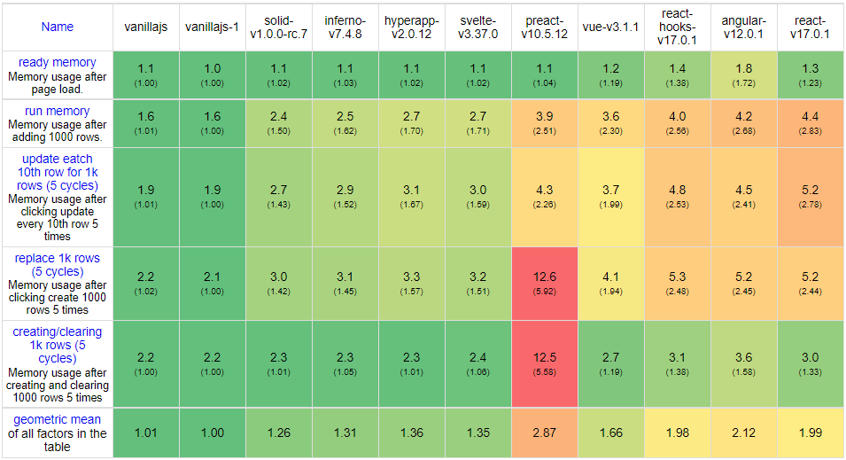

## 前端框架流行度统计 2022

[FrontendFrameworksPopularity.md](https://gist.github.com/tkrotoff/b1caa4c3a185629299ec234d2314e190)

**[React](https://reactjs.org/)：** **用于构建用户界面的 JavaScript 库。**最多的使用率，最大的社区生态，大厂背书的维护。前端必学。

**[angular2](https://angular.io/)：** **现代 Web 应用框架**作为替代 angularjs 另起炉灶的框架。框架约束多，语法和 java 接近，适合全栈。

**[Vue3](https://vuejs.org/)：** **渐进式前端框架。**文档很棒，上手简单，模版语法，生态丰富，V3 全面拥抱 TS，框架提供很多常用功能和语法糖。

**[svelte](https://svelte.dev/)：** **构建 web 应用程序的工具。**语法和 Vue 接近，抛弃了虚拟 DOM，在编译阶段就将代码编译成能原生 DOM，最大限度减少对运行时的依赖。

**[solidjs](https://www.solidjs.com/)：一个用于构建用户界面，简单高效、性能卓越的 JavaScript 库**。2022 年火爆的项目，同 svelte 一样抛弃了虚拟 dom，语法和 React 接近，但性能上比 svelte 更强。如果以后的大趋势是围剿虚拟 DOM，solidjs 就有可能会替代 react 成为下一个巫妖王。

**angularjs：**除了一些老系统的维护或者公司内部积累了相当多物料的情况下还会选择用 angularjs，新的系统基本上不会考虑了。他还有这么多的问题搜索率仅仅是因为很多老系统还需要维护。

## 自身定位

官方对自己的作品的定位都是比较清晰的，从定位上我们就可以知道每个框架侧重什么。

React 是一个 js function 的库，库和框架的区别在于，后者定义了开发者如何设计一个程序，而前者只是一些用于渲染 UI 的工具的合集。

更具体一点就是，react 没有内置的路由，测试框架，request 方案以及状态管理工具等，但这不意味着这些功能都不能实现，react 官方依旧会推荐一些流行的第三方库来实现这些功能。

### React

react 只专注于构建 UI，这样的优势就是开发者在选型的时候拥有极大的灵活度，开发者可以选择用 mobx 或者 redux 或者 zustand 来管理状态，可以选择 react-router 或者 reach-router 来管理路由。react 也可以只用来渲染页面的某一部分，可以很方便的进行迁移和集成。

react 的灵活度促进了 react 生态的繁荣，同样一个功能，你可以找到好几个流行的第三方库，而且在跨端，桌边端和一些冷门领域比如 web3D 方面都能找到解决方案。其他框架在生态这一块是没办法和 react 相提并论的。

### Vue 和 Angular

Vue 和 angular 都是完美集成的前端框架，特殊的是 Vue 还称自己是渐进式前端框架，渐进式意味着你可以像 react 一样灵活地只使用他的模版引擎，其他的东西自己实现，也可以如 angular 一样全盘采用官方集成的功能。

官方集成意味着这些功能会得到长久的维护，以及更好的兼容性和稳定性。不会出现在 react 中每次升级 react 版本，第三方插件都可能失效或者出各种各样问题的情况。在 Vue 中我们会一直使用 Pinia(VueX)作为状态管理，但在之前的一个 React 项目里我们的状态管理从 redux 换成了 context 最后又换成了 recoil

### Svelte 和 Solid

Svelte 在语法上和 Vue 接近，Solid 和 React 接近。

这两个库都是摒弃了虚拟 DOM，将更多的工作放在编译过程而不是运行时。定位就是比 Vue 和 React 更快的 UI 构建工具。

由于其生态的不完善，所以也只能当成 UI 的库。

## 生态对比

这里要算上稳定可靠的第三方支持，否则对 React 不公平。

由于很多第三方实际上同时支持 react，Vue 以及 angular，但除了最初设计支持的框架，其他框架的支持都很差，所以只考虑最初设计的框架。

🚧 : 有支持。但不成熟或者还在开发中， 或者没有一个能成为标准的插件。

💥：相对于其他框架有明显优势

🗑️：不再流行的方案，但是依然可以使用

⭕：内置支持

❌：无直接支持的插件。并不意味着框架不支持这个功能，以动画为例，虽然框架不内置动画支持，但是可以用 anime 或者 gsap 等第三方库。

|          | React                    | Vue        | Angular     | selvte       | solid        |
| -------- | ------------------------ | ---------- | ----------- | ------------ | ------------ |
| 语法     | JSX                      | template   | template    | template     | JSX          |
| CLI      | CRA                      | create-vue | Angular CLI | 🚧selvte kit | 🚧solid-star |
| Hybrid   | 💥RN                     | 🗑️Weex     | ⭕ 🚧       | ❌           | ❌           |
| 小程序   | Taro                     | Uni        | 🚧          | ❌           | ❌           |
| SSR 框架 | Next/Remix               | Nuxt       | 🚧          | 🚧           | 🚧           |
| Jamstack | gatsby/Next/Remix        | Nuxt       | 🚧 Sully    | ❌           | ❌           |
| 3D/AR/VR | three-fiber              | ❌         | ❌          | ❌           | ❌           |
| 表单     | fomik                    | ⭕         | ⭕          | ❌           | ❌           |
| 过渡动画 | 🚧react-transition-group | ⭕         | ⭕          | ⭕           | ❌           |
| 文档     | 🚧 新文档开发中          | 💥         | ⭕          | ⭕           | ⭕           |

- 速度（性能）

  Solid > selvte > Vue > React > Angular

- 打包后大小

  Solid < Selvte < Vue < React < Angular

- 实现同一功能( 中等大小的业务代码 )需要的代码量

  Solid < React < Selvate < Vue < Angular

其他

Angular 有一个杀手级别的库 [ag-grid](https://www.ag-grid.com/), 该库广泛运用于金融和工业领域，所以 Angular 才会在传统公司里依然大行其道。该库虽然也支持了 react 和 vue，但是从稳定性和官方支持角度考虑依旧是 Angular 优先。

## 性能

随着设备性能的不断提升，除非有复杂的页面需求，网页的响应性能实际上不再是选择一个前端框架的最主要的考量。（数据来源：[js-framework-benchmark](https://krausest.github.io/js-framework-benchmark/current.html)）

但对于特定场景下的前端，React 相比其他流行的框架有很大劣势。

在复杂表单场景，Vue 和 Svelte 里你可以通过双向绑定很轻松地完成表单的 UI 和数据更新，但在 React 里无论你得在受控于非受控组件之间做出选择。前者需要写大量代码并且容易出现性能问题，后者基本上是绕过了 React，并不是官方提倡的。所以 React 在处理表单场景的时候非常依赖第三方库。

### 速度

### 内存占用

可以看到 React 曾经引以为傲的速度，其实已经没多少优势了。

### 虚拟 DOM

React 是虚拟 DOM 的先驱，引领了数年的虚拟 DOM 热潮，但最近一两年，社区对虚拟 DOM 讨伐的声量也越来越大。

Svelte 官网在解释为什么不用虚拟 DOM 的时候贴了一篇博客

[virtual dom is pure overhead](https://www.sveltejs.cn/blog/virtual-dom-is-pure-overhead)

React 曾经很快，现在依然快，但这是在和 jqury 等比较老的前端方案比较得出的结论。

新一代的前端框架，比如 Svelte 和 Solid，都是细粒度响应式地直接更新 DOM，并且将大量的工作放在构建阶段。

由于开发者很容易写出重渲染的函数组件（这并不是开发者的问题，react 官方倡导的即是只有在性能出现问题的时候再进行性能优化），所以 react 的 diff 次数实际上会比测试预期的更高一点，进一步拖慢了 react 的性能。

## 心智负担（苦 React 久矣）

心智负担是一个偏主观的东西，但他可以一定程度上反应一个框架的上手难度以及出 Bug 的几率。

### 文档

React 的文档是所有前端框架里最差的。很难想象一个这么流行的框架，有这么垃圾的文档。和他一比，Vue 的文档简直就是一本大学教材。不过 react 的[新文档](https://beta.reactjs.org)也在路程上了

Vue 团队在文档上下了很多功夫，点个赞。后端同学在读完 Vue 的文档过后就可以开开心心写前端了。

Angular 的文档也很丰富，涵盖了相当多的最佳实践。但碍于 Angular 本身 API 和新概念较其他框架复杂，所以上手也很慢。

Svelte 和 Solid 由于并未深入使用，并且他们的文档还在持续完善中，所以不做评价。

### 过于灵活

React 的灵活度是几个框架里最好的，但是过于自由会导致：

1. 风格不统一。1000 个人有 1000 种 React 风格
2. 结构不清晰。JSX 可作为函数的返回值杂糅在文件的各个地方，导致 React 代码的工整程度不如 Vue 和 Angular 规整。
3. 选型多元。有技术狂热的 dev 会不断尝试新东西，新东西会带来风险和额外的学习成本。相比 Vue 和 Angular 官方直接提供最佳实践来说，在工程化领域并不是个好的点。
4. 扯皮和纠结。由于 React 太过自由，同一种功能的实现方案相比 Vue 和 Angular 会多很多，这就可能导致 code review 上无尽的扯皮和纠结。

React 工作的项目，除了要有严格的 eslint + prettier 约束外，还需要制定一份组件设计模式的规范，来最大限度减少风格不统一。

Vue 和 Angular 相比就没那么多灵活度，但是用这两个框架写出来的代码相对工整，逻辑清晰。

### API 设计

我不止一次遇到同事截图 React 文档的内容问我一些官方说的不清不楚的问题，这些问题主要集中在函数组件的重渲染，`useEffect`依赖和 `memo`的问题，由此引发的性能 bug 非常常见。在官方刻意淡化生命周期的概念，转而用切片概念，但并没有足够的文档说明其原因和注意事项。

React 将 `onMounted` `onUpdate`和 `onUnMounted`生命周期，副作用还有未来可能新增的离屏组件等功能全部揉到 `useEffect`一个 API 里，在最新版本的 react 文档已经 6 篇关于 `useEffect`的解释：[react beta](https://beta.reactjs.org/learn/synchronizing-with-effects)，相信新文档上线过后情况会有所改观。

而 Vue3 的组合式函数则将其分为多个独立的函数，Angular 有固定的生命周期，就连 Solid 也分开了两个周期函数 `onMount`和 `onCleanup`。`useEffect`变得越来越复杂，对其工作原理不清楚的人可能写出 bug，上手难度越来越高。

对 react 的讨伐，这里有一篇写得不错的文章：[React I Love You, But You&#39;re Bringing Me Down](https://marmelab.com/blog/2022/09/20/react-i-love-you.html)

## 总结

React 始终将会是我工作中首选的前端框架，因为他对熟练开发者非常友好，开发者使用起来非常舒适。

但对于团队内部人员水平层次不齐，需要更多的框架层面的约束，或者有 keep-alive，过渡动画等开箱即用的功能需求，Vue 会是更好的选择。

和 Vue 比起来，React 官方提供的框架功能很少，需要自己实现或者找第三方的实现，第三方插件和 Vue 的官方提供并维护相比，安全风险和成本大了很多。

svelte 和 solid 还不成熟，生态无法和三巨头相比，这意味着有些能靠第三方库解决的问题，换了这两个框架就得自己实现。抛弃了虚拟 DOM 可以让一些表单或复杂的动画有更好的性能，目前来说更适合生成一些插件和组件，作为大的工程项目的选型不太合适。这两个框架未来可期。我个人非常看好 solid 的前景，因为他吸收了各大框架的精华，没有 React 那些让人抓狂的设定，如果作者能把 API 名字设计得更好一点就好了，真想立马丢掉 React。

这些还仅仅只是 js 的前端框架，实际上在 js 范围之外，还有纯 web-component 框架，通过 wasm 入侵的 rust，wasm 前端框架，了解即可，不必过于深入。

框架只是工具，工作的核心还是得落实到业务上。
