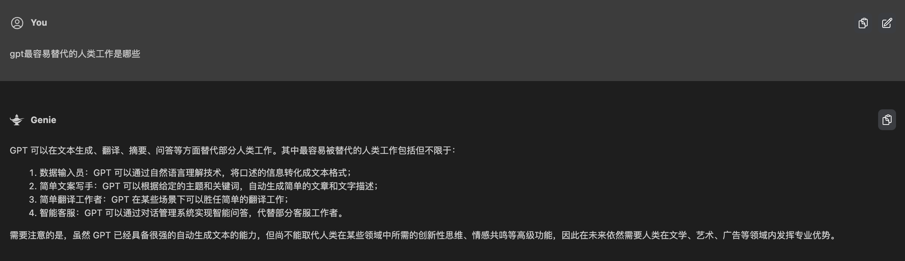

import { Link } from 'gatsby';

## 使用一段时间 AI 之后的感受

一个字，“强”。

已经无法用言语来形容 GPT 带给我的震撼了。

今年早些时候我还只是看到了 AI 绘图的一些新闻，那时候的 AI 还很不成熟，画的人物缺胳膊少腿，人体结构和透视一塌糊涂。但是短短几个月过后，AI 绘图从风格到精细程度就已经达到了以假乱真甚至超越一般画师的程度。

记得当时我和印度 UX 小姐姐开玩笑，我说我们都要被 AI 干掉了。没想到几个月过后一语成谶。不少 IT 公司认真调研 AI，并进行了组织结构和人员变更来适应 AI 时代。

公司 CTO 做过一次 GPT 的分享。在分享中他对项目通过合理的工序拆分和建模，在用指令让 GPT 完成了一个中型项目的前后端架构。

GPT：理解上下文的能力 + 没有边界的数据库 + 自学习的能力。

在坐的各位 Dev 好好想想，按现在 AI 的进化速度，你有什么技术上的护城河可以把 AI 挡在外面。

## 回顾 19 年的文章《对人工智能社会的担忧》

19 年，我刚毕业一年。彼时的我还十分幼稚，在看到市场铺天盖地地炒作 AI 的时候写了一篇现在看来颇显尴尬的文章： <Link to="/essay/对人工智能社会的担忧/">对人工智能社会的担忧</Link>

基本思想其实没有变：AI 会对现有的生产关系产生颠覆性影响，而 AI 的浪潮浩浩荡荡无法阻挡。

## 技术的变革

## 生产力与生产关系

## 我很乐观
